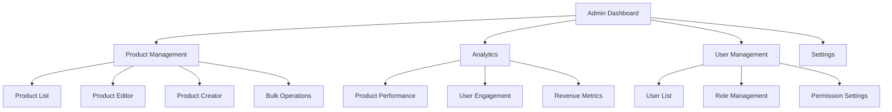

# Product Management Admin Interface

## Overview

This document outlines the implementation of a comprehensive product management admin interface that enables administrators to efficiently manage 500+ financial products with features for creating, editing, deleting, and analyzing products.

## Admin Interface Requirements

### 1. Core Features
- **Product Listing**: View all products with filtering and sorting
- **Product Creation**: Add new products with validation
- **Product Editing**: Update existing products
- **Product Deletion**: Remove products with confirmation
- **Bulk Operations**: Perform actions on multiple products
- **Analytics Dashboard**: View product performance metrics
- **Import/Export**: Import products in bulk and export data

### 2. User Experience Requirements
- **Responsive Design**: Works on desktop and tablet devices
- **Role-Based Access**: Different permission levels for users
- **Audit Trail**: Track changes made to products
- **Search Functionality**: Find products quickly
- **Data Validation**: Prevent invalid data entry
- **Error Handling**: Clear error messages and recovery options

## System Architecture

### 1. Admin Interface Structure



### 2. Component Hierarchy

```
AdminLayout
├── AdminHeader
├── AdminSidebar
├── AdminMain
│   ├── Dashboard
│   ├── ProductManagement
│   │   ├── ProductList
│   │   ├── ProductEditor
│   │   ├── ProductCreator
│   │   └── BulkOperations
│   ├── Analytics
│   │   ├── ProductPerformance
│   │   ├── UserEngagement
│   │   └── RevenueMetrics
│   └── Settings
└── AdminFooter
```

## Backend Implementation

### 1. Admin API Routes

```typescript
// backend/src/routes/admin.ts
import { Router } from 'express';
import { ProductAdminController } from '../controllers/ProductAdminController';
import { authenticateAdmin } from '../middleware/auth';
import { validateProduct } from '../middleware/validation';

const router = Router();
const adminController = new ProductAdminController();

// Apply admin authentication middleware to all routes
router.use(authenticateAdmin);

// Product management routes
router.get('/products', adminController.getProducts);
router.get('/products/:id', adminController.getProductById);
router.post('/products', validateProduct, adminController.createProduct);
router.put('/products/:id', validateProduct, adminController.updateProduct);
router.delete('/products/:id', adminController.deleteProduct);
router.delete('/products', adminController.bulkDeleteProducts);

// Bulk operations
router.post('/products/bulk', adminController.bulkUpdateProducts);
router.get('/products/export', adminController.exportProducts);

// Analytics routes
router.get('/analytics/products', adminController.getProductAnalytics);
router.get('/analytics/users', adminController.getUserAnalytics);
router.get('/analytics/revenue', adminController.getRevenueAnalytics);

// User management routes
router.get('/users', adminController.getUsers);
router.put('/users/:id', adminController.updateUser);
router.delete('/users/:id', adminController.deleteUser);

// Settings routes
router.get('/settings', adminController.getSettings);
router.put('/settings', adminController.updateSettings);

export default router;
```

### 2. Admin Controller

```typescript
// backend/src/controllers/ProductAdminController.ts
import { Request, Response } from 'express';
import { ProductService } from '../services/ProductService';
import { AnalyticsService } from '../services/AnalyticsService';
import { UserService } from '../services/UserService';
import { v4 as uuidv4 } from 'uuid';

interface AdminProduct {
  id: string;
  name: string;
  tagline: string;
  description: string;
  category: string;
  institution: string;
  targetSegment: 'individual' | 'business' | 'both';
  isActive: boolean;
  isFeatured: boolean;
  createdAt: Date;
  updatedAt: Date;
  // Additional fields as needed
}

interface ProductAnalytics {
  productId: string;
  views: number;
  clicks: number;
  conversions: number;
  revenue: number;
  rating: number;
}

class ProductAdminController {
  private productService: ProductService;
  private analyticsService: AnalyticsService;
  private userService: UserService;

  constructor() {
    this.productService = new ProductService();
    this.analyticsService = new AnalyticsService();
    this.userService = new UserService();
  }

  /**
   * Get all products with filtering and pagination
   */
  async getProducts(req: Request, res: Response) {
    try {
      const {
        page = 1,
        limit = 20,
        search,
        category,
        institution,
        isActive,
        isFeatured,
        sortBy = 'updatedAt',
        sortOrder = 'desc'
      } = req.query;

      const filters: any = {};
      if (category) filters.category = category;
      if (institution) filters.institution = institution;
      if (isActive !== undefined) filters.isActive = isActive === 'true';
      if (isFeatured !== undefined) filters.isFeatured = isFeatured === 'true';

      const result = await this.productService.getProducts({
        page: parseInt(page as string),
        limit: parseInt(limit as string),
        search: search as string,
        filters,
        sort: `${sortBy}_${sortOrder}`
      });

      // Add analytics data to products
      const productIds = result.data.map((p: any) => p.id);
      const analyticsData = await this.analyticsService.getProductMetrics(productIds);

      const productsWithAnalytics = result.data.map((product: any) => {
        const analytics = analyticsData.find((a: any) => a.productId === product.id);
        return {
          ...product,
          analytics: analytics || {
            views: 0,
            clicks: 0,
            conversions: 0,
            revenue: 0,
            rating: 0
          }
        };
      });

      res.json({
        data: productsWithAnalytics,
        pagination: result.pagination
      });
    } catch (error) {
      res.status(500).json({
        error: 'Failed to retrieve products',
        message: error instanceof Error ? error.message : 'Unknown error'
      });
    }
  }

  /**
   * Get product by ID
   */
  async getProductById(req: Request, res: Response) {
    try {
      const { id } = req.params;
      const product = await this.productService.getProductById(id);
      
      if (!product) {
        return res.status(404).json({ error: 'Product not found' });
      }

      // Add analytics data
      const analytics = await this.analyticsService.getProductMetrics([id]);
      
      res.json({
        data: {
          ...product,
          analytics: analytics[0] || {
            views: 0,
            clicks: 0,
            conversions: 0,
            revenue: 0,
            rating: 0
          }
        }
      });
    } catch (error) {
      res.status(500).json({
        error: 'Failed to retrieve product',
        message: error instanceof Error ? error.message : 'Unknown error'
      });
    }
  }

  /**
   * Create new product
   */
  async createProduct(req: Request, res: Response) {
    try {
      const productData = req.body;
      
      // Add audit information
      productData.createdBy = req.user?.id;
      productData.updatedBy = req.user?.id;
      
      const productId = await this.productService.createProduct(productData);
      
      // Log audit trail
      await this.analyticsService.logAuditEvent({
        userId: req.user?.id,
        action: 'CREATE_PRODUCT',
        resourceId: productId,
        resourceType: 'PRODUCT',
        details: productData
      });

      res.status(201).json({
        message: 'Product created successfully',
        data: { id: productId }
      });
    } catch (error) {
      res.status(500).json({
        error: 'Failed to create product',
        message: error instanceof Error ? error.message : 'Unknown error'
      });
    }
  }

  /**
   * Update product
   */
  async updateProduct(req: Request, res: Response) {
    try {
      const { id } = req.params;
      const productData = req.body;
      
      // Add audit information
      productData.updatedBy = req.user?.id;
      
      const updated = await this.productService.updateProduct(id, productData);
      
      if (!updated) {
        return res.status(404).json({ error: 'Product not found' });
      }
      
      // Log audit trail
      await this.analyticsService.logAuditEvent({
        userId: req.user?.id,
        action: 'UPDATE_PRODUCT',
        resourceId: id,
        resourceType: 'PRODUCT',
        details: productData
      });

      res.json({
        message: 'Product updated successfully',
        data: { id }
      });
    } catch (error) {
      res.status(500).json({
        error: 'Failed to update product',
        message: error instanceof Error ? error.message : 'Unknown error'
      });
    }
  }

  /**
   * Delete product
   */
  async deleteProduct(req: Request, res: Response) {
    try {
      const { id } = req.params;
      
      const deleted = await this.productService.deleteProduct(id);
      
      if (!deleted) {
        return res.status(404).json({ error: 'Product not found' });
      }
      
      // Log audit trail
      await this.analyticsService.logAuditEvent({
        userId: req.user?.id,
        action: 'DELETE_PRODUCT',
        resourceId: id,
        resourceType: 'PRODUCT'
      });

      res.json({
        message: 'Product deleted successfully'
      });
    } catch (error) {
      res.status(500).json({
        error: 'Failed to delete product',
        message: error instanceof Error ? error.message : 'Unknown error'
      });
    }
  }

  /**
   * Bulk delete products
   */
  async bulkDeleteProducts(req: Request, res: Response) {
    try {
      const { productIds } = req.body;
      
      if (!Array.isArray(productIds) || productIds.length === 0) {
        return res.status(400).json({ error: 'Invalid product IDs' });
      }
      
      const deletedCount = await this.productService.bulkDeleteProducts(productIds);
      
      // Log audit trail
      await this.analyticsService.logAuditEvent({
        userId: req.user?.id,
        action: 'BULK_DELETE_PRODUCTS',
        resourceType: 'PRODUCT',
        details: { count: deletedCount, productIds }
      });

      res.json({
        message: `${deletedCount} products deleted successfully`
      });
    } catch (error) {
      res.status(500).json({
        error: 'Failed to delete products',
        message: error instanceof Error ? error.message : 'Unknown error'
      });
    }
  }

  /**
   * Bulk update products
   */
  async bulkUpdateProducts(req: Request, res: Response) {
    try {
      const { productIds, updates } = req.body;
      
      if (!Array.isArray(productIds) || productIds.length === 0) {
        return res.status(400).json({ error: 'Invalid product IDs' });
      }
      
      const updatedCount = await this.productService.bulkUpdateProducts(productIds, updates);
      
      // Log audit trail
      await this.analyticsService.logAuditEvent({
        userId: req.user?.id,
        action: 'BULK_UPDATE_PRODUCTS',
        resourceType: 'PRODUCT',
        details: { count: updatedCount, productIds, updates }
      });

      res.json({
        message: `${updatedCount} products updated successfully`
      });
    } catch (error) {
      res.status(500).json({
        error: 'Failed to update products',
        message: error instanceof Error ? error.message : 'Unknown error'
      });
    }
  }

  /**
   * Export products
   */
  async exportProducts(req: Request, res: Response) {
    try {
      const { format = 'csv', filters = {} } = req.query;
      
      const products = await this.productService.exportProducts(filters as any);
      
      // Log audit trail
      await this.analyticsService.logAuditEvent({
        userId: req.user?.id,
        action: 'EXPORT_PRODUCTS',
        resourceType: 'PRODUCT',
        details: { format, filters }
      });

      res.setHeader('Content-Type', 'text/csv');
      res.setHeader('Content-Disposition', `attachment; filename=products-${new Date().toISOString()}.${format}`);
      
      // Convert products to CSV format
      const csv = this.convertToCSV(products);
      res.send(csv);
    } catch (error) {
      res.status(500).json({
        error: 'Failed to export products',
        message: error instanceof Error ? error.message : 'Unknown error'
      });
    }
  }

  /**
   * Get product analytics
   */
  async getProductAnalytics(req: Request, res: Response) {
    try {
      const { 
        startDate = new Date(Date.now() - 30 * 24 * 60 * 60 * 1000).toISOString(),
        endDate = new Date().toISOString(),
        productId
      } = req.query;

      const analytics = await this.analyticsService.getProductAnalytics({
        startDate: new Date(startDate as string),
        endDate: new Date(endDate as string),
        productId: productId as string
      });

      res.json({
        data: analytics
      });
    } catch (error) {
      res.status(500).json({
        error: 'Failed to retrieve analytics',
        message: error instanceof Error ? error.message : 'Unknown error'
      });
    }
  }

  /**
   * Get user analytics
   */
  async getUserAnalytics(req: Request, res: Response) {
    try {
      const { 
        startDate = new Date(Date.now() - 30 * 24 * 60 * 60 * 1000).toISOString(),
        endDate = new Date().toISOString()
      } = req.query;

      const analytics = await this.analyticsService.getUserAnalytics({
        startDate: new Date(startDate as string),
        endDate: new Date(endDate as string)
      });

      res.json({
        data: analytics
      });
    } catch (error) {
      res.status(500).json({
        error: 'Failed to retrieve user analytics',
        message: error instanceof Error ? error.message : 'Unknown error'
      });
    }
  }

  /**
   * Get revenue analytics
   */
  async getRevenueAnalytics(req: Request, res: Response) {
    try {
      const { 
        startDate = new Date(Date.now() - 30 * 24 * 60 * 60 * 1000).toISOString(),
        endDate = new Date().toISOString()
      } = req.query;

      const analytics = await this.analyticsService.getRevenueAnalytics({
        startDate: new Date(startDate as string),
        endDate: new Date(endDate as string)
      });

      res.json({
        data: analytics
      });
    } catch (error) {
      res.status(500).json({
        error: 'Failed to retrieve revenue analytics',
        message: error instanceof Error ? error.message : 'Unknown error'
      });
    }
  }

  /**
   * Get users
   */
  async getUsers(req: Request, res: Response) {
    try {
      const { page = 1, limit = 20, search, role } = req.query;
      
      const filters: any = {};
      if (search) filters.search = search;
      if (role) filters.role = role;

      const users = await this.userService.getUsers({
        page: parseInt(page as string),
        limit: parseInt(limit as string),
        filters
      });

      res.json({
        data: users.data,
        pagination: users.pagination
      });
    } catch (error) {
      res.status(500).json({
        error: 'Failed to retrieve users',
        message: error instanceof Error ? error.message : 'Unknown error'
      });
    }
  }

  /**
   * Update user
   */
  async updateUser(req: Request, res: Response) {
    try {
      const { id } = req.params;
      const userData = req.body;
      
      const updated = await this.userService.updateUser(id, userData);
      
      if (!updated) {
        return res.status(404).json({ error: 'User not found' });
      }
      
      // Log audit trail
      await this.analyticsService.logAuditEvent({
        userId: req.user?.id,
        action: 'UPDATE_USER',
        resourceId: id,
        resourceType: 'USER',
        details: userData
      });

      res.json({
        message: 'User updated successfully'
      });
    } catch (error) {
      res.status(500).json({
        error: 'Failed to update user',
        message: error instanceof Error ? error.message : 'Unknown error'
      });
    }
  }

  /**
   * Delete user
   */
  async deleteUser(req: Request, res: Response) {
    try {
      const { id } = req.params;
      
      const deleted = await this.userService.deleteUser(id);
      
      if (!deleted) {
        return res.status(404).json({ error: 'User not found' });
      }
      
      // Log audit trail
      await this.analyticsService.logAuditEvent({
        userId: req.user?.id,
        action: 'DELETE_USER',
        resourceId: id,
        resourceType: 'USER'
      });

      res.json({
        message: 'User deleted successfully'
      });
    } catch (error) {
      res.status(500).json({
        error: 'Failed to delete user',
        message: error instanceof Error ? error.message : 'Unknown error'
      });
    }
  }

  /**
   * Get settings
   */
  async getSettings(req: Request, res: Response) {
    try {
      const settings = await this.productService.getSettings();
      res.json({
        data: settings
      });
    } catch (error) {
      res.status(500).json({
        error: 'Failed to retrieve settings',
        message: error instanceof Error ? error.message : 'Unknown error'
      });
    }
  }

  /**
   * Update settings
   */
  async updateSettings(req: Request, res: Response) {
    try {
      const settings = req.body;
      
      await this.productService.updateSettings(settings);
      
      // Log audit trail
      await this.analyticsService.logAuditEvent({
        userId: req.user?.id,
        action: 'UPDATE_SETTINGS',
        resourceType: 'SETTINGS',
        details: settings
      });

      res.json({
        message: 'Settings updated successfully'
      });
    } catch (error) {
      res.status(500).json({
        error: 'Failed to update settings',
        message: error instanceof Error ? error.message : 'Unknown error'
      });
    }
  }

  /**
   * Convert products to CSV format
   */
  private convertToCSV(products: any[]): string {
    if (products.length === 0) return '';
    
    // Get headers from first product
    const headers = Object.keys(products[0]).join(',');
    
    // Convert products to CSV rows
    const rows = products.map(product => 
      Object.values(product).map(value => 
        typeof value === 'string' ? `"${value.replace(/"/g, '""')}"` : value
      ).join(',')
    );
    
    return [headers, ...rows].join('\n');
  }
}

export { ProductAdminController };
```

## Frontend Implementation

### 1. Admin Layout Component

```tsx
// src/components/admin/AdminLayout.tsx
'use client';

import React, { useState } from 'react';
import { AdminHeader } from './AdminHeader';
import { AdminSidebar } from './AdminSidebar';
import { AdminFooter } from './AdminFooter';

interface AdminLayoutProps {
  children: React.ReactNode;
}

export default function AdminLayout({ children }: AdminLayoutProps) {
  const [sidebarOpen, setSidebarOpen] = useState(true);

  return (
    <div className="min-h-screen bg-gray-50">
      <AdminHeader 
        sidebarOpen={sidebarOpen} 
        setSidebarOpen={setSidebarOpen} 
      />
      
      <div className="flex">
        <AdminSidebar open={sidebarOpen} />
        
        <main className="flex-1 pb-8">
          <div className="py-6">
            <div className="max-w-7xl mx-auto px-4 sm:px-6 md:px-8">
              {children}
            </div>
          </div>
        </main>
      </div>
      
      <AdminFooter />
    </div>
  );
}
```

### 2. Admin Header Component

```tsx
// src/components/admin/AdminHeader.tsx
'use client';

import React from 'react';
import { Bell, Menu, Search } from 'lucide-react';
import { Button } from '@/components/ui/button';
import { Input } from '@/components/ui/input';
import { Badge } from '@/components/ui/badge';
import {
  DropdownMenu,
  DropdownMenuContent,
  DropdownMenuItem,
  DropdownMenuLabel,
  DropdownMenuSeparator,
  DropdownMenuTrigger,
} from '@/components/ui/dropdown-menu';
import { Avatar, AvatarFallback, AvatarImage } from '@/components/ui/avatar';

interface AdminHeaderProps {
  sidebarOpen: boolean;
  setSidebarOpen: (open: boolean) => void;
}

export function AdminHeader({ sidebarOpen, setSidebarOpen }: AdminHeaderProps) {
  return (
    <header className="bg-white shadow">
      <div className="px-4 sm:px-6 lg:px-8">
        <div className="flex justify-between h-16">
          <div className="flex">
            <Button
              variant="ghost"
              size="icon"
              onClick={() => setSidebarOpen(!sidebarOpen)}
              className="md:hidden"
            >
              <Menu className="h-6 w-6" />
            </Button>
            
            <div className="flex items-center">
              <h1 className="text-xl font-bold text-gray-900">Admin Dashboard</h1>
              <Badge variant="secondary" className="ml-2">
                Beta
              </Badge>
            </div>
          </div>
          
          <div className="flex items-center space-x-4">
            <div className="relative">
              <Search className="absolute left-2 top-1/2 transform -translate-y-1/2 h-4 w-4 text-gray-400" />
              <Input
                type="search"
                placeholder="Search..."
                className="pl-8 w-64"
              />
            </div>
            
            <Button variant="ghost" size="icon">
              <Bell className="h-5 w-5" />
            </Button>
            
            <DropdownMenu>
              <DropdownMenuTrigger asChild>
                <Button variant="ghost" className="relative h-8 w-8 rounded-full">
                  <Avatar className="h-8 w-8">
                    <AvatarImage src="/avatars/admin.jpg" alt="Admin" />
                    <AvatarFallback>AD</AvatarFallback>
                  </Avatar>
                </Button>
              </DropdownMenuTrigger>
              <DropdownMenuContent className="w-56" align="end" forceMount>
                <DropdownMenuLabel className="font-normal">
                  <div className="flex flex-col space-y-1">
                    <p className="text-sm font-medium leading-none">Admin User</p>
                    <p className="text-xs leading-none text-muted-foreground">
                      admin@example.com
                    </p>
                  </div>
                </DropdownMenuLabel>
                <DropdownMenuSeparator />
                <DropdownMenuItem>
                  Profile
                </DropdownMenuItem>
                <DropdownMenuItem>
                  Settings
                </DropdownMenuItem>
                <DropdownMenuSeparator />
                <DropdownMenuItem>
                  Log out
                </DropdownMenuItem>
              </DropdownMenuContent>
            </DropdownMenu>
          </div>
        </div>
      </div>
    </header>
  );
}
```

### 3. Admin Sidebar Component

```tsx
// src/components/admin/AdminSidebar.tsx
'use client';

import React from 'react';
import Link from 'next/link';
import { usePathname } from 'next/navigation';
import {
  BarChart3,
  CreditCard,
  FileText,
  Home,
  Settings,
  ShoppingCart,
  Users,
  Package,
  Upload,
  Download
} from 'lucide-react';

interface SidebarItem {
  title: string;
  href: string;
  icon: React.ReactNode;
  children?: SidebarItem[];
}

const sidebarItems: SidebarItem[] = [
  {
    title: 'Dashboard',
    href: '/admin',
    icon: <Home className="h-4 w-4" />
  },
  {
    title: 'Products',
    href: '/admin/products',
    icon: <Package className="h-4 w-4" />,
    children: [
      {
        title: 'All Products',
        href: '/admin/products',
        icon: <FileText className="h-4 w-4" />
      },
      {
        title: 'Add Product',
        href: '/admin/products/new',
        icon: <CreditCard className="h-4 w-4" />
      },
      {
        title: 'Bulk Import',
        href: '/admin/products/import',
        icon: <Upload className="h-4 w-4" />
      },
      {
        title: 'Export',
        href: '/admin/products/export',
        icon: <Download className="h-4 w-4" />
      }
    ]
  },
  {
    title: 'Analytics',
    href: '/admin/analytics',
    icon: <BarChart3 className="h-4 w-4" />,
    children: [
      {
        title: 'Product Performance',
        href: '/admin/analytics/products',
        icon: <Package className="h-4 w-4" />
      },
      {
        title: 'User Engagement',
        href: '/admin/analytics/users',
        icon: <Users className="h-4 w-4" />
      },
      {
        title: 'Revenue',
        href: '/admin/analytics/revenue',
        icon: <ShoppingCart className="h-4 w-4" />
      }
    ]
  },
  {
    title: 'Users',
    href: '/admin/users',
    icon: <Users className="h-4 w-4" />
  },
  {
    title: 'Settings',
    href: '/admin/settings',
    icon: <Settings className="h-4 w-4" />
  }
];

interface AdminSidebarProps {
  open: boolean;
}

export function AdminSidebar({ open }: AdminSidebarProps) {
  const pathname = usePathname();

  const isActive = (href: string) => {
    return pathname === href || pathname.startsWith(href + '/');
  };

  return (
    <aside className={`${open ? 'block' : 'hidden'} md:block md:w-64 bg-white border-r border-gray-200`}>
      <div className="flex flex-col h-full">
        <div className="flex-1 flex flex-col pt-5 pb-4 overflow-y-auto">
          <nav className="mt-5 flex-1 px-2 space-y-1">
            {sidebarItems.map((item) => (
              <div key={item.href}>
                <Link
                  href={item.href}
                  className={`${
                    isActive(item.href)
                      ? 'bg-gray-100 text-gray-900'
                      : 'text-gray-600 hover:bg-gray-50 hover:text-gray-900'
                  } group flex items-center px-2 py-2 text-sm font-medium rounded-md`}
                >
                  {item.icon}
                  <span className="ml-3">{item.title}</span>
                </Link>
                
                {item.children && isActive(item.href) && (
                  <div className="ml-8 mt-1 space-y-1">
                    {item.children.map((child) => (
                      <Link
                        key={child.href}
                        href={child.href}
                        className={`${
                          isActive(child.href)
                            ? 'bg-gray-100 text-gray-900'
                            : 'text-gray-600 hover:bg-gray-50 hover:text-gray-900'
                        } group flex items-center px-2 py-2 text-sm font-medium rounded-md`}
                      >
                        {child.icon}
                        <span className="ml-3">{child.title}</span>
                      </Link>
                    ))}
                  </div>
                )}
              </div>
            ))}
          </nav>
        </div>
      </div>
    </aside>
  );
}
```

### 4. Product List Component

```tsx
// src/components/admin/ProductList.tsx
'use client';

import React, { useState, useEffect } from 'react';
import Link from 'next/link';
import {
  Table,
  TableBody,
  TableCell,
  TableHead,
  TableHeader,
  TableRow,
} from '@/components/ui/table';
import { Button } from '@/components/ui/button';
import { Input } from '@/components/ui/input';
import { Badge } from '@/components/ui/badge';
import {
  DropdownMenu,
  DropdownMenuContent,
  DropdownMenuItem,
  DropdownMenuTrigger,
} from '@/components/ui/dropdown-menu';
import { Checkbox } from '@/components/ui/checkbox';
import { 
  MoreHorizontal, 
  Edit, 
  Trash2, 
  Eye, 
  BarChart3,
  PlusCircle
} from 'lucide-react';
import { format } from 'date-fns';
import { es } from 'date-fns/locale';

interface Product {
  id: string;
  name: string;
  tagline: string;
  category: string;
  institution: string;
  targetSegment: 'individual' | 'business' | 'both';
  isActive: boolean;
  isFeatured: boolean;
  createdAt: string;
  updatedAt: string;
  analytics: {
    views: number;
    clicks: number;
    conversions: number;
    revenue: number;
    rating: number;
  };
}

interface ProductListProps {
  products: Product[];
  pagination: {
    page: number;
    limit: number;
    total: number;
    totalPages: number;
  };
  onRefresh: () => void;
  onEdit: (id: string) => void;
  onDelete: (id: string) => void;
  onView: (id: string) => void;
  onAnalytics: (id: string) => void;
}

export default function ProductList({
  products,
  pagination,
  onRefresh,
  onEdit,
  onDelete,
  onView,
  onAnalytics
}: ProductListProps) {
  const [selectedProducts, setSelectedProducts] = useState<string[]>([]);
  const [searchTerm, setSearchTerm] = useState('');

  const handleSelectAll = (checked: boolean) => {
    if (checked) {
      setSelectedProducts(products.map(p => p.id));
    } else {
      setSelectedProducts([]);
    }
  };

  const handleSelectProduct = (id: string, checked: boolean) => {
    if (checked) {
      setSelectedProducts([...selectedProducts, id]);
    } else {
      setSelectedProducts(selectedProducts.filter(productId => productId !== id));
    }
  };

  const allSelected = selectedProducts.length === products.length && products.length > 0;

  return (
    <div className="space-y-4">
      <div className="flex flex-col sm:flex-row sm:items-center sm:justify-between">
        <div className="flex-1">
          <Input
            placeholder="Search products..."
            value={searchTerm}
            onChange={(e) => setSearchTerm(e.target.value)}
            className="max-w-sm"
          />
        </div>
        
        <div className="flex items-center space-x-2 mt-2 sm:mt-0">
          <Button onClick={onRefresh} variant="outline">
            Refresh
          </Button>
          
          <Link href="/admin/products/new">
            <Button>
              <PlusCircle className="mr-2 h-4 w-4" />
              Add Product
            </Button>
          </Link>
        </div>
      </div>

      <div className="rounded-md border">
        <Table>
          <TableHeader>
            <TableRow>
              <TableHead className="w-12">
                <Checkbox
                  checked={allSelected}
                  onCheckedChange={handleSelectAll}
                />
              </TableHead>
              <TableHead>Product</TableHead>
              <TableHead>Category</TableHead>
              <TableHead>Institution</TableHead>
              <TableHead>Segment</TableHead>
              <TableHead>Analytics</TableHead>
              <TableHead>Status</TableHead>
              <TableHead>Updated</TableHead>
              <TableHead className="w-16"></TableHead>
            </TableRow>
          </TableHeader>
          <TableBody>
            {products.map((product) => (
              <TableRow key={product.id}>
                <TableCell>
                  <Checkbox
                    checked={selectedProducts.includes(product.id)}
                    onCheckedChange={(checked) => 
                      handleSelectProduct(product.id, checked as boolean)
                    }
                  />
                </TableCell>
                <TableCell>
                  <div className="font-medium">{product.name}</div>
                  <div className="text-sm text-gray-500">{product.tagline}</div>
                </TableCell>
                <TableCell>
                  <Badge variant="secondary">{product.category}</Badge>
                </TableCell>
                <TableCell>{product.institution}</TableCell>
                <TableCell>
                  <Badge variant="outline">
                    {product.targetSegment}
                  </Badge>
                </TableCell>
                <TableCell>
                  <div className="flex space-x-2">
                    <span className="text-xs">
                      👁️ {product.analytics.views}
                    </span>
                    <span className="text-xs">
                      🖱️ {product.analytics.clicks}
                    </span>
                    <span className="text-xs">
                      💰 {product.analytics.revenue}
                    </span>
                  </div>
                </TableCell>
                <TableCell>
                  <div className="flex flex-col space-y-1">
                    <Badge 
                      variant={product.isActive ? "default" : "destructive"}
                      className="w-fit"
                    >
                      {product.isActive ? 'Active' : 'Inactive'}
                    </Badge>
                    {product.isFeatured && (
                      <Badge variant="secondary" className="w-fit">
                        Featured
                      </Badge>
                    )}
                  </div>
                </TableCell>
                <TableCell>
                  {format(new Date(product.updatedAt), 'PP', { locale: es })}
                </TableCell>
                <TableCell>
                  <DropdownMenu>
                    <DropdownMenuTrigger asChild>
                      <Button variant="ghost" className="h-8 w-8 p-0">
                        <span className="sr-only">Open menu</span>
                        <MoreHorizontal className="h-4 w-4" />
                      </Button>
                    </DropdownMenuTrigger>
                    <DropdownMenuContent align="end">
                      <DropdownMenuItem onClick={() => onView(product.id)}>
                        <Eye className="mr-2 h-4 w-4" />
                        View
                      </DropdownMenuItem>
                      <DropdownMenuItem onClick={() => onEdit(product.id)}>
                        <Edit className="mr-2 h-4 w-4" />
                        Edit
                      </DropdownMenuItem>
                      <DropdownMenuItem onClick={() => onAnalytics(product.id)}>
                        <BarChart3 className="mr-2 h-4 w-4" />
                        Analytics
                      </DropdownMenuItem>
                      <DropdownMenuSeparator />
                      <DropdownMenuItem 
                        className="text-red-600"
                        onClick={() => onDelete(product.id)}
                      >
                        <Trash2 className="mr-2 h-4 w-4" />
                        Delete
                      </DropdownMenuItem>
                    </DropdownMenuContent>
                  </DropdownMenu>
                </TableCell>
              </TableRow>
            ))}
          </TableBody>
        </Table>
      </div>

      {/* Pagination */}
      <div className="flex items-center justify-between">
        <div className="text-sm text-gray-700">
          Showing {products.length} of {pagination.total} products
        </div>
        
        <div className="flex space-x-2">
          <Button
            variant="outline"
            size="sm"
            disabled={pagination.page === 1}
            onClick={() => onRefresh()} // Would need to implement actual pagination
          >
            Previous
          </Button>
          
          <Button
            variant="outline"
            size="sm"
            disabled={pagination.page === pagination.totalPages}
            onClick={() => onRefresh()} // Would need to implement actual pagination
          >
            Next
          </Button>
        </div>
      </div>
    </div>
  );
}
```

### 5. Product Editor Component

```tsx
// src/components/admin/ProductEditor.tsx
'use client';

import React, { useState, useEffect } from 'react';
import { useRouter } from 'next/navigation';
import { Button } from '@/components/ui/button';
import { Input } from '@/components/ui/input';
import { Textarea } from '@/components/ui/textarea';
import { Label } from '@/components/ui/label';
import { Select, SelectContent, SelectItem, SelectTrigger, SelectValue } from '@/components/ui/select';
import { Switch } from '@/components/ui/switch';
import { Card, CardContent, CardDescription, CardHeader, CardTitle } from '@/components/ui/card';
import { Alert, AlertDescription, AlertTitle } from '@/components/ui/alert';
import { Badge } from '@/components/ui/badge';
import { 
  Save, 
  X, 
  Plus, 
  Trash2,
  Upload,
  Image as ImageIcon
} from 'lucide-react';

interface ProductFormData {
  id?: string;
  name: string;
  tagline: string;
  description: string;
  longDescription: string;
  category: string;
  institution: string;
  targetSegment: 'individual' | 'business' | 'both';
  imageUrl: string;
  features: string[];
  benefits: string[];
  interestRateMin?: number;
  interestRateMax?: number;
  annualFee?: number;
  minIncome?: number;
  minCreditScore?: number;
  isActive: boolean;
  isFeatured: boolean;
}

interface ProductEditorProps {
  product?: ProductFormData;
  onSave: (data: ProductFormData) => Promise<void>;
  onCancel: () => void;
}

export default function ProductEditor({ product, onSave, onCancel }: ProductEditorProps) {
  const router = useRouter();
  const [formData, setFormData] = useState<ProductFormData>({
    name: '',
    tagline: '',
    description: '',
    longDescription: '',
    category: '',
    institution: '',
    targetSegment: 'individual',
    imageUrl: '',
    features: [''],
    benefits: [''],
    isActive: true,
    isFeatured: false,
    ...product
  });
  const [errors, setErrors] = useState<Record<string, string>>({});
  const [isSaving, setIsSaving] = useState(false);
  const [imagePreview, setImagePreview] = useState<string | null>(null);

  useEffect(() => {
    if (formData.imageUrl) {
      setImagePreview(formData.imageUrl);
    }
  }, [formData.imageUrl]);

  const validateForm = (): boolean => {
    const newErrors: Record<string, string> = {};

    if (!formData.name.trim()) {
      newErrors.name = 'Product name is required';
    }

    if (!formData.tagline.trim()) {
      newErrors.tagline = 'Tagline is required';
    }

    if (!formData.description.trim()) {
      newErrors.description = 'Description is required';
    }

    if (!formData.category) {
      newErrors.category = 'Category is required';
    }

    if (!formData.institution) {
      newErrors.institution = 'Institution is required';
    }

    setErrors(newErrors);
    return Object.keys(newErrors).length === 0;
  };

  const handleChange = (field: keyof ProductFormData, value: any) => {
    setFormData(prev => ({ ...prev, [field]: value }));
    
    // Clear error when field is updated
    if (errors[field]) {
      setErrors(prev => {
        const newErrors = { ...prev };
        delete newErrors[field];
        return newErrors;
      });
    }
  };

  const handleArrayChange = (field: 'features' | 'benefits', index: number, value: string) => {
    const newArray = [...formData[field]];
    newArray[index] = value;
    handleChange(field, newArray);
  };

  const addArrayItem = (field: 'features' | 'benefits') => {
    const newArray = [...formData[field], ''];
    handleChange(field, newArray);
  };

  const removeArrayItem = (field: 'features' | 'benefits', index: number) => {
    const newArray = formData[field].filter((_, i) => i !== index);
    handleChange(field, newArray);
  };

  const handleImageUpload = (e: React.ChangeEvent<HTMLInputElement>) => {
    const file = e.target.files?.[0];
    if (file) {
      // In a real app, you would upload the file to a server
      // For now, we'll just create a preview
      const reader = new FileReader();
      reader.onload = (e) => {
        const result = e.target?.result as string;
        setImagePreview(result);
        handleChange('imageUrl', result);
      };
      reader.readAsDataURL(file);
    }
  };

  const handleSubmit = async (e: React.FormEvent) => {
    e.preventDefault();
    
    if (!validateForm()) {
      return;
    }

    setIsSaving(true);
    
    try {
      await onSave(formData);
      router.push('/admin/products');
    } catch (error) {
      console.error('Failed to save product:', error);
      // In a real app, you would show an error message to the user
    } finally {
      setIsSaving(false);
    }
  };

  return (
    <div className="space-y-6">
      <div className="flex items-center justify-between">
        <h1 className="text-2xl font-bold">
          {product?.id ? 'Edit Product' : 'Add New Product'}
        </h1>
        <div className="flex space-x-2">
          <Button variant="outline" onClick={onCancel}>
            <X className="mr-2 h-4 w-4" />
            Cancel
          </Button>
          <Button onClick={handleSubmit} disabled={isSaving}>
            <Save className="mr-2 h-4 w-4" />
            {isSaving ? 'Saving...' : 'Save'}
          </Button>
        </div>
      </div>

      <form onSubmit={handleSubmit} className="space-y-6">
        <Card>
          <CardHeader>
            <CardTitle>Basic Information</CardTitle>
            <CardDescription>
              Essential details about the product
            </CardDescription>
          </CardHeader>
          <CardContent className="space-y-4">
            <div className="grid grid-cols-1 md:grid-cols-2 gap-4">
              <div>
                <Label htmlFor="name">Product Name *</Label>
                <Input
                  id="name"
                  value={formData.name}
                  onChange={(e) => handleChange('name', e.target.value)}
                  className={errors.name ? 'border-red-500' : ''}
                />
                {errors.name && (
                  <p className="text-sm text-red-500 mt-1">{errors.name}</p>
                )}
              </div>
              
              <div>
                <Label htmlFor="tagline">Tagline *</Label>
                <Input
                  id="tagline"
                  value={formData.tagline}
                  onChange={(e) => handleChange('tagline', e.target.value)}
                  className={errors.tagline ? 'border-red-500' : ''}
                />
                {errors.tagline && (
                  <p className="text-sm text-red-500 mt-1">{errors.tagline}</p>
                )}
              </div>
            </div>
            
            <div>
              <Label htmlFor="description">Short Description *</Label>
              <Textarea
                id="description"
                value={formData.description}
                onChange={(e) => handleChange('description', e.target.value)}
                className={errors.description ? 'border-red-500' : ''}
              />
              {errors.description && (
                <p className="text-sm text-red-500 mt-1">{errors.description}</p>
              )}
            </div>
            
            <div>
              <Label htmlFor="longDescription">Long Description</Label>
              <Textarea
                id="longDescription"
                value={formData.longDescription}
                onChange={(e) => handleChange('longDescription', e.target.value)}
                rows={4}
              />
            </div>
          </CardContent>
        </Card>

        <Card>
          <CardHeader>
            <CardTitle>Product Details</CardTitle>
            <CardDescription>
              Categorization and targeting information
            </CardDescription>
          </CardHeader>
          <CardContent className="space-y-4">
            <div className="grid grid-cols-1 md:grid-cols-2 gap-4">
              <div>
                <Label htmlFor="category">Category *</Label>
                <Select 
                  value={formData.category} 
                  onValueChange={(value) => handleChange('category', value)}
                >
                  <SelectTrigger className={errors.category ? 'border-red-500' : ''}>
                    <SelectValue placeholder="Select category" />
                  </SelectTrigger>
                  <SelectContent>
                    <SelectItem value="Credit">Credit</SelectItem>
                    <SelectItem value="Financing">Financing</SelectItem>
                    <SelectItem value="Investment">Investment</SelectItem>
                    <SelectItem value="Insurance">Insurance</SelectItem>
                  </SelectContent>
                </Select>
                {errors.category && (
                  <p className="text-sm text-red-500 mt-1">{errors.category}</p>
                )}
              </div>
              
              <div>
                <Label htmlFor="institution">Institution *</Label>
                <Input
                  id="institution"
                  value={formData.institution}
                  onChange={(e) => handleChange('institution', e.target.value)}
                  className={errors.institution ? 'border-red-500' : ''}
                />
                {errors.institution && (
                  <p className="text-sm text-red-500 mt-1">{errors.institution}</p>
                )}
              </div>
            </div>
            
            <div>
              <Label htmlFor="targetSegment">Target Segment</Label>
              <Select 
                value={formData.targetSegment} 
                onValueChange={(value) => handleChange('targetSegment', value as any)}
              >
                <SelectTrigger>
                  <SelectValue />
                </SelectTrigger>
                <SelectContent>
                  <SelectItem value="individual">Individual</SelectItem>
                  <SelectItem value="business">Business</SelectItem>
                  <SelectItem value="both">Both</SelectItem>
                </SelectContent>
              </Select>
            </div>
          </CardContent>
        </Card>

        <Card>
          <CardHeader>
            <CardTitle>Features & Benefits</CardTitle>
            <CardDescription>
              Key features and benefits of the product
            </CardDescription>
          </CardHeader>
          <CardContent className="space-y-4">
            <div>
              <Label>Features</Label>
              {formData.features.map((feature, index) => (
                <div key={index} className="flex items-center space-x-2 mt-2">
                  <Input
                    value={feature}
                    onChange={(e) => handleArrayChange('features', index, e.target.value)}
                    placeholder={`Feature ${index + 1}`}
                  />
                  <Button
                    type="button"
                    variant="ghost"
                    size="icon"
                    onClick={() => removeArrayItem('features', index)}
                    disabled={formData.features.length <= 1}
                  >
                    <Trash2 className="h-4 w-4" />
                  </Button>
                </div>
              ))}
              <Button
                type="button"
                variant="outline"
                size="sm"
                className="mt-2"
                onClick={() => addArrayItem('features')}
              >
                <Plus className="mr-2 h-4 w-4" />
                Add Feature
              </Button>
            </div>
            
            <div>
              <Label>Benefits</Label>
              {formData.benefits.map((benefit, index) => (
                <div key={index} className="flex items-center space-x-2 mt-2">
                  <Input
                    value={benefit}
                    onChange={(e) => handleArrayChange('benefits', index, e.target.value)}
                    placeholder={`Benefit ${index + 1}`}
                  />
                  <Button
                    type="button"
                    variant="ghost"
                    size="icon"
                    onClick={() => removeArrayItem('benefits', index)}
                    disabled={formData.benefits.length <= 1}
                  >
                    <Trash2 className="h-4 w-4" />
                  </Button>
                </div>
              ))}
              <Button
                type="button"
                variant="outline"
                size="sm"
                className="mt-2"
                onClick={() => addArrayItem('benefits')}
              >
                <Plus className="mr-2 h-4 w-4" />
                Add Benefit
              </Button>
            </div>
          </CardContent>
        </Card>

        <Card>
          <CardHeader>
            <CardTitle>Financial Details</CardTitle>
            <CardDescription>
              Interest rates, fees, and requirements
            </CardDescription>
          </CardHeader>
          <CardContent className="grid grid-cols-1 md:grid-cols-2 gap-4">
            <div>
              <Label htmlFor="interestRateMin">Minimum Interest Rate (%)</Label>
              <Input
                id="interestRateMin"
                type="number"
                step="0.01"
                min="0"
                max="100"
                value={formData.interestRateMin || ''}
                onChange={(e) => handleChange('interestRateMin', parseFloat(e.target.value) || undefined)}
              />
            </div>
            
            <div>
              <Label htmlFor="interestRateMax">Maximum Interest Rate (%)</Label>
              <Input
                id="interestRateMax"
                type="number"
                step="0.01"
                min="0"
                max="100"
                value={formData.interestRateMax || ''}
                onChange={(e) => handleChange('interestRateMax', parseFloat(e.target.value) || undefined)}
              />
            </div>
            
            <div>
              <Label htmlFor="annualFee">Annual Fee ($)</Label>
              <Input
                id="annualFee"
                type="number"
                step="0.01"
                min="0"
                value={formData.annualFee || ''}
                onChange={(e) => handleChange('annualFee', parseFloat(e.target.value) || undefined)}
              />
            </div>
            
            <div>
              <Label htmlFor="minIncome">Minimum Income ($)</Label>
              <Input
                id="minIncome"
                type="number"
                step="1"
                min="0"
                value={formData.minIncome || ''}
                onChange={(e) => handleChange('minIncome', parseFloat(e.target.value) || undefined)}
              />
            </div>
            
            <div>
              <Label htmlFor="minCreditScore">Minimum Credit Score</Label>
              <Input
                id="minCreditScore"
                type="number"
                min="300"
                max="850"
                value={formData.minCreditScore || ''}
                onChange={(e) => handleChange('minCreditScore', parseInt(e.target.value) || undefined)}
              />
            </div>
          </CardContent>
        </Card>

        <Card>
          <CardHeader>
            <CardTitle>Media</CardTitle>
            <CardDescription>
              Product images and visual content
            </CardDescription>
          </CardHeader>
          <CardContent>
            <div className="space-y-4">
              <div>
                <Label htmlFor="image">Product Image</Label>
                <div className="mt-1 flex items-center space-x-4">
                  <div className="flex-shrink-0">
                    {imagePreview ? (
                      
                    ) : (
                      <div className="bg-gray-200 border-2 border-dashed rounded-md w-16 h-16 flex items-center justify-center">
                        <ImageIcon className="h-6 w-6 text-gray-400" />
                      </div>
                    )}
                  </div>
                  <div className="flex-1">
                    <Input
                      id="image"
                      type="file"
                      accept="image/*"
                      onChange={handleImageUpload}
                    />
                    <p className="text-sm text-gray-500 mt-1">
                      Upload a product image (recommended size: 600x400px)
                    </p>
                  </div>
                </div>
              </div>
            </div>
          </CardContent>
        </Card>

        <Card>
          <CardHeader>
            <CardTitle>Status & Visibility</CardTitle>
            <CardDescription>
              Control product availability and visibility
            </CardDescription>
          </CardHeader>
          <CardContent className="space-y-4">
            <div className="flex items-center justify-between">
              <div>
                <Label htmlFor="isActive">Active</Label>
                <p className="text-sm text-gray-500">
                  Product is available to users
                </p>
              </div>
              <Switch
                id="isActive"
                checked={formData.isActive}
                onCheckedChange={(checked) => handleChange('isActive', checked)}
              />
            </div>
            
            <div className="flex items-center justify-between">
              <div>
                <Label htmlFor="isFeatured">Featured</Label>
                <p className="text-sm text-gray-500">
                  Product appears in featured sections
                </p>
              </div>
              <Switch
                id="isFeatured"
                checked={formData.isFeatured}
                onCheckedChange={(checked) => handleChange('isFeatured', checked)}
              />
            </div>
          </CardContent>
        </Card>

        <div className="flex justify-end space-x-2">
          <Button variant="outline" onClick={onCancel}>
            <X className="mr-2 h-4 w-4" />
            Cancel
          </Button>
          <Button type="submit" disabled={isSaving}>
            <Save className="mr-2 h-4 w-4" />
            {isSaving ? 'Saving...' : 'Save Product'}
          </Button>
        </div>
      </form>
    </div>
  );
}
```

### 6. Analytics Dashboard Component

```tsx
// src/components/admin/AnalyticsDashboard.tsx
'use client';

import React, { useState, useEffect } from 'react';
import { BarChart, LineChart, PieChart } from '@/components/ui/chart';
import { Card, CardContent, CardDescription, CardHeader, CardTitle } from '@/components/ui/card';
import { Select, SelectContent, SelectItem, SelectTrigger, SelectValue } from '@/components/ui/select';
import { Button } from '@/components/ui/button';
import { 
  Calendar, 
  Download, 
  TrendingUp, 
  Users, 
  DollarSign,
  Eye,
  MousePointerClick
} from 'lucide-react';

interface AnalyticsData {
  date: string;
  views: number;
  clicks: number;
  conversions: number;
  revenue: number;
}

interface ProductPerformance {
  productId: string;
  productName: string;
  views: number;
  clicks: number;
  conversionRate: number;
  revenue: number;
}

interface UserEngagement {
  date: string;
  activeUsers: number;
  newUsers: number;
  sessionDuration: number;
}

export default function AnalyticsDashboard() {
  const [timeRange, setTimeRange] = useState('30d');
  const [productPerformance, setProductPerformance] = useState<ProductPerformance[]>([]);
  const [userEngagement, setUserEngagement] = useState<UserEngagement[]>([]);
  const [revenueData, setRevenueData] = useState<AnalyticsData[]>([]);
  const [loading, setLoading] = useState(true);

  useEffect(() => {
    // In a real app, you would fetch this data from your API
    // For now, we'll use mock data
    const mockProductPerformance: ProductPerformance[] = [
      { productId: '1', productName: 'Tarjeta Oro BBVA', views: 1250, clicks: 320, conversionRate: 12.5, revenue: 15000 },
      { productId: '2', productName: 'Préstamo Personal Flex', views: 890, clicks: 210, conversionRate: 8.9, revenue: 8900 },
      { productId: '3', productName: 'Inversión Crecimiento', views: 650, clicks: 180, conversionRate: 15.2, revenue: 12000 },
      { productId: '4', productName: 'Seguro Vida Temporal', views: 420, clicks: 95, conversionRate: 6.8, revenue: 4500 },
    ];

    const mockUserEngagement: UserEngagement[] = [
      { date: '2023-05-01', activeUsers: 1200, newUsers: 150, sessionDuration: 320 },
      { date: '2023-05-02', activeUsers: 1350, newUsers: 180, sessionDuration: 345 },
      { date: '2023-05-03', activeUsers: 1100, newUsers: 120, sessionDuration: 290 },
      { date: '2023-05-04', activeUsers: 1450, newUsers: 210, sessionDuration: 380 },
      { date: '2023-05-05', activeUsers: 1600, newUsers: 240, sessionDuration: 410 },
    ];

    const mockRevenueData: AnalyticsData[] = [
      { date: '2023-05-01', views: 1200, clicks: 300, conversions: 38, revenue: 4500 },
      { date: '2023-05-02', views: 1350, clicks: 340, conversions: 42, revenue: 5200 },
      { date: '2023-05-03', views: 1100, clicks: 280, conversions: 35, revenue: 4100 },
      { date: '2023-05-04', views: 1450, clicks: 380, conversions: 48, revenue: 5800 },
      { date: '2023-05-05', views: 1600, clicks: 420, conversions: 52, revenue: 6300 },
    ];

    setProductPerformance(mockProductPerformance);
    setUserEngagement(mockUserEngagement);
    setRevenueData(mockRevenueData);
    setLoading(false);
  }, [timeRange]);

  const totalViews = revenueData.reduce((sum, data) => sum + data.views, 0);
  const totalClicks = revenueData.reduce((sum, data) => sum + data.clicks, 0);
  const totalConversions = revenueData.reduce((sum, data) => sum + data.conversions, 0);
  const totalRevenue = revenueData.reduce((sum, data) => sum + data.revenue, 0);
  const conversionRate = totalClicks > 0 ? (totalConversions / totalClicks * 100) : 0;

  if (loading) {
    return (
      <div className="flex items-center justify-center h-64">
        <div className="animate-spin rounded-full h-12 w-12 border-b-2 border-gray-900"></div>
      </div>
    );
  }

  return (
    <div className="space-y-6">
      <div className="flex flex-col sm:flex-row sm:items-center sm:justify-between">
        <h1 className="text-2xl font-bold">Analytics Dashboard</h1>
        <div className="flex items-center space-x-2 mt-2 sm:mt-0">
          <Select value={timeRange} onValueChange={setTimeRange}>
            <SelectTrigger className="w-32">
              <SelectValue />
            </SelectTrigger>
            <SelectContent>
              <SelectItem value="7d">Last 7 days</SelectItem>
              <SelectItem value="30d">Last 30 days</SelectItem>
              <SelectItem value="90d">Last 90 days</SelectItem>
              <SelectItem value="1y">Last year</SelectItem>
            </SelectContent>
          </Select>
          
          <Button variant="outline" size="icon">
            <Calendar className="h-4 w-4" />
          </Button>
          
          <Button variant="outline">
            <Download className="mr-2 h-4 w-4" />
            Export
          </Button>
        </div>
      </div>

      {/* Summary Cards */}
      <div className="grid grid-cols-1 md:grid-cols-2 lg:grid-cols-4 gap-4">
        <Card>
          <CardHeader className="flex flex-row items-center justify-between space-y-0 pb-2">
            <CardTitle className="text-sm font-medium">Total Views</CardTitle>
            <Eye className="h-4 w-4 text-muted-foreground" />
          </CardHeader>
          <CardContent>
            <div className="text-2xl font-bold">{totalViews.toLocaleString()}</div>
            <p className="text-xs text-muted-foreground">
              +12% from last period
            </p>
          </CardContent>
        </Card>
        
        <Card>
          <CardHeader className="flex flex-row items-center justify-between space-y-0 pb-2">
            <CardTitle className="text-sm font-medium">Clicks</CardTitle>
            <MousePointerClick className="h-4 w-4 text-muted-foreground" />
          </CardHeader>
          <CardContent>
            <div className="text-2xl font-bold">{totalClicks.toLocaleString()}</div>
            <p className="text-xs text-muted-foreground">
              +8% from last period
            </p>
          </CardContent>
        </Card>
        
        <Card>
          <CardHeader className="flex flex-row items-center justify-between space-y-0 pb-2">
            <CardTitle className="text-sm font-medium">Conversion Rate</CardTitle>
            <TrendingUp className="h-4 w-4 text-muted-foreground" />
          </CardHeader>
          <CardContent>
            <div className="text-2xl font-bold">{conversionRate.toFixed(1)}%</div>
            <p className="text-xs text-muted-foreground">
              +2.3% from last period
            </p>
          </CardContent>
        </Card>
        
        <Card>
          <CardHeader className="flex flex-row items-center justify-between space-y-0 pb-2">
            <CardTitle className="text-sm font-medium">Revenue</CardTitle>
            <DollarSign className="h-4 w-4 text-muted-foreground" />
          </CardHeader>
          <CardContent>
            <div className="text-2xl font-bold">${totalRevenue.toLocaleString()}</div>
            <p className="text-xs text-muted-foreground">
              +18% from last period
            </p>
          </CardContent>
        </Card>
      </div>

      {/* Charts */}
      <div className="grid grid-cols-1 lg:grid-cols-2 gap-6">
        <Card>
          <CardHeader>
            <CardTitle>Revenue Over Time</CardTitle>
            <CardDescription>
              Daily revenue for the selected period
            </CardDescription>
          </CardHeader>
          <CardContent>
            <LineChart
              data={revenueData.map(d => ({
                date: d.date,
                revenue: d.revenue
              }))}
              xAxisKey="date"
              yAxisKey="revenue"
              height={300}
            />
          </CardContent>
        </Card>
        
        <Card>
          <CardHeader>
            <CardTitle>User Engagement</CardTitle>
            <CardDescription>
              Active users and session duration
            </CardDescription>
          </CardHeader>
          <CardContent>
            <BarChart
              data={userEngagement.map(d => ({
                date: d.date,
                activeUsers: d.activeUsers,
                sessionDuration: d.sessionDuration
              }))}
              xAxisKey="date"
              yAxisKeys={['activeUsers', 'sessionDuration']}
              height={300}
            />
          </CardContent>
        </Card>
      </div>

      {/* Product Performance Table */}
      <Card>
        <CardHeader>
          <CardTitle>Product Performance</CardTitle>
          <CardDescription>
            Top performing products by revenue
          </CardDescription>
        </CardHeader>
        <CardContent>
          <div className="overflow-x-auto">
            <table className="w-full">
              <thead>
                <tr className="border-b">
                  <th className="text-left py-2">Product</th>
                  <th className="text-right py-2">Views</th>
                  <th className="text-right py-2">Clicks</th>
                  <th className="text-right py-2">Conversion Rate</th>
                  <th className="text-right py-2">Revenue</th>
                </tr>
              </thead>
              <tbody>
                {productPerformance.map((product) => (
                  <tr key={product.productId} className="border-b">
                    <td className="py-3">{product.productName}</td>
                    <td className="text-right py-3">{product.views.toLocaleString()}</td>
                    <td className="text-right py-3">{product.clicks.toLocaleString()}</td>
                    <td className="text-right py-3">{product.conversionRate.toFixed(1)}%</td>
                    <td className="text-right py-3">${product.revenue.toLocaleString()}</td>
                  </tr>
                ))}
              </tbody>
            </table>
          </div>
        </CardContent>
      </Card>
    </div>
  );
}
```

## Security Considerations

### 1. Authentication and Authorization

```typescript
// backend/src/middleware/auth.ts
import { Request, Response, NextFunction } from 'express';
import jwt from 'jsonwebtoken';

interface AdminUser {
  id: string;
  email: string;
  role: 'admin' | 'editor' | 'viewer';
}

export const authenticateAdmin = async (
  req: Request, 
  res: Response, 
  next: NextFunction
) => {
  try {
    const token = req.headers.authorization?.split(' ')[1];
    
    if (!token) {
      return res.status(401).json({ error: 'Authentication required' });
    }

    const decoded = jwt.verify(token, process.env.JWT_SECRET!) as AdminUser;
    
    // Check if user has admin role
    if (decoded.role !== 'admin') {
      return res.status(403).json({ error: 'Insufficient permissions' });
    }

    req.user = decoded;
    next();
  } catch (error) {
    return res.status(401).json({ error: 'Invalid or expired token' });
  }
};

export const authorizeRole = (roles: string[]) => {
  return (req: Request, res: Response, next: NextFunction) => {
    if (!req.user || !roles.includes(req.user.role)) {
      return res.status(403).json({ error: 'Insufficient permissions' });
    }
    next();
  };
};
```

### 2. Input Validation

```typescript
// backend/src/middleware/validation.ts
import { Request, Response, NextFunction } from 'express';
import { z } from 'zod';

const productSchema = z.object({
  name: z.string().min(1).max(200),
  tagline: z.string().min(1).max(255),
  description: z.string().min(1).max(1000),
  longDescription: z.string().max(5000).optional(),
  category: z.string().min(1),
  institution: z.string().min(1),
  targetSegment: z.enum(['individual', 'business', 'both']),
  imageUrl: z.string().url().optional(),
  features: z.array(z.string().max(200)).optional(),
  benefits: z.array(z.string().max(200)).optional(),
  interestRateMin: z.number().min(0).max(100).optional(),
  interestRateMax: z.number().min(0).max(100).optional(),
  annualFee: z.number().min(0).optional(),
  minIncome: z.number().min(0).optional(),
  minCreditScore: z.number().min(300).max(850).optional(),
  isActive: z.boolean().optional(),
  isFeatured: z.boolean().optional()
});

export const validateProduct = (req: Request, res: Response, next: NextFunction) => {
  try {
    productSchema.parse(req.body);
    next();
  } catch (error) {
    if (error instanceof z.ZodError) {
      return res.status(400).json({
        error: 'Validation failed',
        details: error.errors
      });
    }
    next(error);
  }
};
```

## Performance Optimization

### 1. Caching Strategy

```typescript
// backend/src/services/CacheService.ts
import Redis from 'ioredis';

class CacheService {
  private redis: Redis;

  constructor() {
    this.redis = new Redis({
      host: process.env.REDIS_HOST || 'localhost',
      port: parseInt(process.env.REDIS_PORT || '6379'),
      password: process.env.REDIS_PASSWORD
    });
  }

  async get<T>(key: string): Promise<T | null> {
    const cached = await this.redis.get(key);
    return cached ? JSON.parse(cached) : null;
  }

  async set<T>(key: string, data: T, ttl: number = 300): Promise<void> {
    await this.redis.setex(key, ttl, JSON.stringify(data));
  }

  async invalidate(pattern: string): Promise<void> {
    const keys = await this.redis.keys(pattern);
    if (keys.length > 0) {
      await this.redis.del(...keys);
    }
  }

  async clear(): Promise<void> {
    await this.redis.flushall();
  }
}

export const cacheService = new CacheService();
```

### 2. Database Indexing

```sql
-- Add indexes for admin queries
CREATE INDEX idx_products_admin_updated ON financial.products(updated_at DESC);
CREATE INDEX idx_products_admin_active ON financial.products(is_active, is_featured);
CREATE INDEX idx_products_admin_category ON financial.products(category_id, is_active);
CREATE INDEX idx_products_admin_institution ON financial.products(institution_id, is_active);

-- Add indexes for analytics
CREATE INDEX idx_analytics_product_id ON analytics.product_metrics(product_id);
CREATE INDEX idx_analytics_metric_date ON analytics.product_metrics(metric_date);
```

## Testing Strategy

### 1. Unit Tests

```typescript
// tests/controllers/ProductAdminController.test.ts
import { ProductAdminController } from '@/controllers/ProductAdminController';
import { ProductService } from '@/services/ProductService';
import { AnalyticsService } from '@/services/AnalyticsService';

describe('ProductAdminController', () => {
  let adminController: ProductAdminController;
  let mockProductService: jest.Mocked<ProductService>;
  let mockAnalyticsService: jest.Mocked<AnalyticsService>;

  beforeEach(() => {
    mockProductService = {
      getProducts: jest.fn(),
      getProductById: jest.fn(),
      createProduct: jest.fn(),
      updateProduct: jest.fn(),
      deleteProduct: jest.fn(),
      bulkDeleteProducts: jest.fn(),
      bulkUpdateProducts: jest.fn(),
      exportProducts: jest.fn(),
      getSettings: jest.fn(),
      updateSettings: jest.fn()
    } as any;

    mockAnalyticsService = {
      getProductMetrics: jest.fn(),
      getProductAnalytics: jest.fn(),
      getUserAnalytics: jest.fn(),
      getRevenueAnalytics: jest.fn(),
      logAuditEvent: jest.fn()
    } as any;

    (ProductAdminController as any).prototype.productService = mockProductService;
    (ProductAdminController as any).prototype.analyticsService = mockAnalyticsService;

    adminController = new ProductAdminController();
  });

  describe('getProducts', () => {
    it('should return products with analytics data', async () => {
      const mockProducts = [
        { id: '1', name: 'Test Product' }
      ];
      const mockAnalytics = [
        { productId: '1', views: 100, clicks: 50 }
      ];

      mockProductService.getProducts.mockResolvedValue({
        data: mockProducts,
        pagination: { page: 1, limit: 20, total: 1, totalPages: 1 }
      });
      mockAnalyticsService.getProductMetrics.mockResolvedValue(mockAnalytics);

      const req = {
        query: {},
        user: { id: 'admin1' }
      } as any;
      const res = {
        json: jest.fn(),
        status: jest.fn().mockReturnThis()
      } as any;

      await adminController.getProducts(req, res);

      expect(res.json).toHaveBeenCalledWith({
        data: [{
          ...mockProducts[0],
          analytics: mockAnalytics[0]
        }],
        pagination: { page: 1, limit: 20, total: 1, totalPages: 1 }
      });
    });
  });

  describe('createProduct', () => {
    it('should create a product and log audit event', async () => {
      const productId = 'new-product-id';
      mockProductService.createProduct.mockResolvedValue(productId);
      mockAnalyticsService.logAuditEvent.mockResolvedValue(undefined);

      const req = {
        body: { name: 'New Product' },
        user: { id: 'admin1' }
      } as any;
      const res = {
        status: jest.fn().mockReturnThis(),
        json: jest.fn()
      } as any;

      await adminController.createProduct(req, res);

      expect(mockProductService.createProduct).toHaveBeenCalledWith({
        name: 'New Product',
        createdBy: 'admin1',
        updatedBy: 'admin1'
      });
      expect(mockAnalyticsService.logAuditEvent).toHaveBeenCalledWith({
        userId: 'admin1',
        action: 'CREATE_PRODUCT',
        resourceId: productId,
        resourceType: 'PRODUCT',
        details: {
          name: 'New Product',
          createdBy: 'admin1',
          updatedBy: 'admin1'
        }
      });
      expect(res.status).toHaveBeenCalledWith(201);
      expect(res.json).toHaveBeenCalledWith({
        message: 'Product created successfully',
        data: { id: productId }
      });
    });
  });
});
```

### 2. Integration Tests

```typescript
// tests/components/admin/ProductList.test.tsx
import { render, screen, fireEvent, waitFor } from '@testing-library/react';
import ProductList from '@/components/admin/ProductList';

describe('ProductList', () => {
  const mockProducts = [
   