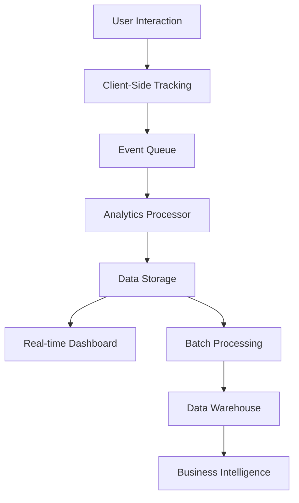

# Analytics System for Product Views and Interactions

## Overview

This document outlines the implementation of a comprehensive analytics system to track product views and user interactions for the financial product platform. The system will capture detailed metrics on how users engage with products, enabling data-driven decisions and personalization.

## Analytics Requirements

### 1. Tracking Goals
- **User Behavior**: Understand how users navigate and interact with products
- **Product Performance**: Measure which products are most popular
- **Conversion Tracking**: Monitor user journeys from view to application
- **Personalization**: Collect data to improve product recommendations
- **Business Insights**: Provide actionable metrics for business decisions

### 2. Key Metrics to Track
- **Product Views**: Number of times each product is viewed
- **Product Clicks**: Number of clicks on product cards/details
- **Time on Product Page**: How long users spend viewing product details
- **Filter Usage**: Which filters are used most frequently
- **Search Queries**: What users search for
- **Comparison Actions**: Products added to comparison
- **Application Starts**: Number of application initiations
- **Conversion Rates**: Percentage of views that lead to applications
- **User Paths**: Navigation patterns through the site
- **Device/Platform Usage**: How users access the platform

## System Architecture

### 1. Analytics Pipeline



### 2. Data Flow

1. **Event Collection**: Client-side tracking captures user interactions
2. **Event Queue**: Events are queued for reliable delivery
3. **Analytics Processing**: Events are processed and validated
4. **Data Storage**: Events are stored in appropriate databases
5. **Real-time Dashboard**: Live metrics for monitoring
6. **Batch Processing**: Aggregated data for reporting
7. **Data Warehouse**: Long-term storage for analysis
8. **Business Intelligence**: Insights and reports

## Backend Implementation

### 1. Analytics Service

```typescript
// backend/src/services/AnalyticsService.ts
import { Pool } from 'pg';
import { createHash } from 'crypto';

interface AnalyticsEvent {
  id: string;
  userId?: string;
  sessionId: string;
  eventType: string;
  eventData: Record<string, any>;
  timestamp: Date;
  userAgent?: string;
  ipAddress?: string;
  url?: string;
  referrer?: string;
}

interface ProductViewEvent {
  productId: string;
  category: string;
  segment: string;
  source: string; // 'listing', 'search', 'recommendation', etc.
}

interface ProductClickEvent {
  productId: string;
  action: string; // 'view_details', 'compare', 'apply'
  position?: number; // Position in listing
}

interface SearchEvent {
  query: string;
  resultCount: number;
  filtersApplied: Record<string, any>;
}

interface FilterEvent {
  filterType: string;
  filterValue: any;
  category?: string;
}

interface ConversionEvent {
  productId: string;
  conversionType: string; // 'application_started', 'application_completed'
  value?: number; // Monetary value if applicable
}

class AnalyticsService {
  private db: Pool;
  private eventQueue: AnalyticsEvent[] = [];
  private flushInterval: NodeJS.Timeout;

  constructor(db: Pool) {
    this.db = db;
    
    // Flush events every 5 seconds
    this.flushInterval = setInterval(() => {
      this.flushEvents();
    }, 5000);
  }

  /**
   * Track product view
   */
  async trackProductView(event: ProductViewEvent, context: any): Promise<void> {
    const analyticsEvent: AnalyticsEvent = {
      id: this.generateEventId(),
      userId: context.userId,
      sessionId: context.sessionId,
      eventType: 'product_view',
      eventData: event,
      timestamp: new Date(),
      userAgent: context.userAgent,
      ipAddress: context.ipAddress,
      url: context.url,
      referrer: context.referrer
    };

    await this.enqueueEvent(analyticsEvent);
    
    // Update product metrics in analytics table
    await this.updateProductMetrics(event.productId, {
      views: 1
    });
  }

  /**
   * Track product click
   */
  async trackProductClick(event: ProductClickEvent, context: any): Promise<void> {
    const analyticsEvent: AnalyticsEvent = {
      id: this.generateEventId(),
      userId: context.userId,
      sessionId: context.sessionId,
      eventType: 'product_click',
      eventData: event,
      timestamp: new Date(),
      userAgent: context.userAgent,
      ipAddress: context.ipAddress,
      url: context.url,
      referrer: context.referrer
    };

    await this.enqueueEvent(analyticsEvent);
    
    // Update product metrics
    const metricUpdate: Record<string, number> = {};
    if (event.action === 'view_details') {
      metricUpdate.clicks = 1;
    } else if (event.action === 'compare') {
      metricUpdate.comparisons = 1;
    } else if (event.action === 'apply') {
      metricUpdate.applications = 1;
    }
    
    await this.updateProductMetrics(event.productId, metricUpdate);
  }

  /**
   * Track search
   */
  async trackSearch(event: SearchEvent, context: any): Promise<void> {
    const analyticsEvent: AnalyticsEvent = {
      id: this.generateEventId(),
      userId: context.userId,
      sessionId: context.sessionId,
      eventType: 'search',
      eventData: event,
      timestamp: new Date(),
      userAgent: context.userAgent,
      ipAddress: context.ipAddress,
      url: context.url,
      referrer: context.referrer
    };

    await this.enqueueEvent(analyticsEvent);
  }

  /**
   * Track filter usage
   */
  async trackFilter(event: FilterEvent, context: any): Promise<void> {
    const analyticsEvent: AnalyticsEvent = {
      id: this.generateEventId(),
      userId: context.userId,
      sessionId: context.sessionId,
      eventType: 'filter',
      eventData: event,
      timestamp: new Date(),
      userAgent: context.userAgent,
      ipAddress: context.ipAddress,
      url: context.url,
      referrer: context.referrer
    };

    await this.enqueueEvent(analyticsEvent);
  }

  /**
   * Track conversion
   */
  async trackConversion(event: ConversionEvent, context: any): Promise<void> {
    const analyticsEvent: AnalyticsEvent = {
      id: this.generateEventId(),
      userId: context.userId,
      sessionId: context.sessionId,
      eventType: 'conversion',
      eventData: event,
      timestamp: new Date(),
      userAgent: context.userAgent,
      ipAddress: context.ipAddress,
      url: context.url,
      referrer: context.referrer
    };

    await this.enqueueEvent(analyticsEvent);
    
    // Update product metrics
    const metricUpdate: Record<string, number> = {};
    if (event.conversionType === 'application_started') {
      metricUpdate.application_starts = 1;
    } else if (event.conversionType === 'application_completed') {
      metricUpdate.application_completions = 1;
      if (event.value) {
        metricUpdate.revenue = event.value;
      }
    }
    
    await this.updateProductMetrics(event.productId, metricUpdate);
  }

  /**
   * Get product metrics
   */
  async getProductMetrics(productIds: string[]): Promise<any[]> {
    if (productIds.length === 0) return [];
    
    const placeholders = productIds.map((_, index) => `$${index + 1}`).join(',');
    const query = `
      SELECT 
        product_id,
        views,
        clicks,
        comparisons,
        applications,
        application_starts,
        application_completions,
        revenue,
        last_updated
      FROM analytics.product_metrics
      WHERE product_id IN (${placeholders})
    `;
    
    const result = await this.db.query(query, productIds);
    return result.rows;
  }

  /**
   * Get product analytics
   */
  async getProductAnalytics(options: {
    startDate: Date;
    endDate: Date;
    productId?: string;
    category?: string;
  }): Promise<any> {
    let query = `
      SELECT 
        p.id as product_id,
        p.name as product_name,
        c.name as category_name,
        SUM(pm.views) as total_views,
        SUM(pm.clicks) as total_clicks,
        SUM(pm.applications) as total_applications,
        SUM(pm.revenue) as total_revenue,
        AVG(pm.views) as avg_daily_views,
        AVG(pm.clicks) as avg_daily_clicks
      FROM analytics.product_metrics pm
      JOIN financial.products p ON pm.product_id = p.id
      JOIN financial.product_categories c ON p.category_id = c.id
      WHERE pm.metric_date BETWEEN $1 AND $2
    `;
    
    const params: any[] = [options.startDate, options.endDate];
    let paramIndex = 3;
    
    if (options.productId) {
      query += ` AND p.id = $${paramIndex}`;
      params.push(options.productId);
      paramIndex++;
    }
    
    if (options.category) {
      query += ` AND c.slug = $${paramIndex}`;
      params.push(options.category);
      paramIndex++;
    }
    
    query += `
      GROUP BY p.id, p.name, c.name
      ORDER BY total_views DESC
      LIMIT 100
    `;
    
    const result = await this.db.query(query, params);
    return result.rows;
  }

  /**
   * Get user analytics
   */
  async getUserAnalytics(options: {
    startDate: Date;
    endDate: Date;
  }): Promise<any> {
    const query = `
      SELECT 
        DATE(ae.timestamp) as date,
        COUNT(DISTINCT ae.user_id) as unique_users,
        COUNT(DISTINCT ae.session_id) as sessions,
        COUNT(*) as total_events,
        COUNT(CASE WHEN ae.event_type = 'product_view' THEN 1 END) as product_views,
        COUNT(CASE WHEN ae.event_type = 'product_click' THEN 1 END) as product_clicks,
        COUNT(CASE WHEN ae.event_type = 'conversion' THEN 1 END) as conversions
      FROM analytics.events ae
      WHERE ae.timestamp BETWEEN $1 AND $2
      GROUP BY DATE(ae.timestamp)
      ORDER BY date
    `;
    
    const result = await this.db.query(query, [options.startDate, options.endDate]);
    return result.rows;
  }

  /**
   * Get revenue analytics
   */
  async getRevenueAnalytics(options: {
    startDate: Date;
    endDate: Date;
  }): Promise<any> {
    const query = `
      SELECT 
        DATE(pm.metric_date) as date,
        SUM(pm.revenue) as daily_revenue,
        SUM(pm.application_completions) as daily_applications,
        AVG(pm.revenue / NULLIF(pm.application_completions, 0)) as avg_revenue_per_application
      FROM analytics.product_metrics pm
      WHERE pm.metric_date BETWEEN $1 AND $2
      GROUP BY DATE(pm.metric_date)
      ORDER BY date
    `;
    
    const result = await this.db.query(query, [options.startDate, options.endDate]);
    return result.rows;
  }

  /**
   * Log audit event
   */
  async logAuditEvent(event: {
    userId?: string;
    action: string;
    resourceId?: string;
    resourceType: string;
    details?: any;
  }): Promise<void> {
    const query = `
      INSERT INTO compliance.audit_log (
        event_type,
        event_category,
        event_description,
        user_id,
        resource_type,
        resource_id,
        request_data,
        created_at
      ) VALUES ($1, $2, $3, $4, $5, $6, $7, NOW())
    `;
    
    await this.db.query(query, [
      event.action,
      'user_action',
      `User ${event.userId} performed ${event.action} on ${event.resourceType}`,
      event.userId,
      event.resourceType,
      event.resourceId,
      event.details ? JSON.stringify(event.details) : null
    ]);
  }

  /**
   * Generate unique event ID
   */
  private generateEventId(): string {
    return createHash('sha256')
      .update(Date.now().toString() + Math.random().toString())
      .digest('hex');
  }

  /**
   * Add event to queue
   */
  private async enqueueEvent(event: AnalyticsEvent): Promise<void> {
    this.eventQueue.push(event);
    
    // Flush immediately if queue is large
    if (this.eventQueue.length >= 50) {
      await this.flushEvents();
    }
  }

  /**
   * Flush events to database
   */
  private async flushEvents(): Promise<void> {
    if (this.eventQueue.length === 0) return;
    
    const eventsToFlush = [...this.eventQueue];
    this.eventQueue = [];
    
    try {
      const client = await this.db.connect();
      
      try {
        await client.query('BEGIN');
        
        for (const event of eventsToFlush) {
          const query = `
            INSERT INTO analytics.events (
              id, user_id, session_id, event_type, event_data,
              timestamp, user_agent, ip_address, url, referrer
            ) VALUES ($1, $2, $3, $4, $5, $6, $7, $8, $9, $10)
          `;
          
          await client.query(query, [
            event.id,
            event.userId,
            event.sessionId,
            event.eventType,
            JSON.stringify(event.eventData),
            event.timestamp,
            event.userAgent,
            event.ipAddress,
            event.url,
            event.referrer
          ]);
        }
        
        await client.query('COMMIT');
        console.log(`Flushed ${eventsToFlush.length} events to database`);
      } catch (error) {
        await client.query('ROLLBACK');
        // Re-add events to queue for retry
        this.eventQueue.unshift(...eventsToFlush);
        throw error;
      } finally {
        client.release();
      }
    } catch (error) {
      console.error('Failed to flush analytics events:', error);
    }
  }

  /**
   * Update product metrics
   */
  private async updateProductMetrics(
    productId: string, 
    updates: Record<string, number>
  ): Promise<void> {
    const today = new Date().toISOString().split('T')[0];
    
    // Build dynamic update query
    const updateFields = Object.keys(updates).map((field, index) => 
      `${field} = ${field} + $${index + 3}`
    ).join(', ');
    
    const query = `
      INSERT INTO analytics.product_metrics (
        product_id, metric_date, ${Object.keys(updates).join(', ')}
      ) VALUES ($1, $2, ${Object.values(updates).map((_, index) => `$${index + 3}`).join(', ')})
      ON CONFLICT (product_id, metric_date)
      DO UPDATE SET ${updateFields}
    `;
    
    const params = [
      productId,
      today,
      ...Object.values(updates)
    ];
    
    await this.db.query(query, params);
  }

  /**
   * Shutdown analytics service
   */
  async shutdown(): Promise<void> {
    if (this.flushInterval) {
      clearInterval(this.flushInterval);
    }
    
    // Flush remaining events
    await this.flushEvents();
  }
}

export { AnalyticsService, AnalyticsEvent, ProductViewEvent, ProductClickEvent, SearchEvent, FilterEvent, ConversionEvent };
```

### 2. Analytics Database Schema

```sql
-- Create analytics schema
CREATE SCHEMA IF NOT EXISTS analytics;

-- Events table for raw event data
CREATE TABLE analytics.events (
    id UUID PRIMARY KEY DEFAULT uuid_generate_v4(),
    
    -- Event information
    event_type VARCHAR(50) NOT NULL,
    event_category VARCHAR(50),
    event_data JSONB,
    
    -- User information
    user_id UUID,
    session_id UUID NOT NULL,
    
    -- Context information
    timestamp TIMESTAMP WITH TIME ZONE DEFAULT NOW(),
    user_agent TEXT,
    ip_address INET,
    url VARCHAR(500),
    referrer VARCHAR(500),
    
    -- Metadata
    created_at TIMESTAMP WITH TIME ZONE DEFAULT NOW()
);

-- Product metrics table for aggregated data
CREATE TABLE analytics.product_metrics (
    id UUID PRIMARY KEY DEFAULT uuid_generate_v4(),
    product_id UUID NOT NULL REFERENCES financial.products(id),
    metric_date DATE NOT NULL,
    
    -- View metrics
    views INTEGER DEFAULT 0,
    clicks INTEGER DEFAULT 0,
    comparisons INTEGER DEFAULT 0,
    applications INTEGER DEFAULT 0,
    
    -- Conversion metrics
    application_starts INTEGER DEFAULT 0,
    application_completions INTEGER DEFAULT 0,
    revenue DECIMAL(15,2) DEFAULT 0,
    
    -- Metadata
    created_at TIMESTAMP WITH TIME ZONE DEFAULT NOW(),
    updated_at TIMESTAMP WITH TIME ZONE DEFAULT NOW(),
    
    UNIQUE(product_id, metric_date)
);

-- User metrics table
CREATE TABLE analytics.user_metrics (
    id UUID PRIMARY KEY DEFAULT uuid_generate_v4(),
    user_id UUID REFERENCES core.users(id),
    metric_date DATE NOT NULL,
    
    -- Engagement metrics
    sessions INTEGER DEFAULT 0,
    page_views INTEGER DEFAULT 0,
    time_on_site INTEGER DEFAULT 0, -- in seconds
    
    -- Device metrics
    desktop_views INTEGER DEFAULT 0,
    mobile_views INTEGER DEFAULT 0,
    tablet_views INTEGER DEFAULT 0,
    
    -- Geographic metrics
    country VARCHAR(2),
    region VARCHAR(100),
    
    -- Metadata
    created_at TIMESTAMP WITH TIME ZONE DEFAULT NOW(),
    updated_at TIMESTAMP WITH TIME ZONE DEFAULT NOW(),
    
    UNIQUE(user_id, metric_date)
);

-- Search metrics table
CREATE TABLE analytics.search_metrics (
    id UUID PRIMARY KEY DEFAULT uuid_generate_v4(),
    query TEXT NOT NULL,
    metric_date DATE NOT NULL,
    
    -- Search metrics
    search_count INTEGER DEFAULT 0,
    result_count INTEGER DEFAULT 0,
    click_through_rate DECIMAL(5,4) DEFAULT 0,
    
    -- Filter metrics
    filters_applied JSONB,
    
    -- Metadata
    created_at TIMESTAMP WITH TIME ZONE DEFAULT NOW(),
    updated_at TIMESTAMP WITH TIME ZONE DEFAULT NOW(),
    
    UNIQUE(query, metric_date)
);

-- Indexes for performance
CREATE INDEX idx_events_timestamp ON analytics.events(timestamp);
CREATE INDEX idx_events_user_id ON analytics.events(user_id);
CREATE INDEX idx_events_event_type ON analytics.events(event_type);
CREATE INDEX idx_events_session_id ON analytics.events(session_id);

CREATE INDEX idx_product_metrics_product_id ON analytics.product_metrics(product_id);
CREATE INDEX idx_product_metrics_date ON analytics.product_metrics(metric_date);
CREATE INDEX idx_product_metrics_views ON analytics.product_metrics(views DESC);

CREATE INDEX idx_user_metrics_user_id ON analytics.user_metrics(user_id);
CREATE INDEX idx_user_metrics_date ON analytics.user_metrics(metric_date);

CREATE INDEX idx_search_metrics_query ON analytics.search_metrics(query);
CREATE INDEX idx_search_metrics_date ON analytics.search_metrics(metric_date);

-- Function to update updated_at timestamp
CREATE OR REPLACE FUNCTION update_updated_at_column()
RETURNS TRIGGER AS $$
BEGIN
    NEW.updated_at = NOW();
    RETURN NEW;
END;
$$ LANGUAGE plpgsql;

-- Triggers for updated_at
CREATE TRIGGER update_product_metrics_updated_at 
BEFORE UPDATE ON analytics.product_metrics 
FOR EACH ROW EXECUTE FUNCTION update_updated_at_column();

CREATE TRIGGER update_user_metrics_updated_at 
BEFORE UPDATE ON analytics.user_metrics 
FOR EACH ROW EXECUTE FUNCTION update_updated_at_column();

CREATE TRIGGER update_search_metrics_updated_at 
BEFORE UPDATE ON analytics.search_metrics 
FOR EACH ROW EXECUTE FUNCTION update_updated_at_column();
```

### 3. Analytics Controller

```typescript
// backend/src/controllers/AnalyticsController.ts
import { Request, Response } from 'express';
import { AnalyticsService } from '../services/AnalyticsService';

class AnalyticsController {
  private analyticsService: AnalyticsService;

  constructor(analyticsService: AnalyticsService) {
    this.analyticsService = analyticsService;
  }

  /**
   * Track product view
   */
  async trackProductView(req: Request, res: Response) {
    try {
      const { productId, category, segment, source } = req.body;
      
      await this.analyticsService.trackProductView(
        { productId, category, segment, source },
        {
          userId: req.user?.id,
          sessionId: req.session?.id,
          userAgent: req.get('User-Agent'),
          ipAddress: req.ip,
          url: req.originalUrl,
          referrer: req.get('Referer')
        }
      );

      res.status(200).json({ message: 'Product view tracked' });
    } catch (error) {
      res.status(500).json({
        error: 'Failed to track product view',
        message: error instanceof Error ? error.message : 'Unknown error'
      });
    }
  }

  /**
   * Track product click
   */
  async trackProductClick(req: Request, res: Response) {
    try {
      const { productId, action, position } = req.body;
      
      await this.analyticsService.trackProductClick(
        { productId, action, position },
        {
          userId: req.user?.id,
          sessionId: req.session?.id,
          userAgent: req.get('User-Agent'),
          ipAddress: req.ip,
          url: req.originalUrl,
          referrer: req.get('Referer')
        }
      );

      res.status(200).json({ message: 'Product click tracked' });
    } catch (error) {
      res.status(500).json({
        error: 'Failed to track product click',
        message: error instanceof Error ? error.message : 'Unknown error'
      });
    }
  }

  /**
   * Track search
   */
  async trackSearch(req: Request, res: Response) {
    try {
      const { query, resultCount, filtersApplied } = req.body;
      
      await this.analyticsService.trackSearch(
        { query, resultCount, filtersApplied },
        {
          userId: req.user?.id,
          sessionId: req.session?.id,
          userAgent: req.get('User-Agent'),
          ipAddress: req.ip,
          url: req.originalUrl,
          referrer: req.get('Referer')
        }
      );

      res.status(200).json({ message: 'Search tracked' });
    } catch (error) {
      res.status(500).json({
        error: 'Failed to track search',
        message: error instanceof Error ? error.message : 'Unknown error'
      });
    }
  }

  /**
   * Track filter usage
   */
  async trackFilter(req: Request, res: Response) {
    try {
      const { filterType, filterValue, category } = req.body;
      
      await this.analyticsService.trackFilter(
        { filterType, filterValue, category },
        {
          userId: req.user?.id,
          sessionId: req.session?.id,
          userAgent: req.get('User-Agent'),
          ipAddress: req.ip,
          url: req.originalUrl,
          referrer: req.get('Referer')
        }
      );

      res.status(200).json({ message: 'Filter usage tracked' });
    } catch (error) {
      res.status(500).json({
        error: 'Failed to track filter usage',
        message: error instanceof Error ? error.message : 'Unknown error'
      });
    }
  }

  /**
   * Track conversion
   */
  async trackConversion(req: Request, res: Response) {
    try {
      const { productId, conversionType, value } = req.body;
      
      await this.analyticsService.trackConversion(
        { productId, conversionType, value },
        {
          userId: req.user?.id,
          sessionId: req.session?.id,
          userAgent: req.get('User-Agent'),
          ipAddress: req.ip,
          url: req.originalUrl,
          referrer: req.get('Referer')
        }
      );

      res.status(200).json({ message: 'Conversion tracked' });
    } catch (error) {
      res.status(500).json({
        error: 'Failed to track conversion',
        message: error instanceof Error ? error.message : 'Unknown error'
      });
    }
  }

  /**
   * Get product metrics
   */
  async getProductMetrics(req: Request, res: Response) {
    try {
      const { productIds } = req.query;
      
      if (!productIds || !Array.isArray(productIds)) {
        return res.status(400).json({ error: 'Invalid product IDs' });
      }
      
      const metrics = await this.analyticsService.getProductMetrics(productIds as string[]);
      
      res.json({
        data: metrics
      });
    } catch (error) {
      res.status(500).json({
        error: 'Failed to retrieve product metrics',
        message: error instanceof Error ? error.message : 'Unknown error'
      });
    }
  }

  /**
   * Get product analytics
   */
  async getProductAnalytics(req: Request, res: Response) {
    try {
      const { 
        startDate = new Date(Date.now() - 30 * 24 * 60 * 60 * 1000).toISOString(),
        endDate = new Date().toISOString(),
        productId,
        category
      } = req.query;

      const analytics = await this.analyticsService.getProductAnalytics({
        startDate: new Date(startDate as string),
        endDate: new Date(endDate as string),
        productId: productId as string,
        category: category as string
      });

      res.json({
        data: analytics
      });
    } catch (error) {
      res.status(500).json({
        error: 'Failed to retrieve product analytics',
        message: error instanceof Error ? error.message : 'Unknown error'
      });
    }
  }

  /**
   * Get user analytics
   */
  async getUserAnalytics(req: Request, res: Response) {
    try {
      const { 
        startDate = new Date(Date.now() - 30 * 24 * 60 * 60 * 1000).toISOString(),
        endDate = new Date().toISOString()
      } = req.query;

      const analytics = await this.analyticsService.getUserAnalytics({
        startDate: new Date(startDate as string),
        endDate: new Date(endDate as string)
      });

      res.json({
        data: analytics
      });
    } catch (error) {
      res.status(500).json({
        error: 'Failed to retrieve user analytics',
        message: error instanceof Error ? error.message : 'Unknown error'
      });
    }
  }

  /**
   * Get revenue analytics
   */
  async getRevenueAnalytics(req: Request, res: Response) {
    try {
      const { 
        startDate = new Date(Date.now() - 30 * 24 * 60 * 60 * 1000).toISOString(),
        endDate = new Date().toISOString()
      } = req.query;

      const analytics = await this.analyticsService.getRevenueAnalytics({
        startDate: new Date(startDate as string),
        endDate: new Date(endDate as string)
      });

      res.json({
        data: analytics
      });
    } catch (error) {
      res.status(500).json({
        error: 'Failed to retrieve revenue analytics',
        message: error instanceof Error ? error.message : 'Unknown error'
      });
    }
  }
}

export { AnalyticsController };
```

## Frontend Implementation

### 1. Analytics Tracking Hook

```typescript
// src/hooks/useAnalytics.ts
import { useEffect, useCallback } from 'react';
import { usePathname, useSearchParams } from 'next/navigation';

interface AnalyticsContext {
  userId?: string;
  sessionId: string;
  userAgent: string;
  ipAddress?: string;
  url: string;
  referrer?: string;
}

class AnalyticsTracker {
  private sessionId: string;
  private eventQueue: any[] = [];
  private flushInterval: NodeJS.Timeout;

  constructor() {
    // Generate session ID
    this.sessionId = this.generateSessionId();
    
    // Flush events every 5 seconds
    this.flushInterval = setInterval(() => {
      this.flushEvents();
    }, 5000);
  }

  /**
   * Track product view
   */
  trackProductView(productId: string, category: string, segment: string, source: string) {
    this.enqueueEvent({
      type: 'product_view',
      data: { productId, category, segment, source },
      timestamp: Date.now()
    });
  }

  /**
   * Track product click
   */
  trackProductClick(productId: string, action: string, position?: number) {
    this.enqueueEvent({
      type: 'product_click',
      data: { productId, action, position },
      timestamp: Date.now()
    });
  }

  /**
   * Track search
   */
  trackSearch(query: string, resultCount: number, filtersApplied: Record<string, any>) {
    this.enqueueEvent({
      type: 'search',
      data: { query, resultCount, filtersApplied },
      timestamp: Date.now()
    });
  }

  /**
   * Track filter usage
   */
  trackFilter(filterType: string, filterValue: any, category?: string) {
    this.enqueueEvent({
      type: 'filter',
      data: { filterType, filterValue, category },
      timestamp: Date.now()
    });
  }

  /**
   * Track conversion
   */
  trackConversion(productId: string, conversionType: string, value?: number) {
    this.enqueueEvent({
      type: 'conversion',
      data: { productId, conversionType, value },
      timestamp: Date.now()
    });
  }

  /**
   * Track page view
   */
  trackPageView(path: string, title: string) {
    this.enqueueEvent({
      type: 'page_view',
      data: { path, title },
      timestamp: Date.now()
    });
  }

  /**
   * Track custom event
   */
  trackEvent(eventName: string, eventData: Record<string, any>) {
    this.enqueueEvent({
      type: 'custom_event',
      data: { eventName, ...eventData },
      timestamp: Date.now()
    });
  }

  /**
   * Generate session ID
   */
  private generateSessionId(): string {
    return 'session_' + Date.now() + '_' + Math.random().toString(36).substr(2, 9);
  }

  /**
   * Enqueue event for sending
   */
  private enqueueEvent(event: any) {
    const context: AnalyticsContext = {
      sessionId: this.sessionId,
      userAgent: navigator.userAgent,
      url: window.location.href,
      referrer: document.referrer
    };

    this.eventQueue.push({
      ...event,
      context,
      id: this.generateEventId()
    });

    // Flush immediately if queue is large
    if (this.eventQueue.length >= 10) {
      this.flushEvents();
    }
  }

  /**
   * Flush events to backend
   */
  private async flushEvents() {
    if (this.eventQueue.length === 0) return;

    const eventsToFlush = [...this.eventQueue];
    this.eventQueue = [];

    try {
      const response = await fetch('/api/analytics/events', {
        method: 'POST',
        headers: {
          'Content-Type': 'application/json',
        },
        body: JSON.stringify({ events: eventsToFlush })
      });

      if (!response.ok) {
        // Re-add events to queue for retry
        this.eventQueue.unshift(...eventsToFlush);
        throw new Error('Failed to send analytics events');
      }

      console.log(`Sent ${eventsToFlush.length} analytics events`);
    } catch (error) {
      console.error('Failed to send analytics events:', error);
      // Re-add events to queue for retry
      this.eventQueue.unshift(...eventsToFlush);
    }
  }

  /**
   * Generate event ID
   */
  private generateEventId(): string {
    return Date.now().toString(36) + Math.random().toString(36).substr(2);
  }

  /**
   * Cleanup
   */
  cleanup() {
    if (this.flushInterval) {
      clearInterval(this.flushInterval);
    }
    // Flush remaining events
    this.flushEvents();
  }
}

// Create singleton instance
const analyticsTracker = new AnalyticsTracker();

// Export hook for React components
export function useAnalytics() {
  const pathname = usePathname();
  const searchParams = useSearchParams();

  // Track page views
  useEffect(() => {
    const title = document.title;
    analyticsTracker.trackPageView(pathname, title);
  }, [pathname, searchParams]);

  // Return tracking functions
  return {
    trackProductView: analyticsTracker.trackProductView.bind(analyticsTracker),
    trackProductClick: analyticsTracker.trackProductClick.bind(analyticsTracker),
    trackSearch: analyticsTracker.trackSearch.bind(analyticsTracker),
    trackFilter: analyticsTracker.trackFilter.bind(analyticsTracker),
    trackConversion: analyticsTracker.trackConversion.bind(analyticsTracker),
    trackEvent: analyticsTracker.trackEvent.bind(analyticsTracker)
  };
}

// Cleanup on unload
if (typeof window !== 'undefined') {
  window.addEventListener('beforeunload', () => {
    analyticsTracker.cleanup();
  });
}
```

### 2. Product Analytics Integration

```tsx
// src/components/products/ProductCard.tsx (updated with analytics)
'use client';

import Link from 'next/link';
import Image from 'next/image';
import type { FinancialProduct } from '@/types';
import { Button } from '@/components/ui/button';
import { Card, CardContent, CardDescription, CardFooter, CardHeader, CardTitle } from '@/components/ui/card';
import { Star, Tag, Users, Briefcase, PlusCircle, MinusCircle } from 'lucide-react';
import { Badge } from '@/components/ui/badge';
import { useCompare } from '@/contexts/CompareContext';
import { useAnalytics } from '@/hooks/useAnalytics';
import { useEffect } from 'react';

interface ProductCardProps {
  product: FinancialProduct;
  position?: number; // Position in listing
  source?: string; // Source of the product display
}

export default function ProductCard({ product, position, source = 'listing' }: ProductCardProps) {
  const { addToCompare, removeFromCompare, isInCompare } = useCompare();
  const isComparing = isInCompare(product.id);
  const { trackProductView, trackProductClick } = useAnalytics();

  // Track product view when component mounts
  useEffect(() => {
    trackProductView(product.id, product.category, product.segment, source);
  }, [product.id, product.category, product.segment, source, trackProductView]);

  const handleCompareClick = (e: React.MouseEvent) => {
    e.preventDefault();
    e.stopPropagation();
    
    if (isComparing) {
      removeFromCompare(product.id);
      trackProductClick(product.id, 'remove_from_compare', position);
    } else {
      addToCompare(product);
      trackProductClick(product.id, 'add_to_compare', position);
    }
  };
  
  const averageRating = product.averageRating || 0;

  return (
    <Card className="h-full flex flex-col overflow-hidden shadow-lg hover:shadow-xl transition-all duration-300 ease-in-out transform hover:-translate-y-1">
      <Link 
        href={`/products/${product.id}`} 
        className="flex flex-col h-full"
        onClick={() => trackProductClick(product.id, 'view_details', position)}
      >
        <CardHeader className="p-0 relative">
          <Image
            src={product.imageUrl}
            alt={product.name}
            width={400}
            height={200}
            className="object-cover w-full h-48"
            data-ai-hint={product.aiHint || product.category.toLowerCase()}
          />
          <div className="absolute top-2 right-2 flex space-x-1">
            <Badge variant={product.segment === 'Individual' ? 'secondary' : 'outline'} className="bg-opacity-80 backdrop-blur-sm">
              {product.segment === 'Individual' ? <Users className="h-3 w-3 mr-1" /> : <Briefcase className="h-3 w-3 mr-1" />}
              {product.segment}
            </Badge>
          </div>
        </CardHeader>
        <CardContent className="p-4 flex-grow">
          <Badge variant="default" className="mb-2 text-sm py-1 px-2.5 bg-accent text-accent-foreground">
            <Tag className="h-3.5 w-3.5 mr-1.5" />
            {product.category}
          </Badge>
          <CardTitle className="font-headline text-xl mb-1 leading-tight text-primary group-hover:text-accent transition-colors">
            {product.name}
          </CardTitle>
          <CardDescription className="text-sm text-foreground/70 mb-2 line-clamp-2">
            {product.tagline}
          </CardDescription>
          <div className="flex items-center text-sm text-muted-foreground">
            {Array.from({ length: 5 }, (_, i) => (
              <Star
                key={i}
                className={`h-4 w-4 ${i < Math.round(averageRating) ? 'fill-yellow-400 text-yellow-400' : 'text-gray-300'}`}
              />
            ))}
            <span className="ml-1.5">{averageRating.toFixed(1)} ({product.reviewCount} reviews)</span>
          </div>
        </CardContent>
        <CardFooter className="p-4 pt-0 border-t mt-auto">
          <div className="flex justify-between items-center w-full">
            <Button variant="ghost" size="sm" asChild className="text-primary hover:text-accent hover:bg-accent/10">
              <span>View Details</span> 
            </Button>
            <Button
              variant={isComparing ? "secondary" : "outline"}
              size="sm"
              onClick={handleCompareClick}
              aria-label={isComparing ? `Remove ${product.name} from comparison` : `Add ${product.name} to comparison`}
              className="transition-all"
            >
              {isComparing ? <MinusCircle className="h-4 w-4 mr-1.5" /> : <PlusCircle className="h-4 w-4 mr-1.5" />}
              {isComparing ? 'Comparing' : 'Compare'}
            </Button>
          </div>
        </CardFooter>
      </Link>
    </Card>
  );
}
```

### 3. Search Analytics Integration

```tsx
// src/components/products/ProductSearch.tsx (updated with analytics)
'use client';

import React, { useState, useEffect, useRef, useCallback } from 'react';
import { Input } from '@/components/ui/input';
import { Button } from '@/components/ui/button';
import { Search, X } from 'lucide-react';
import { useDebounce } from '@/hooks/useDebounce';
import { useAnalytics } from '@/hooks/useAnalytics';
import { productService } from '@/services/productService';

interface ProductSearchProps {
  onSearch: (term: string) => void;
  initialTerm?: string;
  placeholder?: string;
}

export default function ProductSearch({ onSearch, initialTerm = '', placeholder = 'Buscar productos...' }: ProductSearchProps) {
  const [searchTerm, setSearchTerm] = useState(initialTerm);
  const [suggestions, setSuggestions] = useState<any[]>([]);
  const [showSuggestions, setShowSuggestions] = useState(false);
  const debouncedSearchTerm = useDebounce(searchTerm, 300);
  const inputRef = useRef<HTMLInputElement>(null);
  const { trackSearch, trackEvent } = useAnalytics();

  // Fetch search suggestions
  useEffect(() => {
    if (debouncedSearchTerm.length > 2) {
      const fetchSuggestions = async () => {
        try {
          const result = await productService.searchProducts(debouncedSearchTerm, undefined, undefined, 1, 5);
          setSuggestions(result.data);
          setShowSuggestions(true);
          
          // Track search suggestion view
          trackEvent('search_suggestions_shown', {
            query: debouncedSearchTerm,
            suggestionCount: result.data.length
          });
        } catch (error) {
          console.error('Failed to fetch search suggestions:', error);
        }
      };

      fetchSuggestions();
    } else {
      setSuggestions([]);
      setShowSuggestions(false);
    }
  }, [debouncedSearchTerm, trackEvent]);

  // Handle search submission
  const handleSearch = useCallback((term: string) => {
    setSearchTerm(term);
    onSearch(term);
    
    if (term.trim()) {
      // Track search event
      trackSearch(term, suggestions.length, {});
    }
  }, [onSearch, suggestions.length, trackSearch]);

  // Handle suggestion click
  const handleSuggestionClick = (suggestion: any) => {
    handleSearch(suggestion.name);
    setShowSuggestions(false);
    
    // Track suggestion click
    trackEvent('search_suggestion_clicked', {
      query: searchTerm,
      suggestion: suggestion.name,
      productId: suggestion.id
    });
  };

  // Handle clear search
  const handleClear = () => {
    setSearchTerm('');
    onSearch('');
    setShowSuggestions(false);
    inputRef.current?.focus();
    
    // Track search clear
    trackEvent('search_cleared', {
      previousQuery: searchTerm
    });
  };

  // Handle key events
  const handleKeyDown = (e: React.KeyboardEvent) => {
    if (e.key === 'Escape') {
      setShowSuggestions(false);
    } else if (e.key === 'Enter') {
      handleSearch(searchTerm);
      setShowSuggestions(false);
    }
  };

  return (
    <div className="relative">
      <div className="relative">
        <Search className="absolute left-3 top-1/2 transform -translate-y-1/2 h-4 w-4 text-gray-400" />
        <Input
          ref={inputRef}
          type="text"
          placeholder={placeholder}
          value={searchTerm}
          onChange={(e) => setSearchTerm(e.target.value)}
          onKeyDown={handleKeyDown}
          onFocus={() => searchTerm.length > 2 && setSuggestions.length > 0 && setShowSuggestions(true)}
          className="pl-10 pr-10"
        />
        {searchTerm && (
          <Button
            type="button"
            variant="ghost"
            size="icon"
            className="absolute right-0 top-1/2 transform -translate-y-1/2 h-8 w-8 text-gray-400 hover:text-gray-600"
            onClick={handleClear}
          >
            <X className="h-4 w-4" />
          </Button>
        )}
      </div>

      {/* Search suggestions */}
      {showSuggestions && suggestions.length > 0 && (
        <div className="absolute z-10 w-full mt-1 bg-white border border-gray-200 rounded-md shadow-lg">
          <div className="py-1">
            {suggestions.map((suggestion) => (
              <button
                key={suggestion.id}
                type="button"
                className="w-full text-left px-4 py-2 text-sm hover:bg-gray-100 focus:bg-gray-100 focus:outline-none"
                onClick={() => handleSuggestionClick(suggestion)}
              >
                <div className="font-medium">{suggestion.name}</div>
                <div className="text-gray-500 text-xs">
                  {suggestion.institution?.name} • {suggestion.category?.name}
                </div>
              </button>
            ))}
          </div>
        </div>
      )}
    </div>
  );
}
```

### 4. Filter Analytics Integration

```tsx
// src/components/products/FilterPanel.tsx (updated with analytics)
'use client';

import React, { useState, useEffect } from 'react';
import { useFilters } from '@/contexts/FilterContext';
import { useAnalytics } from '@/hooks/useAnalytics';
import RangeSlider from '@/components/ui/range-slider';
import CheckboxGroup from '@/components/ui/checkbox-group';
import Select from '@/components/ui/select';
import SearchInput from '@/components/ui/search-input';

interface FilterPanelProps {
  categorySlug?: string;
  onFiltersChange?: () => void;
}

const FilterPanel: React.FC<FilterPanelProps> = ({ categorySlug, onFiltersChange }) => {
  const { availableFilters, activeFilters, addFilter, removeFilter, updateFilter } = useFilters();
  const [searchTerm, setSearchTerm] = useState('');
  const { trackFilter, trackEvent } = useAnalytics();

  // Filter available filters by category
  const categoryFilters = availableFilters.filter(filter => {
    if (!categorySlug) return true;
    // Implementation would filter by category
    return true;
  });

  const handleRangeChange = (slug: string, min: number, max: number) => {
    updateFilter({ slug, value: { min, max } });
    onFiltersChange?.();
    
    // Track range filter change
    trackFilter('range', { min, max }, categorySlug);
    trackEvent('filter_applied', {
      filterType: 'range',
      filterSlug: slug,
      value: { min, max }
    });
  };

  const handleBooleanChange = (slug: string, value: boolean) => {
    if (value) {
      addFilter({ slug, value });
    } else {
      removeFilter(slug);
    }
    onFiltersChange?.();
    
    // Track boolean filter change
    trackFilter('boolean', value, categorySlug);
    trackEvent('filter_applied', {
      filterType: 'boolean',
      filterSlug: slug,
      value
    });
  };

  const handleMultiSelectChange = (slug: string, values: string[]) => {
    if (values.length > 0) {
      addFilter({ slug, value: values });
    } else {
      removeFilter(slug);
    }
    onFiltersChange?.();
    
    // Track multi-select filter change
    trackFilter('multi_select', values, categorySlug);
    trackEvent('filter_applied', {
      filterType: 'multi_select',
      filterSlug: slug,
      value: values
    });
  };

  const handleSearchChange = (value: string) => {
    setSearchTerm(value);
    if (value) {
      addFilter({ slug: 'search', value });
    } else {
      removeFilter('search');
    }
    onFiltersChange?.();
    
    // Track search filter change
    trackFilter('search', value, categorySlug);
  };

  return (
    <div className="bg-white rounded-lg shadow p-6">
      <div className="mb-6">
        <h3 className="text-lg font-semibold mb-4">Filtros</h3>
        <SearchInput
          value={searchTerm}
          onChange={handleSearchChange}
          placeholder="Buscar productos..."
        />
      </div>

      {categoryFilters.map(filter => {
        switch (filter.type) {
          case 'range':
            const activeRangeFilter = activeFilters.find(f => f.slug === filter.slug);
            const rangeValue = activeRangeFilter?.value || { 
              min: filter.min_value, 
              max: filter.max_value 
            };
            
            return (
              <div key={filter.id} className="mb-6">
                <h4 className="font-medium mb-2">{filter.name}</h4>
                <RangeSlider
                  min={filter.min_value || 0}
                  max={filter.max_value || 100}
                  value={rangeValue}
                  onChange={(min, max) => handleRangeChange(filter.slug, min, max)}
                  unit={filter.unit}
                />
              </div>
            );

          case 'boolean':
            const activeBooleanFilter = activeFilters.find(f => f.slug === filter.slug);
            const booleanValue = activeBooleanFilter?.value || false;
            
            return (
              <div key={filter.id} className="mb-4">
                <CheckboxGroup
                  options={[{ value: 'true', label: filter.name }]}
                  selectedValues={booleanValue ? ['true'] : []}
                  onChange={(values) => handleBooleanChange(filter.slug, values.includes('true'))}
                />
              </div>
            );

          case 'multi_select':
            const activeMultiFilter = activeFilters.find(f => f.slug === filter.slug);
            const multiValues = activeMultiFilter?.value || [];
            
            return (
              <div key={filter.id} className="mb-6">
                <h4 className="font-medium mb-2">{filter.name}</h4>
                <CheckboxGroup
                  options={filter.options || []}
                  selectedValues={multiValues}
                  onChange={(values) => handleMultiSelectChange(filter.slug, values)}
                />
              </div>
            );

          case 'enum':
            const activeEnumFilter = activeFilters.find(f => f.slug === filter.slug);
            const enumValue = activeEnumFilter?.value || '';
            
            return (
              <div key={filter.id} className="mb-6">
                <h4 className="font-medium mb-2">{filter.name}</h4>
                <Select
                  options={filter.options || []}
                  value={enumValue}
                  onChange={(value) => {
                    if (value) {
                      addFilter({ slug: filter.slug, value });
                    } else {
                      removeFilter(filter.slug);
                    }
                    onFiltersChange?.();
                    
                    // Track enum filter change
                    trackFilter('enum', value, categorySlug);
                    trackEvent('filter_applied', {
                      filterType: 'enum',
                      filterSlug: filter.slug,
                      value
                    });
                  }}
                />
              </div>
            );

          default:
            return null;
        }
      })}

      <button
        onClick={() => {
          // Clear all filters
          // Implementation would clear filters
          trackEvent('filters_cleared', {
            category: categorySlug,
            filterCount: activeFilters.length
          });
        }}
        className="w-full py-2 px-4 border border-gray-300 rounded-md text-sm font-medium text-gray-700 hover:bg-gray-50"
      >
        Limpiar Filtros
      </button>
    </div>
  );
};

export default FilterPanel;
```

## Analytics Dashboard

### 1. Product Performance Dashboard

```tsx
// src/components/admin/ProductPerformanceDashboard.tsx
'use client';

import React, { useState, useEffect } from 'react';
import { BarChart, LineChart, PieChart } from '@/components/ui/chart';
import { Card, CardContent, CardDescription, CardHeader, CardTitle } from '@/components/ui/card';
import { Select, SelectContent, SelectItem, SelectTrigger, SelectValue } from '@/components/ui/select';
import { Button } from '@/components/ui/button';
import { 
  Calendar, 
  Download, 
  TrendingUp, 
  Users, 
  DollarSign,
  Eye,
  MousePointerClick,
  Shuffle
} from 'lucide-react';

interface ProductMetrics {
  productId: string;
  productName: string;
  views: number;
  clicks: number;
  comparisons: number;
  applications: number;
  conversionRate: number;
  revenue: number;
}

interface TimeSeriesData {
  date: string;
  views: number;
  clicks: number;
  conversions: number;
  revenue: number;
}

export default function ProductPerformanceDashboard() {
  const [timeRange, setTimeRange] = useState('30d');
  const [productMetrics, setProductMetrics] = useState<ProductMetrics[]>([]);
  const [timeSeriesData, setTimeSeriesData] = useState<TimeSeriesData[]>([]);
  const [loading, setLoading] = useState(true);

  useEffect(() => {
    // In a real app, you would fetch this data from your API
    // For now, we'll use mock data
    const mockProductMetrics: ProductMetrics[] = [
      { 
        productId: '1', 
        productName: 'Tarjeta Oro BBVA', 
        views: 12500, 
        clicks: 3200, 
        comparisons: 850,
        applications: 380,
        conversionRate: 11.9,
        revenue: 150000 
      },
      { 
        productId: '2', 
        productName: 'Préstamo Personal Flex', 
        views: 8900, 
        clicks: 2100, 
        comparisons: 620,
        applications: 240,
        conversionRate: 11.4,
        revenue: 89000 
      },
      { 
        productId: '3', 
        productName: 'Inversión Crecimiento', 
        views: 6500, 
        clicks: 1800, 
        comparisons: 450,
        applications: 180,
        conversionRate: 10.0,
        revenue: 120000 
      },
      { 
        productId: '4', 
        productName: 'Seguro Vida Temporal', 
        views: 4200, 
        clicks: 950, 
        comparisons: 280,
        applications: 95,
        conversionRate: 10.0,
        revenue: 45000 
      },
    ];

    const mockTimeSeriesData: TimeSeriesData[] = [
      { date: '2023-05-01', views: 12000, clicks: 3000, conversions: 380, revenue: 45000 },
      { date: '2023-05-02', views: 13500, clicks: 3400, conversions: 420, revenue: 52000 },
      { date: '2023-05-03', views: 11000, clicks: 2800, conversions: 350, revenue: 41000 },
      { date: '2023-05-04', views: 14500, clicks: 3800, conversions: 480, revenue: 58000 },
      { date: '2023-05-05', views: 16000, clicks: 4200, conversions: 520, revenue: 63000 },
    ];

    setProductMetrics(mockProductMetrics);
    setTimeSeriesData(mockTimeSeriesData);
    setLoading(false);
  }, [timeRange]);

  const totalViews = timeSeriesData.reduce((sum, data) => sum + data.views, 0);
  const totalClicks = timeSeriesData.reduce((sum, data) => sum + data.clicks, 0);
  const totalConversions = timeSeriesData.reduce((sum, data) => sum + data.conversions, 0);
  const totalRevenue = timeSeriesData.reduce((sum, data) => sum + data.revenue, 0);
  const conversionRate = totalClicks > 0 ? (totalConversions / totalClicks * 100) : 0;

  if (loading) {
    return (
      <div className="flex items-center justify-center h-64">
        <div className="animate-spin rounded-full h-12 w-12 border-b-2 border-gray-900"></div>
      </div>
    );
  }

  return (
    <div className="space-y-6">
      <div className="flex flex-col sm:flex-row sm:items-center sm:justify-between">
        <h1 className="text-2xl font-bold">Product Performance</h1>
        <div className="flex items-center space-x-2 mt-2 sm:mt-0">
          <Select value={timeRange} onValueChange={setTimeRange}>
            <SelectTrigger className="w-32">
              <SelectValue />
            </SelectTrigger>
            <SelectContent>
              <SelectItem value="7d">Last 7 days</SelectItem>
              <SelectItem value="30d">Last 30 days</SelectItem>
              <SelectItem value="90d">Last 90 days</SelectItem>
              <SelectItem value="1y">Last year</SelectItem>
            </SelectContent>
          </Select>
          
          <Button variant="outline" size="icon">
            <Calendar className="h-4 w-4" />
          </Button>
          
          <Button variant="outline">
            <Download className="mr-2 h-4 w-4" />
            Export
          </Button>
        </div>
      </div>

      {/* Summary Cards */}
      <div className="grid grid-cols-1 md:grid-cols-2 lg:grid-cols-5 gap-4">
        <Card>
          <CardHeader className="flex flex-row items-center justify-between space-y-0 pb-2">
            <Card