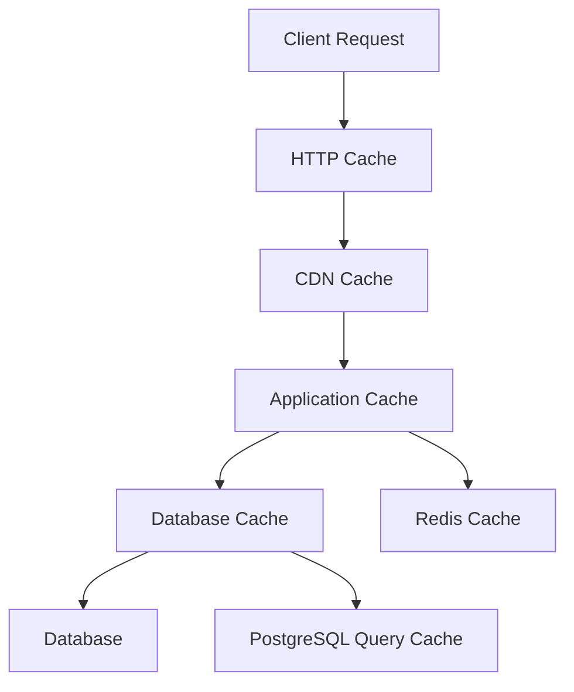

# Caching Strategy for Improved Performance

## Overview

This document outlines a comprehensive caching strategy to improve the performance of the financial product platform when handling 500+ products. The strategy includes Redis caching for frequently accessed data, HTTP caching for static assets, and database query caching to reduce load and improve response times.

## Caching Requirements

### 1. Performance Goals
- **Response Time**: Reduce API response times by 50-70%
- **Database Load**: Decrease database queries by 60-80%
- **Scalability**: Support 10x growth in traffic
- **Consistency**: Maintain data consistency with cache invalidation

### 2. Cache Layers
- **Application Cache**: Redis for frequently accessed data
- **HTTP Cache**: Browser and CDN caching for static assets
- **Database Cache**: Query result caching
- **Component Cache**: Frontend component caching

## System Architecture

### 1. Cache Hierarchy



### 2. Cache Flow

1. **Client Request**: User requests product data
2. **HTTP Cache**: Browser checks local cache
3. **CDN Cache**: CDN serves cached static assets
4. **Application Cache**: Redis serves cached product data
5. **Database Cache**: PostgreSQL query cache for complex queries
6. **Database**: Fallback to database for uncached data

## Redis Caching Implementation

### 1. Cache Service

```typescript
// backend/src/services/CacheService.ts
import Redis from 'ioredis';
import { createHash } from 'crypto';

interface CacheOptions {
  ttl?: number; // Time to live in seconds
  tags?: string[]; // Cache tags for invalidation
  compress?: boolean; // Compress large values
}

class CacheService {
  private redis: Redis;
  private defaultTTL: number;

  constructor() {
    this.redis = new Redis({
      host: process.env.REDIS_HOST || 'localhost',
      port: parseInt(process.env.REDIS_PORT || '6379'),
      password: process.env.REDIS_PASSWORD,
      db: parseInt(process.env.REDIS_DB || '0'),
      retryStrategy: (times) => {
        return Math.min(times * 50, 2000);
      }
    });

    this.defaultTTL = 300; // 5 minutes default TTL

    // Handle Redis connection events
    this.redis.on('connect', () => {
      console.log('Connected to Redis');
    });

    this.redis.on('error', (err) => {
      console.error('Redis connection error:', err);
    });
  }

  /**
   * Generate cache key from parameters
   */
  generateKey(prefix: string, params: Record<string, any>): string {
    const paramStr = Object.keys(params)
      .sort()
      .map(key => `${key}=${params[key]}`)
      .join('&');
    
    const hash = createHash('md5').update(paramStr).digest('hex');
    return `${prefix}:${hash}`;
  }

  /**
   * Get value from cache
   */
  async get<T>(key: string): Promise<T | null> {
    try {
      const cached = await this.redis.get(key);
      if (cached) {
        return JSON.parse(cached);
      }
      return null;
    } catch (error) {
      console.error('Cache get error:', error);
      return null;
    }
  }

  /**
   * Set value in cache
   */
  async set<T>(key: string, data: T, options: CacheOptions = {}): Promise<void> {
    try {
      const ttl = options.ttl || this.defaultTTL;
      const value = JSON.stringify(data);
      
      // Compress large values
      if (options.compress && value.length > 1024) {
        // Implementation would use compression library like zlib
        // For now, we'll store as-is
      }
      
      await this.redis.setex(key, ttl, value);
      
      // Add tags for invalidation
      if (options.tags && options.tags.length > 0) {
        const tagKey = `tags:${key}`;
        await this.redis.sadd(tagKey, ...options.tags);
        
        // Add key to each tag set
        for (const tag of options.tags) {
          await this.redis.sadd(`tag:${tag}`, key);
        }
      }
    } catch (error) {
      console.error('Cache set error:', error);
    }
  }

  /**
   * Delete value from cache
   */
  async delete(key: string): Promise<void> {
    try {
      // Remove associated tags
      const tagKey = `tags:${key}`;
      const tags = await this.redis.smembers(tagKey);
      
      // Remove key from each tag set
      for (const tag of tags) {
        await this.redis.srem(`tag:${tag}`, key);
      }
      
      // Delete tag key
      await this.redis.del(tagKey);
      
      // Delete actual key
      await this.redis.del(key);
    } catch (error) {
      console.error('Cache delete error:', error);
    }
  }

  /**
   * Invalidate cache by tag
   */
  async invalidateTag(tag: string): Promise<void> {
    try {
      const tagKey = `tag:${tag}`;
      const keys = await this.redis.smembers(tagKey);
      
      if (keys.length > 0) {
        // Delete all keys associated with this tag
        await this.redis.del(...keys);
        
        // Delete the tag set itself
        await this.redis.del(tagKey);
      }
    } catch (error) {
      console.error('Cache invalidate tag error:', error);
    }
  }

  /**
   * Invalidate multiple tags
   */
  async invalidateTags(tags: string[]): Promise<void> {
    for (const tag of tags) {
      await this.invalidateTag(tag);
    }
  }

  /**
   * Clear all cache
   */
  async clear(): Promise<void> {
    try {
      await this.redis.flushall();
    } catch (error) {
      console.error('Cache clear error:', error);
    }
  }

  /**
   * Get cache statistics
   */
  async getStats(): Promise<Record<string, any>> {
    try {
      const info = await this.redis.info();
      const stats: Record<string, any> = {};
      
      // Parse Redis info string
      const lines = info.split('\n');
      for (const line of lines) {
        const [key, value] = line.split(':');
        if (key && value) {
          stats[key.trim()] = value.trim();
        }
      }
      
      return stats;
    } catch (error) {
      console.error('Cache stats error:', error);
      return {};
    }
  }

  /**
   * Check if cache is healthy
   */
  async isHealthy(): Promise<boolean> {
    try {
      const result = await this.redis.ping();
      return result === 'PONG';
    } catch (error) {
      return false;
    }
  }
}

export const cacheService = new CacheService();
```

### 2. Cached Product Service

```typescript
// backend/src/services/CachedProductService.ts
import { ProductService } from './ProductService';
import { cacheService } from './CacheService';
import { PaginationResult } from './PaginationService';

interface ProductQueryOptions {
  category?: string;
  segment?: string;
  page?: number;
  limit?: number;
  sort?: string;
  search?: string;
  filters?: Record<string, any>;
}

class CachedProductService extends ProductService {
  /**
   * Get products with caching
   */
  async getProducts(options: ProductQueryOptions): Promise<PaginationResult<any>> {
    // Generate cache key
    const cacheKey = cacheService.generateKey('products', {
      category: options.category,
      segment: options.segment,
      page: options.page,
      limit: options.limit,
      sort: options.sort,
      search: options.search,
      filters: options.filters
    });

    // Try to get from cache first
    const cached = await cacheService.get<PaginationResult<any>>(cacheKey);
    if (cached) {
      console.log(`Cache hit for products: ${cacheKey}`);
      return cached;
    }

    console.log(`Cache miss for products: ${cacheKey}`);
    
    // Get from database
    const result = await super.getProducts(options);
    
    // Cache the result
    await cacheService.set(cacheKey, result, {
      ttl: 300, // 5 minutes
      tags: ['products', `category:${options.category}`, `segment:${options.segment}`]
    });
    
    return result;
  }

  /**
   * Get product by ID with caching
   */
  async getProductById(id: string): Promise<any> {
    const cacheKey = `product:${id}`;
    
    // Try to get from cache first
    const cached = await cacheService.get<any>(cacheKey);
    if (cached) {
      console.log(`Cache hit for product: ${cacheKey}`);
      return cached;
    }

    console.log(`Cache miss for product: ${cacheKey}`);
    
    // Get from database
    const result = await super.getProductById(id);
    
    // Cache the result
    if (result) {
      await cacheService.set(cacheKey, result, {
        ttl: 600, // 10 minutes
        tags: ['products', 'product', `product:${id}`]
      });
    }
    
    return result;
  }

  /**
   * Get categories with caching
   */
  async getCategories(): Promise<any[]> {
    const cacheKey = 'categories';
    
    // Try to get from cache first
    const cached = await cacheService.get<any[]>(cacheKey);
    if (cached) {
      console.log(`Cache hit for categories: ${cacheKey}`);
      return cached;
    }

    console.log(`Cache miss for categories: ${cacheKey}`);
    
    // Get from database
    const result = await super.getCategories();
    
    // Cache the result
    await cacheService.set(cacheKey, result, {
      ttl: 1800, // 30 minutes
      tags: ['categories']
    });
    
    return result;
  }

  /**
   * Get available filters with caching
   */
  async getAvailableFilters(categorySlug?: string): Promise<any[]> {
    const cacheKey = cacheService.generateKey('filters', { category: categorySlug });
    
    // Try to get from cache first
    const cached = await cacheService.get<any[]>(cacheKey);
    if (cached) {
      console.log(`Cache hit for filters: ${cacheKey}`);
      return cached;
    }

    console.log(`Cache miss for filters: ${cacheKey}`);
    
    // Get from database
    const result = await super.getAvailableFilters(categorySlug);
    
    // Cache the result
    await cacheService.set(cacheKey, result, {
      ttl: 1800, // 30 minutes
      tags: ['filters', `category:${categorySlug}`]
    });
    
    return result;
  }

  /**
   * Get sort options with caching
   */
  async getSortOptions(): Promise<any[]> {
    const cacheKey = 'sort-options';
    
    // Try to get from cache first
    const cached = await cacheService.get<any[]>(cacheKey);
    if (cached) {
      console.log(`Cache hit for sort options: ${cacheKey}`);
      return cached;
    }

    console.log(`Cache miss for sort options: ${cacheKey}`);
    
    // Get from database
    const result = await super.getSortOptions();
    
    // Cache the result
    await cacheService.set(cacheKey, result, {
      ttl: 3600, // 1 hour
      tags: ['sort-options']
    });
    
    return result;
  }

  /**
   * Invalidate product cache
   */
  async invalidateProductCache(productId?: string): Promise<void> {
    if (productId) {
      // Invalidate specific product
      await cacheService.invalidateTag(`product:${productId}`);
    } else {
      // Invalidate all product-related cache
      await cacheService.invalidateTags(['products', 'categories', 'filters', 'sort-options']);
    }
  }

  /**
   * Search products with caching
   */
  async searchProducts(
    searchTerm: string,
    category?: string,
    segment?: string,
    page: number = 1,
    limit: number = 20,
    sort: string = 'featured',
    filters: Record<string, any> = {}
  ): Promise<PaginationResult<any>> {
    // Generate cache key
    const cacheKey = cacheService.generateKey('search', {
      term: searchTerm,
      category,
      segment,
      page,
      limit,
      sort,
      filters
    });

    // Try to get from cache first
    const cached = await cacheService.get<PaginationResult<any>>(cacheKey);
    if (cached) {
      console.log(`Cache hit for search: ${cacheKey}`);
      return cached;
    }

    console.log(`Cache miss for search: ${cacheKey}`);
    
    // Get from database
    const result = await super.searchProducts(searchTerm, category, segment, page, limit, sort, filters);
    
    // Cache the result
    await cacheService.set(cacheKey, result, {
      ttl: 120, // 2 minutes for search results
      tags: ['search', `search:${searchTerm}`, `category:${category}`, `segment:${segment}`]
    });
    
    return result;
  }
}

export const cachedProductService = new CachedProductService();
```

### 3. Cache Middleware

```typescript
// backend/src/middleware/cacheMiddleware.ts
import { Request, Response, NextFunction } from 'express';
import { cacheService } from '../services/CacheService';

/**
 * Cache middleware for GET requests
 */
export const cacheMiddleware = (ttl: number = 300) => {
  return async (req: Request, res: Response, next: NextFunction) => {
    // Only cache GET requests
    if (req.method !== 'GET') {
      return next();
    }

    // Generate cache key from URL and query parameters
    const cacheKey = `http:${req.originalUrl}`;
    
    try {
      // Try to get from cache
      const cached = await cacheService.get<any>(cacheKey);
      if (cached) {
        console.log(`HTTP cache hit: ${cacheKey}`);
        return res.json(cached);
      }

      console.log(`HTTP cache miss: ${cacheKey}`);
      
      // Override res.json to cache the response
      const originalJson = res.json;
      res.json = function(body: any) {
        // Cache the response
        cacheService.set(cacheKey, body, { ttl });
        
        // Call original json method
        return originalJson.call(this, body);
      };
      
      next();
    } catch (error) {
      console.error('Cache middleware error:', error);
      next();
    }
  };
};

/**
 * Invalidate cache middleware
 */
export const invalidateCacheMiddleware = (tags: string[]) => {
  return async (req: Request, res: Response, next: NextFunction) => {
    try {
      // Invalidate cache after request is processed
      const originalSend = res.send;
      res.send = function(body: any) {
        // Invalidate cache tags
        cacheService.invalidateTags(tags);
        return originalSend.call(this, body);
      };
      
      next();
    } catch (error) {
      console.error('Invalidate cache middleware error:', error);
      next();
    }
  };
};
```

### 4. Updated Routes with Caching

```typescript
// backend/src/routes/products.ts (updated with caching)
import { Router } from 'express';
import { cachedProductService } from '../services/CachedProductService';
import { cacheMiddleware, invalidateCacheMiddleware } from '../middleware/cacheMiddleware';

const router = Router();

/**
 * @route GET /api/products
 * @desc Get products with filtering and pagination
 * @access Public
 */
router.get('/', cacheMiddleware(300), async (req, res) => {
  try {
    const {
      category,
      segment,
      page = 1,
      limit = 20,
      sort,
      search,
      ...filters
    } = req.query;

    const result = await cachedProductService.getProducts({
      category: category as string,
      segment: segment as string,
      page: parseInt(page as string),
      limit: parseInt(limit as string),
      sort: sort as string,
      search: search as string,
      filters: filters as Record<string, any>
    });

    res.json({
      data: result.data,
      pagination: result.pagination
    });
  } catch (error) {
    res.status(500).json({
      error: 'Failed to retrieve products',
      message: error instanceof Error ? error.message : 'Unknown error'
    });
  }
});

/**
 * @route GET /api/products/:id
 * @desc Get product by ID
 * @access Public
 */
router.get('/:id', cacheMiddleware(600), async (req, res) => {
  try {
    const { id } = req.params;
    const product = await cachedProductService.getProductById(id);

    if (!product) {
      return res.status(404).json({
        error: 'Product not found'
      });
    }

    res.json({
      data: product
    });
  } catch (error) {
    res.status(500).json({
      error: 'Failed to retrieve product',
      message: error instanceof Error ? error.message : 'Unknown error'
    });
  }
});

/**
 * @route GET /api/categories
 * @desc Get product categories
 * @access Public
 */
router.get('/categories', cacheMiddleware(1800), async (req, res) => {
  try {
    const categories = await cachedProductService.getCategories();
    res.json({
      data: categories
    });
  } catch (error) {
    res.status(500).json({
      error: 'Failed to retrieve categories',
      message: error instanceof Error ? error.message : 'Unknown error'
    });
  }
});

/**
 * @route GET /api/filters
 * @desc Get available filters
 * @access Public
 */
router.get('/filters', cacheMiddleware(1800), async (req, res) => {
  try {
    const { category } = req.query;
    const filters = await cachedProductService.getAvailableFilters(
      category as string
    );
    res.json({
      data: filters
    });
  } catch (error) {
    res.status(500).json({
      error: 'Failed to retrieve filters',
      message: error instanceof Error ? error.message : 'Unknown error'
    });
  }
});

/**
 * @route POST /api/products
 * @desc Create new product
 * @access Admin
 */
router.post('/', invalidateCacheMiddleware(['products', 'categories', 'filters']), async (req, res) => {
  try {
    // Implementation for creating product
    // This would invalidate cache after successful creation
  } catch (error) {
    res.status(500).json({
      error: 'Failed to create product',
      message: error instanceof Error ? error.message : 'Unknown error'
    });
  }
});

/**
 * @route PUT /api/products/:id
 * @desc Update product
 * @access Admin
 */
router.put('/:id', invalidateCacheMiddleware(['products', `product:${req.params.id}`]), async (req, res) => {
  try {
    // Implementation for updating product
    // This would invalidate cache after successful update
  } catch (error) {
    res.status(500).json({
      error: 'Failed to update product',
      message: error instanceof Error ? error.message : 'Unknown error'
    });
  }
});

/**
 * @route DELETE /api/products/:id
 * @desc Delete product
 * @access Admin
 */
router.delete('/:id', invalidateCacheMiddleware(['products', `product:${req.params.id}`]), async (req, res) => {
  try {
    // Implementation for deleting product
    // This would invalidate cache after successful deletion
  } catch (error) {
    res.status(500).json({
      error: 'Failed to delete product',
      message: error instanceof Error ? error.message : 'Unknown error'
    });
  }
});

export default router;
```

## Frontend Caching Implementation

### 1. React Query Integration

```typescript
// src/lib/react-query.ts
import { QueryClient, QueryClientProvider } from '@tanstack/react-query';
import { ReactQueryDevtools } from '@tanstack/react-query-devtools';

// Create a client
const queryClient = new QueryClient({
  defaultOptions: {
    queries: {
      staleTime: 1000 * 60 * 5, // 5 minutes
      cacheTime: 1000 * 60 * 30, // 30 minutes
      refetchOnWindowFocus: false,
      retry: 1,
    },
  },
});

export { queryClient, QueryClientProvider, ReactQueryDevtools };
```

### 2. Cached Product Hooks

```typescript
// src/hooks/useProducts.ts
import { useQuery, useInfiniteQuery, useMutation, useQueryClient } from '@tanstack/react-query';
import { productService } from '@/services/productService';

interface ProductQueryOptions {
  category?: string;
  segment?: 'individual' | 'business';
  page?: number;
  limit?: number;
  sort?: string;
  search?: string;
  filters?: Record<string, any>;
}

// Get products with caching
export const useProducts = (options: ProductQueryOptions) => {
  return useQuery({
    queryKey: ['products', options],
    queryFn: () => productService.getProducts(options),
    staleTime: 1000 * 60 * 5, // 5 minutes
  });
};

// Get product by ID with caching
export const useProduct = (id: string) => {
  return useQuery({
    queryKey: ['product', id],
    queryFn: () => productService.getProductById(id),
    staleTime: 1000 * 60 * 10, // 10 minutes
  });
};

// Get categories with caching
export const useCategories = () => {
  return useQuery({
    queryKey: ['categories'],
    queryFn: () => productService.getCategories(),
    staleTime: 1000 * 60 * 30, // 30 minutes
  });
};

// Get filters with caching
export const useFilters = (category?: string) => {
  return useQuery({
    queryKey: ['filters', category],
    queryFn: () => productService.getFilters(category),
    staleTime: 1000 * 60 * 30, // 30 minutes
  });
};

// Infinite scroll for products
export const useInfiniteProducts = (options: Omit<ProductQueryOptions, 'page'>) => {
  return useInfiniteQuery({
    queryKey: ['products', 'infinite', options],
    queryFn: ({ pageParam = 1 }) => 
      productService.getProducts({ ...options, page: pageParam }),
    getNextPageParam: (lastPage) => {
      if (lastPage.pagination.hasNext) {
        return lastPage.pagination.page + 1;
      }
      return undefined;
    },
    staleTime: 1000 * 60 * 5, // 5 minutes
  });
};

// Mutation hooks with cache invalidation
export const useCreateProduct = () => {
  const queryClient = useQueryClient();
  
  return useMutation({
    mutationFn: (data: any) => productService.createProduct(data),
    onSuccess: () => {
      // Invalidate relevant queries
      queryClient.invalidateQueries({ queryKey: ['products'] });
      queryClient.invalidateQueries({ queryKey: ['categories'] });
      queryClient.invalidateQueries({ queryKey: ['filters'] });
    },
  });
};

export const useUpdateProduct = () => {
  const queryClient = useQueryClient();
  
  return useMutation({
    mutationFn: ({ id, data }: { id: string; data: any }) => 
      productService.updateProduct(id, data),
    onSuccess: (_, variables) => {
      // Invalidate relevant queries
      queryClient.invalidateQueries({ queryKey: ['products'] });
      queryClient.invalidateQueries({ queryKey: ['product', variables.id] });
    },
  });
};

export const useDeleteProduct = () => {
  const queryClient = useQueryClient();
  
  return useMutation({
    mutationFn: (id: string) => productService.deleteProduct(id),
    onSuccess: () => {
      // Invalidate relevant queries
      queryClient.invalidateQueries({ queryKey: ['products'] });
    },
  });
};
```

### 3. Service Worker for HTTP Caching

```typescript
// public/sw.js
const CACHE_NAME = 'raisket-cache-v1';
const urlsToCache = [
  '/',
  '/static/css/main.css',
  '/static/js/main.js',
  '/manifest.json',
  '/favicon.ico',
];

self.addEventListener('install', (event) => {
  // Perform install steps
  event.waitUntil(
    caches.open(CACHE_NAME)
      .then((cache) => {
        console.log('Opened cache');
        return cache.addAll(urlsToCache);
      })
  );
});

self.addEventListener('fetch', (event) => {
  event.respondWith(
    caches.match(event.request)
      .then((response) => {
        // Cache hit - return response
        if (response) {
          return response;
        }
        
        // Clone the request because it's a stream
        const fetchRequest = event.request.clone();
        
        return fetch(fetchRequest).then(
          (response) => {
            // Check if we received a valid response
            if (!response || response.status !== 200 || response.type !== 'basic') {
              return response;
            }
            
            // Clone the response because it's a stream
            const responseToCache = response.clone();
            
            caches.open(CACHE_NAME)
              .then((cache) => {
                cache.put(event.request, responseToCache);
              });
              
            return response;
          }
        );
      })
    );
});

self.addEventListener('activate', (event) => {
  const cacheWhitelist = [CACHE_NAME];
  
  event.waitUntil(
    caches.keys().then((cacheNames) => {
      return Promise.all(
        cacheNames.map((cacheName) => {
          if (cacheWhitelist.indexOf(cacheName) === -1) {
            return caches.delete(cacheName);
          }
        })
      );
    })
  );
});
```

## Database Query Caching

### 1. PostgreSQL Query Cache Configuration

```sql
-- Enable query cache in PostgreSQL
-- Add to postgresql.conf
shared_preload_libraries = 'pg_stat_statements'
pg_stat_statements.track = all
pg_stat_statements.save = on

-- Create extension
CREATE EXTENSION IF NOT EXISTS pg_stat_statements;

-- View query statistics
SELECT query, calls, total_time, mean_time, rows
FROM pg_stat_statements
ORDER BY total_time DESC
LIMIT 10;
```

### 2. Materialized Views for Frequently Accessed Data

```sql
-- Create materialized view for product listings
CREATE MATERIALIZED VIEW product_listings_cache AS
SELECT 
  p.id,
  p.name,
  p.tagline,
  p.description,
  p.image_url,
  p.interest_rate_min,
  p.interest_rate_max,
  p.annual_fee,
  p.is_featured,
  p.created_at,
  r.average_rating,
  r.review_count,
  i.name as institution_name,
  c.name as category_name,
  c.slug as category_slug
FROM financial.products p
JOIN financial.product_ratings r ON p.id = r.product_id
JOIN financial.institutions i ON p.institution_id = i.id
JOIN financial.product_categories c ON p.category_id = c.id
WHERE p.is_active = true;

-- Create indexes for the materialized view
CREATE INDEX idx_product_listings_cache_featured ON product_listings_cache(is_featured);
CREATE INDEX idx_product_listings_cache_rating ON product_listings_cache(average_rating);
CREATE INDEX idx_product_listings_cache_category ON product_listings_cache(category_slug);

-- Refresh the materialized view periodically
-- This would be run by a scheduled job
REFRESH MATERIALIZED VIEW CONCURRENTLY product_listings_cache;
```

## CDN Configuration

### 1. CDN Setup for Static Assets

```nginx
# Nginx configuration for CDN caching
server {
    listen 80;
    server_name cdn.raisket.com;
    
    # Cache static assets
    location ~* \.(jpg|jpeg|png|gif|ico|css|js|woff|woff2|ttf|svg)$ {
        expires 1y;
        add_header Cache-Control "public, immutable";
        add_header Vary Accept-Encoding;
        
        # Enable gzip compression
        gzip on;
        gzip_vary on;
        gzip_min_length 1024;
        gzip_types text/css application/javascript image/svg+xml;
        
        # Serve from cache directory
        root /var/www/cdn;
    }
    
    # Cache product images
    location /images/products/ {
        expires 30d;
        add_header Cache-Control "public";
        add_header Vary Accept;
        
        # Proxy to image storage
        proxy_pass http://image-storage-service;
        proxy_set_header Host $host;
        proxy_set_header X-Real-IP $remote_addr;
    }
}
```

### 2. Image Optimization with CDN

```typescript
// src/services/imageService.ts
class ImageService {
  private cdnBaseUrl = process.env.CDN_BASE_URL || 'https://cdn.raisket.com';
  
  /**
   * Generate optimized image URL with CDN
   */
  getOptimizedImageUrl(imagePath: string, options: {
    width?: number;
    height?: number;
    quality?: number;
    format?: 'webp' | 'avif' | 'jpg' | 'png';
  } = {}): string {
    const params = new URLSearchParams();
    
    if (options.width) params.append('w', options.width.toString());
    if (options.height) params.append('h', options.height.toString());
    if (options.quality) params.append('q', options.quality.toString());
    if (options.format) params.append('f', options.format);
    
    const queryString = params.toString();
    return `${this.cdnBaseUrl}${imagePath}${queryString ? `?${queryString}` : ''}`;
  }
  
  /**
   * Generate responsive image set
   */
  getResponsiveImageSet(imagePath: string, sizes: number[]): string {
    return sizes.map(size => 
      `${this.getOptimizedImageUrl(imagePath, { width: size })} ${size}w`
    ).join(', ');
  }
}

export const imageService = new ImageService();
```

## Cache Monitoring and Analytics

### 1. Cache Performance Monitoring

```typescript
// backend/src/services/CacheMonitor.ts
import { cacheService } from './CacheService';
import { performance } from 'perf_hooks';

interface CacheMetrics {
  hits: number;
  misses: number;
  hitRate: number;
  avgResponseTime: number;
  memoryUsage: number;
}

class CacheMonitor {
  private metrics: CacheMetrics = {
    hits: 0,
    misses: 0,
    hitRate: 0,
    avgResponseTime: 0,
    memoryUsage: 0
  };
  
  private startTime: number = 0;
  private totalResponseTime: number = 0;
  private requestCount: number = 0;

  /**
   * Record cache hit
   */
  recordHit(responseTime: number) {
    this.metrics.hits++;
    this.updateMetrics(responseTime);
  }

  /**
   * Record cache miss
   */
  recordMiss(responseTime: number) {
    this.metrics.misses++;
    this.updateMetrics(responseTime);
  }

  /**
   * Update metrics
   */
  private updateMetrics(responseTime: number) {
    this.requestCount++;
    this.totalResponseTime += responseTime;
    
    this.metrics.hitRate = this.metrics.hits / (this.metrics.hits + this.metrics.misses);
    this.metrics.avgResponseTime = this.totalResponseTime / this.requestCount;
    
    // Get memory usage from Redis
    cacheService.getStats().then(stats => {
      this.metrics.memoryUsage = parseInt(stats.used_memory || '0');
    });
  }

  /**
   * Get current metrics
   */
  getMetrics(): CacheMetrics {
    return { ...this.metrics };
  }

  /**
   * Reset metrics
   */
  resetMetrics() {
    this.metrics = {
      hits: 0,
      misses: 0,
      hitRate: 0,
      avgResponseTime: 0,
      memoryUsage: 0
    };
    this.totalResponseTime = 0;
    this.requestCount = 0;
  }

  /**
   * Start timing a request
   */
  startTiming() {
    this.startTime = performance.now();
  }

  /**
   * End timing a request
   */
  endTiming(isHit: boolean) {
    const endTime = performance.now();
    const responseTime = endTime - this.startTime;
    
    if (isHit) {
      this.recordHit(responseTime);
    } else {
      this.recordMiss(responseTime);
    }
  }
}

export const cacheMonitor = new CacheMonitor();
```

### 2. Cache Performance Dashboard

```tsx
// src/components/admin/CacheDashboard.tsx
'use client';

import React, { useState, useEffect } from 'react';
import { Card, CardContent, CardDescription, CardHeader, CardTitle } from '@/components/ui/card';
import { Progress } from '@/components/ui/progress';
import { 
  Database, 
  Zap, 
  Clock, 
  MemoryStick,
  RotateCcw
} from 'lucide-react';

interface CacheMetrics {
  hits: number;
  misses: number;
  hitRate: number;
  avgResponseTime: number;
  memoryUsage: number;
}

export default function CacheDashboard() {
  const [metrics, setMetrics] = useState<CacheMetrics>({
    hits: 0,
    misses: 0,
    hitRate: 0,
    avgResponseTime: 0,
    memoryUsage: 0
  });
  const [loading, setLoading] = useState(true);

  useEffect(() => {
    const fetchMetrics = async () => {
      try {
        // In a real app, you would fetch this from your API
        // For now, we'll use mock data
        const mockMetrics: CacheMetrics = {
          hits: 12500,
          misses: 1500,
          hitRate: 0.89,
          avgResponseTime: 45,
          memoryUsage: 128
        };
        
        setMetrics(mockMetrics);
        setLoading(false);
      } catch (error) {
        console.error('Failed to fetch cache metrics:', error);
        setLoading(false);
      }
    };

    fetchMetrics();
    
    // Poll for updates every 30 seconds
    const interval = setInterval(fetchMetrics, 30000);
    return () => clearInterval(interval);
  }, []);

  const handleResetMetrics = () => {
    // In a real app, you would call an API to reset metrics
    setMetrics({
      hits: 0,
      misses: 0,
      hitRate: 0,
      avgResponseTime: 0,
      memoryUsage: 0
    });
  };

  if (loading) {
    return (
      <div className="flex items-center justify-center h-64">
        <div className="animate-spin rounded-full h-12 w-12 border-b-2 border-gray-900"></div>
      </div>
    );
  }

  return (
    <div className="space-y-6">
      <div className="flex items-center justify-between">
        <h1 className="text-2xl font-bold">Cache Performance</h1>
        <button
          onClick={handleResetMetrics}
          className="flex items-center space-x-2 px-4 py-2 bg-gray-100 hover:bg-gray-200 rounded-md text-sm"
        >
          <RotateCcw className="h-4 w-4" />
          <span>Reset Metrics</span>
        </button>
      </div>

      <div className="grid grid-cols-1 md:grid-cols-2 lg:grid-cols-4 gap-4">
        <Card>
          <CardHeader className="flex flex-row items-center justify-between space-y-0 pb-2">
            <CardTitle className="text-sm font-medium">Cache Hits</CardTitle>
            <Zap className="h-4 w-4 text-muted-foreground" />
          </CardHeader>
          <CardContent>
            <div className="text-2xl font-bold">{metrics.hits.toLocaleString()}</div>
            <p className="text-xs text-muted-foreground">
              Requests served from cache
            </p>
          </CardContent>
        </Card>
        
        <Card>
          <CardHeader className="flex flex-row items-center justify-between space-y-0 pb-2">
            <CardTitle className="text-sm font-medium">Cache Misses</CardTitle>
            <Database className="h-4 w-4 text-muted-foreground" />
          </CardHeader>
          <CardContent>
            <div className="text-2xl font-bold">{metrics.misses.toLocaleString()}</div>
            <p className="text-xs text-muted-foreground">
              Requests to database
            </p>
          </CardContent>
        </Card>
        
        <Card>
          <CardHeader className="flex flex-row items-center justify-between space-y-0 pb-2">
            <CardTitle className="text-sm font-medium">Hit Rate</CardTitle>
            <div className="h-4 w-4 text-muted-foreground">%</div>
          </CardHeader>
          <CardContent>
            <div className="text-2xl font-bold">{(metrics.hitRate * 100).toFixed(1)}%</div>
            <Progress value={metrics.hitRate * 100} className="mt-2" />
            <p className="text-xs text-muted-foreground mt-2">
              {metrics.hitRate >= 0.8 ? 'Excellent' : metrics.hitRate >= 0.6 ? 'Good' : 'Needs improvement'}
            </p>
          </CardContent>
        </Card>
        
        <Card>
          <CardHeader className="flex flex-row items-center justify-between space-y-0 pb-2">
            <CardTitle className="text-sm font-medium">Avg Response Time</CardTitle>
            <Clock className="h-4 w-4 text-muted-foreground" />
          </CardHeader>
          <CardContent>
            <div className="text-2xl font-bold">{metrics.avgResponseTime.toFixed(0)}ms</div>
            <p className="text-xs text-muted-foreground">
              Average cache response time
            </p>
          </CardContent>
        </Card>
      </div>

      <Card>
        <CardHeader>
          <CardTitle>Memory Usage</CardTitle>
          <CardDescription>
            Redis memory consumption
          </CardDescription>
        </CardHeader>
        <CardContent>
          <div className="flex items-center space-x-4">
            <MemoryStick className="h-8 w-8 text-muted-foreground" />
            <div className="flex-1">
              <div className="flex justify-between text-sm mb-1">
                <span>Used Memory</span>
                <span>{metrics.memoryUsage} MB</span>
              </div>
              <Progress value={(metrics.memoryUsage / 512) * 100} />
              <div className="text-xs text-muted-foreground mt-1">
                {metrics.memoryUsage < 256 ? 'Healthy' : metrics.memoryUsage < 384 ? 'Warning' : 'Critical'}
              </div>
            </div>
          </div>
        </CardContent>
      </Card>

      <Card>
        <CardHeader>
          <CardTitle>Cache Performance Insights</CardTitle>
        </CardHeader>
        <CardContent>
          <div className="space-y-4">
            <div className="flex items-start space-x-3">
              <div className="h-2 w-2 rounded-full bg-green-500 mt-2"></div>
              <div>
                <h3 className="font-medium">High Hit Rate</h3>
                <p className="text-sm text-muted-foreground">
                  {metrics.hitRate >= 0.8 
                    ? 'Your cache is performing excellently. Most requests are served from cache.'
                    : 'Consider optimizing your cache strategy to increase hit rate.'}
                </p>
              </div>
            </div>
            
            <div className="flex items-start space-x-3">
              <div className="h-2 w-2 rounded-full bg-blue-500 mt-2"></div>
              <div>
                <h3 className="font-medium">Response Time</h3>
                <p className="text-sm text-muted-foreground">
                  {metrics.avgResponseTime < 50 
                    ? 'Cache responses are fast and efficient.'
                    : 'Consider optimizing cache configuration to improve response times.'}
                </p>
              </div>
            </div>
            
            <div className="flex items-start space-x-3">
              <div className="h-2 w-2 rounded-full bg-yellow-500 mt-2"></div>
              <div>
                <h3 className="font-medium">Memory Usage</h3>
                <p className="text-sm text-muted-foreground">
                  {metrics.memoryUsage < 256 
                    ? 'Memory usage is within healthy limits.'
                    : 'Monitor memory usage to prevent performance degradation.'}
                </p>
              </div>
            </div>
          </div>
        </CardContent>
      </Card>
    </div>
  );
}
```

## Cache Invalidation Strategy

### 1. Event-Driven Invalidation

```typescript
// backend/src/services/CacheInvalidationService.ts
import { cacheService } from './CacheService';
import { EventEmitter } from 'events';

class CacheInvalidationService extends EventEmitter {
  /**
   * Invalidate cache when product is created
   */
  async onProductCreated(productId: string, categorySlug: string) {
    await cacheService.invalidateTags([
      'products',
      'categories',
      `category:${categorySlug}`,
      'filters'
    ]);
    
    this.emit('cacheInvalidated', {
      type: 'productCreated',
      productId,
      categorySlug
    });
  }

  /**
   * Invalidate cache when product is updated
   */
  async onProductUpdated(productId: string, categorySlug?: string) {
    const tags = [
      'products',
      `product:${productId}`
    ];
    
    if (categorySlug) {
      tags.push(`category:${categorySlug}`);
    }
    
    await cacheService.invalidateTags(tags);
    
    this.emit('cacheInvalidated', {
      type: 'productUpdated',
      productId,
      categorySlug
    });
  }

  /**
   * Invalidate cache when product is deleted
   */
  async onProductDeleted(productId: string, categorySlug?: string) {
    const tags = [
      'products',
      `product:${productId}`
    ];
    
    if (categorySlug) {
      tags.push(`category:${categorySlug}`);
    }
    
    await cacheService.invalidateTags(tags);
    
    this.emit('cacheInvalidated', {
      type: 'productDeleted',
      productId,
      categorySlug
    });
  }

  /**
   * Invalidate cache when category is updated
   */
  async onCategoryUpdated(categorySlug: string) {
    await cacheService.invalidateTags([
      'categories',
      `category:${categorySlug}`,
      'filters'
    ]);
    
    this.emit('cacheInvalidated', {
      type: 'categoryUpdated',
      categorySlug
    });
  }

  /**
   * Invalidate all product-related cache
   */
  async invalidateAllProductCache() {
    await cacheService.invalidateTags([
      'products',
      'categories',
      'filters',
      'sort-options'
    ]);
    
    this.emit('cacheInvalidated', {
      type: 'allProductsInvalidated'
    });
  }
}

export const cacheInvalidationService = new CacheInvalidationService();
```

### 2. Scheduled Cache Maintenance

```typescript
// backend/src/jobs/cacheMaintenanceJob.ts
import { cacheService } from '../services/CacheService';
import { cacheInvalidationService } from '../services/CacheInvalidationService';

/**
 * Scheduled job to maintain cache health
 */
export class CacheMaintenanceJob {
  private interval: NodeJS.Timeout | null = null;

  /**
   * Start the maintenance job
   */
  start() {
    // Run every hour
    this.interval = setInterval(async () => {
      try {
        await this.performMaintenance();
      } catch (error) {
        console.error('Cache maintenance error:', error);
      }
    }, 60 * 60 * 1000); // 1 hour
  }

  /**
   * Stop the maintenance job
   */
  stop() {
    if (this.interval) {
      clearInterval(this.interval);
      this.interval = null;
    }
  }

  /**
   * Perform cache maintenance tasks
   */
  private async performMaintenance() {
    console.log('Starting cache maintenance...');
    
    // Check cache health
    const isHealthy = await cacheService.isHealthy();
    if (!isHealthy) {
      console.warn('Cache is not healthy, attempting to reconnect...');
      // Handle reconnection logic
    }
    
    // Clean up expired entries
    // This is handled automatically by Redis TTL
    
    // Log cache statistics
    const stats = await cacheService.getStats();
    console.log('Cache stats:', {
      keys: stats.total_commands_processed,
      memory: stats.used_memory_human,
      hitRate: stats.keyspace_hits / (stats.keyspace_hits + stats.keyspace_misses)
    });
    
    console.log('Cache maintenance completed');
  }
}

// Initialize and start the job
const cacheMaintenanceJob = new CacheMaintenanceJob();
cacheMaintenanceJob.start();
```

## Testing Strategy

### 1. Cache Performance Tests

```typescript
// tests/services/CacheService.test.ts
import { cacheService } from '@/services/CacheService';

describe('CacheService', () => {
  beforeEach(async () => {
    await cacheService.clear();
  });

  describe('get/set operations', () => {
    it('should cache and retrieve values correctly', async () => {
      const key = 'test-key';
      const value = { name: 'Test Product', price: 100 };
      
      // Set value in cache
      await cacheService.set(key, value, { ttl: 60 });
      
      // Get value from cache
      const cached = await cacheService.get(key);
      
      expect(cached).toEqual(value);
    });

    it('should expire cached values after TTL', async () => {
      const key = 'expiring-key';
      const value = 'test-value';
      
      // Set value with short TTL
      await cacheService.set(key, value, { ttl: 1 }); // 1 second
      
      // Value should be available immediately
      const cached1 = await cacheService.get(key);
      expect(cached1).toBe(value);
      
      // Wait for expiration
      await new Promise(resolve => setTimeout(resolve, 1100));
      
      // Value should be expired
      const cached2 = await cacheService.get(key);
      expect(cached2).toBeNull();
    });
  });

  describe('tag-based invalidation', () => {
    it('should invalidate cache by tag', async () => {
      const key1 = 'product:1';
      const key2 = 'product:2';
      const value1 = { id: 1, name: 'Product 1' };
      const value2 = { id: 2, name: 'Product 2' };
      
      // Set values with tags
      await cacheService.set(key1, value1, { tags: ['products', 'category:credit'] });
      await cacheService.set(key2, value2, { tags: ['products', 'category:investment'] });
      
      // Both values should be available
      expect(await cacheService.get(key1)).toEqual(value1);
      expect(await cacheService.get(key2)).toEqual(value2);
      
      // Invalidate by tag
      await cacheService.invalidateTag('category:credit');
      
      // First value should be invalidated, second should still be available
      expect(await cacheService.get(key1)).toBeNull();
      expect(await cacheService.get(key2)).toEqual(value2);
    });
  });
});
```

### 2. Integration Tests

```typescript
// tests/services/CachedProductService.test.ts
import { cachedProductService } from '@/services/CachedProductService';
import { cacheService } from '@/services/CacheService';

describe('CachedProductService', () => {
  beforeEach(async () => {
    await cacheService.clear();
  });

  describe('getProducts', () => {
    it('should cache product results', async () => {
      const options = {
        category: 'credit',
        segment: 'individual',
        page: 1,
        limit: 20
      };
      
      // First call should hit database
      const result1 = await cachedProductService.getProducts(options);
      
      // Second call should hit cache
      const result2 = await cachedProductService.getProducts(options);
      
      // Results should be identical
      expect(result1).toEqual(result2);
      
      // Verify cache was used (this would require mocking the underlying service)
    });

    it('should invalidate cache when product is updated', async () => {
      // This test would require setting up the full cache invalidation flow
    });
  });
});
```

## Future Enhancements

### 1. Distributed Cache with Clustering

```typescript
// backend/src/services/DistributedCacheService.ts
import Redis from 'ioredis';

class DistributedCacheService {
  private redis: Redis;
  private cluster: Redis.Cluster;

  constructor() {
    // For single instance
    this.redis = new Redis({
      host: process.env.REDIS_HOST,
      port: parseInt(process.env.REDIS_PORT || '6379')
    });

    // For cluster setup
    this.cluster = new Redis.Cluster([
      { host: 'redis-node-1', port: 6379 },
      { host: 'redis-node-2', port: 6379 },
      { host: 'redis-node-3', port: 6379 }
    ], {
      redisOptions: {
        password: process.env.REDIS_PASSWORD
      }
    });
  }

  async get<T>(key: string): Promise<T | null> {
    const cached = await this.cluster.get(key);
    return cached ? JSON.parse(cached) : null;
  }

  async set<T>(key: string, data: T, ttl: number = 300): Promise<void> {
    await this.cluster.setex(key, ttl, JSON.stringify(data));
  }
}

export const distributedCacheService = new DistributedCacheService();
```

### 2. Cache Warming Strategy

```typescript
// backend/src/jobs/cacheWarmingJob.ts
import { cachedProductService } from '../services/CachedProductService';

/**
 * Cache warming job to pre-populate cache with frequently accessed data
 */
export class CacheWarmingJob {
  async warmCache() {
    console.log('Starting cache warming...');
    
    try {
      // Warm product categories
      await cachedProductService.getCategories();
      
      // Warm popular product listings
      await cachedProductService.getProducts({
        category: 'credit',
        segment: 'individual',
        page: 1,
        limit: 20,
        sort: 'featured'
      });
      
      // Warm filters
      await cachedProductService.getAvailableFilters();
      
      // Warm sort options
      await cachedProductService.getSortOptions();
      
      console.log('Cache warming completed');
    } catch (error) {
      console.error('Cache warming error:', error);
    }
  }
}

// Run cache warming on application startup
const cacheWarmingJob = new CacheWarmingJob();
// cacheWarmingJob.warmCache(); // Would be called during app initialization
```

This caching strategy provides a comprehensive solution for improving the performance of the financial product platform when handling 500+ products, with multiple cache layers, monitoring, and invalidation strategies to ensure optimal performance and data consistency.