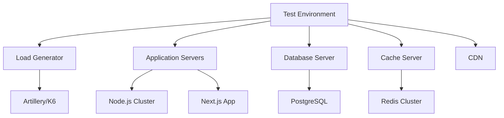

# Performance Testing for 500+ Products

## Overview

This document outlines a comprehensive performance testing strategy to ensure the financial product platform can efficiently handle 500+ products while maintaining optimal response times and user experience.

## Performance Testing Goals

### 1. Response Time Targets
- **Page Load Time**: < 2 seconds for product listing pages
- **API Response Time**: < 500ms for product data APIs
- **Search Response Time**: < 1 second for search queries
- **Filter Application**: < 500ms for filter updates

### 2. Scalability Requirements
- **Concurrent Users**: Support 1,000+ concurrent users
- **Request Rate**: Handle 100+ requests per second
- **Database Performance**: Maintain sub-50ms query times for common operations
- **Cache Hit Rate**: Achieve > 85% cache hit rate for product data

### 3. Resource Utilization
- **CPU Usage**: < 70% under normal load
- **Memory Usage**: < 80% under normal load
- **Database Connections**: Efficient connection pooling
- **Network I/O**: Optimized data transfer

## Testing Strategy

### 1. Test Environment Setup



### 2. Test Scenarios

#### 2.1 Product Listing Performance
- **Scenario**: Load product listing page with various filters
- **Metrics**: Page load time, API response time, database query time
- **Volume**: 500+ products, 100 concurrent users

#### 2.2 Product Search Performance
- **Scenario**: Search for products with different query terms
- **Metrics**: Search response time, result accuracy, database query time
- **Volume**: 100+ search queries per minute

#### 2.3 Product Detail Performance
- **Scenario**: Load individual product detail pages
- **Metrics**: Page load time, API response time, cache hit rate
- **Volume**: 50+ product detail requests per second

#### 2.4 Filter Application Performance
- **Scenario**: Apply various filters to product listings
- **Metrics**: Filter application time, API response time, cache efficiency
- **Volume**: 200+ filter operations per minute

#### 2.5 Concurrent User Load
- **Scenario**: Multiple users browsing simultaneously
- **Metrics**: Response times, error rates, resource utilization
- **Volume**: 1,000+ concurrent users

## Performance Testing Tools

### 1. Load Testing Framework

```typescript
// tests/performance/load-test.js
import { check, sleep } from 'k6';
import http from 'k6/http';

export const options = {
  stages: [
    { duration: '5m', target: 100 }, // Ramp up to 100 users
    { duration: '10m', target: 100 }, // Stay at 100 users
    { duration: '5m', target: 0 },    // Ramp down to 0 users
  ],
  thresholds: {
    http_req_duration: ['p(95)<500'], // 95% of requests should be below 500ms
    http_req_failed: ['rate<0.01'],   // Error rate should be less than 1%
  },
};

export default function () {
  // Test product listing page
  const listingRes = http.get('http://localhost:3000/api/products?category=credit&segment=individual');
  check(listingRes, {
    'product listing status is 200': (r) => r.status === 200,
    'product listing response time < 500ms': (r) => r.timings.duration < 500,
  });

  // Test product search
  const searchRes = http.get('http://localhost:3000/api/products?search=tarjeta');
  check(searchRes, {
    'search status is 200': (r) => r.status === 200,
    'search response time < 1000ms': (r) => r.timings.duration < 1000,
  });

  // Test product detail page
  const productRes = http.get('http://localhost:3000/api/products/12345');
  check(productRes, {
    'product detail status is 200': (r) => r.status === 200,
    'product detail response time < 300ms': (r) => r.timings.duration < 300,
  });

  sleep(1);
}
```

### 2. Database Performance Testing

```sql
-- Test query performance with 500+ products
-- Product listing query
EXPLAIN ANALYZE
SELECT 
  p.id, p.name, p.tagline, p.description, p.image_url,
  p.interest_rate_min, p.interest_rate_max, p.annual_fee,
  p.is_featured, p.created_at,
  r.average_rating, r.review_count,
  i.name as institution_name,
  c.name as category_name
FROM financial.products p
JOIN financial.product_ratings r ON p.id = r.product_id
JOIN financial.institutions i ON p.institution_id = i.id
JOIN financial.product_categories c ON p.category_id = c.id
WHERE p.is_active = true 
  AND c.slug = 'credit'
  AND p.target_segment = 'individual'
ORDER BY p.is_featured DESC, r.average_rating DESC
LIMIT 20 OFFSET 0;

-- Search query performance
EXPLAIN ANALYZE
SELECT 
  p.*, 
  r.average_rating, r.review_count,
  i.name as institution_name,
  c.name as category_name
FROM financial.products p
JOIN financial.product_ratings r ON p.id = r.product_id
JOIN financial.institutions i ON p.institution_id = i.id
JOIN financial.product_categories c ON p.category_id = c.id
WHERE p.is_active = true 
  AND p.search_vector @@ plainto_tsquery('spanish', 'tarjeta')
ORDER BY ts_rank(p.search_vector, plainto_tsquery('spanish', 'tarjeta')) DESC
LIMIT 20;

-- Filter query performance
EXPLAIN ANALYZE
SELECT 
  p.id, p.name, p.tagline, p.description, p.image_url,
  p.interest_rate_min, p.interest_rate_max, p.annual_fee,
  p.is_featured, p.created_at,
  r.average_rating, r.review_count,
  i.name as institution_name,
  c.name as category_name
FROM financial.products p
JOIN financial.product_ratings r ON p.id = r.product_id
JOIN financial.institutions i ON p.institution_id = i.id
JOIN financial.product_categories c ON p.category_id = c.id
WHERE p.is_active = true 
  AND p.interest_rate_min >= 15.0
  AND p.interest_rate_max <= 30.0
  AND p.annual_fee <= 1000
  AND p.min_credit_score <= 700
ORDER BY p.is_featured DESC, r.average_rating DESC
LIMIT 20 OFFSET 0;
```

### 3. Cache Performance Testing

```typescript
// tests/performance/cache-test.js
import { check } from 'k6';
import http from 'k6/http';

export const options = {
  vus: 50,
  duration: '5m',
  thresholds: {
    http_req_duration: ['p(95)<200'], // 95% of requests should be below 200ms
  },
};

export default function () {
  // Test cached product listing
  const listingRes = http.get('http://localhost:3000/api/products?category=credit&segment=individual');
  check(listingRes, {
    'cached listing status is 200': (r) => r.status === 200,
  });

  // Test cached product detail
  const productRes = http.get('http://localhost:3000/api/products/12345');
  check(productRes, {
    'cached product status is 200': (r) => r.status === 200,
  });

  // Test cached categories
  const categoriesRes = http.get('http://localhost:3000/api/categories');
  check(categoriesRes, {
    'cached categories status is 200': (r) => r.status === 200,
  });
}
```

## Performance Optimization Strategies

### 1. Database Optimization

#### 1.1 Query Optimization
```sql
-- Create composite indexes for common query patterns
CREATE INDEX idx_products_category_segment_active ON financial.products(category_id, target_segment, is_active);
CREATE INDEX idx_products_featured_rating ON financial.products(is_featured DESC, (SELECT average_rating FROM financial.product_ratings WHERE product_id = financial.products.id) DESC);
CREATE INDEX idx_products_search ON financial.products USING GIN(search_vector);

-- Optimize product listing query with materialized view
CREATE MATERIALIZED VIEW product_listings_optimized AS
SELECT 
  p.id,
  p.name,
  p.tagline,
  p.description,
  p.image_url,
  p.interest_rate_min,
  p.interest_rate_max,
  p.annual_fee,
  p.is_featured,
  p.created_at,
  r.average_rating,
  r.review_count,
  i.name as institution_name,
  c.name as category_name,
  c.slug as category_slug
FROM financial.products p
JOIN financial.product_ratings r ON p.id = r.product_id
JOIN financial.institutions i ON p.institution_id = i.id
JOIN financial.product_categories c ON p.category_id = c.id
WHERE p.is_active = true;

CREATE INDEX idx_product_listings_optimized_featured ON product_listings_optimized(is_featured);
CREATE INDEX idx_product_listings_optimized_rating ON product_listings_optimized(average_rating);
CREATE INDEX idx_product_listings_optimized_category ON product_listings_optimized(category_slug);

-- Refresh materialized view periodically
-- REFRESH MATERIALIZED VIEW CONCURRENTLY product_listings_optimized;
```

#### 1.2 Connection Pooling
```typescript
// backend/src/config/database.ts
import { Pool } from 'pg';

const pool = new Pool({
  host: process.env.DB_HOST,
  port: parseInt(process.env.DB_PORT || '5432'),
  database: process.env.DB_NAME,
  user: process.env.DB_USER,
  password: process.env.DB_PASSWORD,
  // Connection pool settings for high concurrency
  max: 50,           // Maximum number of clients in the pool
  min: 10,           // Minimum number of clients in the pool
  idleTimeoutMillis: 30000,  // Close idle clients after 30 seconds
  connectionTimeoutMillis: 2000, // Return an error after 2 seconds if connection could not be established
  keepAlive: true,   // Keep TCP connection alive
});
```

### 2. Caching Optimization

#### 2.1 Redis Configuration
```typescript
// backend/src/config/redis.ts
import Redis from 'ioredis';

const redis = new Redis({
  host: process.env.REDIS_HOST,
  port: parseInt(process.env.REDIS_PORT || '6379'),
  password: process.env.REDIS_PASSWORD,
  db: parseInt(process.env.REDIS_DB || '0'),
  // Performance settings
  connectTimeout: 2000,
  lazyConnect: true,
  showFriendlyErrorStack: true,
  // Connection pool settings
  connectionName: 'raisket-performance',
  // Memory optimization
  keyPrefix: 'raisket:',
  // Cluster settings for high availability
  clusterRetryStrategy: (times) => {
    return Math.min(times * 50, 2000);
  }
});
```

#### 2.2 Cache Invalidation Strategy
```typescript
// backend/src/services/CacheInvalidationService.ts
class CacheInvalidationService {
  // Invalidate cache with fine-grained control
  async invalidateProductCache(productId?: string, category?: string) {
    if (productId) {
      // Invalidate specific product
      await cacheService.invalidateTag(`product:${productId}`);
    } else if (category) {
      // Invalidate category-specific cache
      await cacheService.invalidateTag(`category:${category}`);
    } else {
      // Invalidate all product-related cache
      await cacheService.invalidateTags([
        'products', 
        'categories', 
        'filters', 
        'sort-options',
        'product-listings'
      ]);
    }
  }

  // Pre-warm cache with frequently accessed data
  async warmCache() {
    // Warm product categories
    await cachedProductService.getCategories();
    
    // Warm popular product listings
    await cachedProductService.getProducts({
      category: 'credit',
      segment: 'individual',
      page: 1,
      limit: 20,
      sort: 'featured'
    });
    
    // Warm filters and sort options
    await cachedProductService.getAvailableFilters();
    await cachedProductService.getSortOptions();
  }
}
```

### 3. Frontend Optimization

#### 3.1 React Component Optimization
```tsx
// src/components/products/ProductList.tsx (optimized)
'use client';

import React, { useMemo } from 'react';
import type { FinancialProduct } from '@/types';
import ProductCard from './ProductCard';
import { useVirtualizer } from '@tanstack/react-virtual';

interface ProductListProps {
  products: FinancialProduct[];
}

export default function ProductList({ products }: ProductListProps) {
  // Memoize expensive calculations
  const memoizedProducts = useMemo(() => products, [products]);
  
  // Virtualize long lists for better performance
  const parentRef = React.useRef<HTMLDivElement>(null);
  
  const rowVirtualizer = useVirtualizer({
    count: memoizedProducts.length,
    getScrollElement: () => parentRef.current,
    estimateSize: () => 300, // Estimated height of each product card
    overscan: 5,
  });

  if (!memoizedProducts || memoizedProducts.length === 0) {
    return <p className="text-center text-muted-foreground py-8">No products found for this category.</p>;
  }

  return (
    <div ref={parentRef} className="h-[calc(100vh-200px)] overflow-auto">
      <div
        style={{
          height: `${rowVirtualizer.getTotalSize()}px`,
          width: '100%',
          position: 'relative',
        }}
      >
        {rowVirtualizer.getVirtualItems().map((virtualItem) => {
          const product = memoizedProducts[virtualItem.index];
          return (
            <div
              key={virtualItem.key}
              style={{
                position: 'absolute',
                top: 0,
                left: 0,
                width: '100%',
                height: `${virtualItem.size}px`,
                transform: `translateY(${virtualItem.start}px)`,
              }}
            >
              <ProductCard product={product} position={virtualItem.index} />
            </div>
          );
        })}
      </div>
    </div>
  );
}
```

#### 3.2 Image Optimization
```typescript
// src/services/imageService.ts (optimized)
class ImageService {
  private cdnBaseUrl = process.env.CDN_BASE_URL || 'https://cdn.raisket.com';
  private imageCache = new Map<string, string>();
  
  /**
   * Get optimized image URL with caching
   */
  getOptimizedImageUrl(imagePath: string, options: {
    width?: number;
    height?: number;
    quality?: number;
    format?: 'webp' | 'avif' | 'jpg' | 'png';
  } = {}): string {
    // Check cache first
    const cacheKey = `${imagePath}-${JSON.stringify(options)}`;
    if (this.imageCache.has(cacheKey)) {
      return this.imageCache.get(cacheKey)!;
    }
    
    const params = new URLSearchParams();
    
    if (options.width) params.append('w', options.width.toString());
    if (options.height) params.append('h', options.height.toString());
    if (options.quality) params.append('q', options.quality.toString());
    if (options.format) params.append('f', options.format);
    
    const queryString = params.toString();
    const url = `${this.cdnBaseUrl}${imagePath}${queryString ? `?${queryString}` : ''}`;
    
    // Cache the result
    this.imageCache.set(cacheKey, url);
    
    return url;
  }
  
  /**
   * Preload critical images
   */
  preloadImages(imageUrls: string[]) {
    imageUrls.forEach(url => {
      const img = new Image();
      img.src = url;
    });
  }
}
```

## Monitoring and Alerting

### 1. Performance Metrics Dashboard

```typescript
// backend/src/monitoring/PerformanceMonitor.ts
import { performance } from 'perf_hooks';

interface PerformanceMetrics {
  responseTime: number;
  databaseQueryTime: number;
  cacheHit: boolean;
  memoryUsage: number;
  cpuUsage: number;
}

class PerformanceMonitor {
  private metrics: PerformanceMetrics[] = [];
  
  /**
   * Start timing an operation
   */
  startTiming(): number {
    return performance.now();
  }
  
  /**
   * End timing and record metrics
   */
  endTiming(startTime: number, operation: string, cacheHit: boolean = false): PerformanceMetrics {
    const endTime = performance.now();
    const responseTime = endTime - startTime;
    
    const metrics: PerformanceMetrics = {
      responseTime,
      databaseQueryTime: 0, // Would be set separately
      cacheHit,
      memoryUsage: process.memoryUsage().heapUsed,
      cpuUsage: process.cpuUsage().user / 1000 // Convert to milliseconds
    };
    
    this.metrics.push(metrics);
    
    // Log if response time is too high
    if (responseTime > 1000) {
      console.warn(`Slow operation detected: ${operation} took ${responseTime}ms`);
    }
    
    return metrics;
  }
  
  /**
   * Get average metrics
   */
  getAverageMetrics(): PerformanceMetrics {
    if (this.metrics.length === 0) {
      return {
        responseTime: 0,
        databaseQueryTime: 0,
        cacheHit: false,
        memoryUsage: 0,
        cpuUsage: 0
      };
    }
    
    const totalResponseTime = this.metrics.reduce((sum, m) => sum + m.responseTime, 0);
    const totalMemoryUsage = this.metrics.reduce((sum, m) => sum + m.memoryUsage, 0);
    const totalCpuUsage = this.metrics.reduce((sum, m) => sum + m.cpuUsage, 0);
    const cacheHits = this.metrics.filter(m => m.cacheHit).length;
    
    return {
      responseTime: totalResponseTime / this.metrics.length,
      databaseQueryTime: 0, // Would be calculated separately
      cacheHit: cacheHits / this.metrics.length > 0.85,
      memoryUsage: totalMemoryUsage / this.metrics.length,
      cpuUsage: totalCpuUsage / this.metrics.length
    };
  }
  
  /**
   * Reset metrics
   */
  resetMetrics() {
    this.metrics = [];
  }
}

export const performanceMonitor = new PerformanceMonitor();
```

### 2. Alerting System

```typescript
// backend/src/monitoring/AlertingService.ts
class AlertingService {
  private alertThresholds = {
    responseTime: 1000, // 1 second
    errorRate: 0.05,    // 5%
    cacheHitRate: 0.85, // 85%
    memoryUsage: 0.8,   // 80%
    cpuUsage: 0.7,      // 70%
  };
  
  /**
   * Check metrics and send alerts if thresholds are exceeded
   */
  async checkMetrics(metrics: any) {
    const alerts = [];
    
    // Check response time
    if (metrics.responseTime > this.alertThresholds.responseTime) {
      alerts.push({
        type: 'HIGH_RESPONSE_TIME',
        message: `Response time is too high: ${metrics.responseTime}ms`,
        severity: 'warning'
      });
    }
    
    // Check error rate
    if (metrics.errorRate > this.alertThresholds.errorRate) {
      alerts.push({
        type: 'HIGH_ERROR_RATE',
        message: `Error rate is too high: ${(metrics.errorRate * 100).toFixed(2)}%`,
        severity: 'critical'
      });
    }
    
    // Check cache hit rate
    if (metrics.cacheHitRate < this.alertThresholds.cacheHitRate) {
      alerts.push({
        type: 'LOW_CACHE_HIT_RATE',
        message: `Cache hit rate is too low: ${(metrics.cacheHitRate * 100).toFixed(2)}%`,
        severity: 'warning'
      });
    }
    
    // Check memory usage
    if (metrics.memoryUsage > this.alertThresholds.memoryUsage) {
      alerts.push({
        type: 'HIGH_MEMORY_USAGE',
        message: `Memory usage is too high: ${(metrics.memoryUsage * 100).toFixed(2)}%`,
        severity: 'warning'
      });
    }
    
    // Check CPU usage
    if (metrics.cpuUsage > this.alertThresholds.cpuUsage) {
      alerts.push({
        type: 'HIGH_CPU_USAGE',
        message: `CPU usage is too high: ${(metrics.cpuUsage * 100).toFixed(2)}%`,
        severity: 'warning'
      });
    }
    
    // Send alerts
    if (alerts.length > 0) {
      await this.sendAlerts(alerts);
    }
  }
  
  /**
   * Send alerts to monitoring system
   */
  private async sendAlerts(alerts: any[]) {
    // Implementation would send alerts to Slack, Email, or other systems
    for (const alert of alerts) {
      console.warn(`ALERT: ${alert.type} - ${alert.message} (${alert.severity})`);
      
      // In a real implementation, you would send to external systems:
      // await slackService.sendMessage(alert.message);
      // await emailService.sendAlert(alert.message);
      // await prometheusService.sendMetric(alert.type, alert.severity);
    }
  }
}

export const alertingService = new AlertingService();
```

## Test Execution Plan

### 1. Pre-Test Preparation

```bash
#!/bin/bash
# setup-performance-test.sh

echo "Setting up performance test environment..."

# 1. Seed database with 500+ products
echo "Seeding database with test products..."
node scripts/seed-products.js --count 500

# 2. Warm up cache
echo "Warming up cache..."
curl -s http://localhost:3000/api/products?category=credit > /dev/null
curl -s http://localhost:3000/api/products?category=financing > /dev/null
curl -s http://localhost:3000/api/products?category=investment > /dev/null
curl -s http://localhost:3000/api/categories > /dev/null

# 3. Start monitoring
echo "Starting performance monitoring..."
pm2 start ecosystem.performance.config.js

echo "Performance test environment ready!"
```

### 2. Test Execution

```bash
#!/bin/bash
# run-performance-tests.sh

echo "Running performance tests..."

# 1. Run load tests
echo "Running load tests..."
k6 run tests/performance/load-test.js

# 2. Run database performance tests
echo "Running database performance tests..."
psql -f tests/performance/db-performance-test.sql

# 3. Run cache performance tests
echo "Running cache performance tests..."
k6 run tests/performance/cache-test.js

# 4. Run stress tests
echo "Running stress tests..."
k6 run tests/performance/stress-test.js

echo "Performance tests completed!"
```

### 3. Post-Test Analysis

```typescript
// tests/performance/analyze-results.ts
interface TestResults {
  loadTest: any;
  dbTest: any;
  cacheTest: any;
  stressTest: any;
}

class PerformanceAnalyzer {
  async analyzeResults(results: TestResults) {
    console.log('=== Performance Test Results Analysis ===');
    
    // Load test analysis
    console.log('\n1. Load Test Results:');
    console.log(`   - Average Response Time: ${results.loadTest.avgResponseTime}ms`);
    console.log(`   - 95th Percentile: ${results.loadTest.p95ResponseTime}ms`);
    console.log(`   - Error Rate: ${(results.loadTest.errorRate * 100).toFixed(2)}%`);
    console.log(`   - Requests per Second: ${results.loadTest.rps}`);
    
    // Database test analysis
    console.log('\n2. Database Performance:');
    console.log(`   - Average Query Time: ${results.dbTest.avgQueryTime}ms`);
    console.log(`   - Slowest Query: ${results.dbTest.slowestQuery}ms`);
    console.log(`   - Cache Hit Rate: ${(results.dbTest.cacheHitRate * 100).toFixed(2)}%`);
    
    // Cache test analysis
    console.log('\n3. Cache Performance:');
    console.log(`   - Cache Hit Rate: ${(results.cacheTest.cacheHitRate * 100).toFixed(2)}%`);
    console.log(`   - Average Cache Response Time: ${results.cacheTest.avgResponseTime}ms`);
    
    // Stress test analysis
    console.log('\n4. Stress Test Results:');
    console.log(`   - Maximum Concurrent Users: ${results.stressTest.maxUsers}`);
    console.log(`   - Breakpoint: ${results.stressTest.breakpoint} users`);
    console.log(`   - Resource Utilization: ${results.stressTest.cpuUsage}% CPU, ${results.stressTest.memoryUsage}% Memory`);
    
    // Overall assessment
    console.log('\n=== Overall Assessment ===');
    const overallScore = this.calculateOverallScore(results);
    console.log(`Overall Performance Score: ${overallScore}/100`);
    
    if (overallScore >= 90) {
      console.log('✅ Performance is excellent!');
    } else if (overallScore >= 75) {
      console.log('⚠️ Performance is good but could be improved.');
    } else {
      console.log('❌ Performance needs significant improvement.');
    }
  }
  
  private calculateOverallScore(results: TestResults): number {
    // Weighted scoring system
    const weights = {
      responseTime: 30,
      errorRate: 20,
      cacheHitRate: 20,
      databasePerformance: 15,
      scalability: 15
    };
    
    let score = 0;
    
    // Response time score (target < 500ms)
    const responseTimeScore = Math.max(0, 100 - (results.loadTest.avgResponseTime / 5));
    score += (responseTimeScore * weights.responseTime) / 100;
    
    // Error rate score (target < 1%)
    const errorRateScore = Math.max(0, 100 - (results.loadTest.errorRate * 10000));
    score += (errorRateScore * weights.errorRate) / 100;
    
    // Cache hit rate score (target > 85%)
    const cacheHitScore = Math.min(100, (results.cacheTest.cacheHitRate * 10000) / 85);
    score += (cacheHitScore * weights.cacheHitRate) / 100;
    
    // Database performance score
    const dbScore = Math.max(0, 100 - (results.dbTest.avgQueryTime / 10));
    score += (dbScore * weights.databasePerformance) / 100;
    
    // Scalability score
    const scalabilityScore = Math.min(100, (results.stressTest.maxUsers / 10));
    score += (scalabilityScore * weights.scalability) / 100;
    
    return Math.round(score);
  }
}

// Run analysis
const analyzer = new PerformanceAnalyzer();
analyzer.analyzeResults({
  // Results would be populated from test runs
  loadTest: {},
  dbTest: {},
  cacheTest: {},
  stressTest: {}
});
```

## Performance Optimization Recommendations

### 1. Immediate Actions
1. **Implement Database Indexing**: Create composite indexes for common query patterns
2. **Optimize Cache Strategy**: Increase cache TTL for static data, implement cache warming
3. **Enable Compression**: Use gzip compression for API responses
4. **Optimize Images**: Convert images to WebP format, implement responsive images

### 2. Short-term Improvements (1-2 weeks)
1. **Implement CDN**: Serve static assets through CDN
2. **Database Connection Pooling**: Optimize connection pool settings
3. **Frontend Virtualization**: Implement virtual scrolling for product lists
4. **API Response Caching**: Cache frequently accessed API endpoints

### 3. Long-term Enhancements (1-2 months)
1. **Database Sharding**: Partition product data by category
2. **Microservices Architecture**: Split monolithic application into services
3. **Advanced Caching**: Implement Redis cluster for distributed caching
4. **Performance Monitoring**: Set up comprehensive monitoring with alerts

## Conclusion

This performance testing strategy provides a comprehensive approach to ensuring the financial product platform can efficiently handle 500+ products. By implementing the optimization strategies and regularly running performance tests, we can maintain optimal response times and user experience even as the product catalog grows.

The key to success is continuous monitoring, regular performance testing, and proactive optimization based on real usage patterns. With the right tools and processes in place, the platform can scale to support even larger product catalogs while maintaining excellent performance.