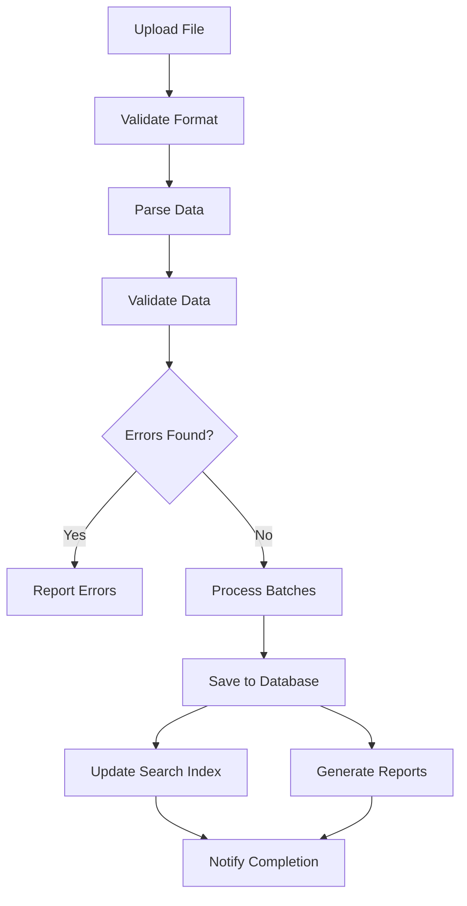

# Product Import System for Bulk Adding Products

## Overview

This document outlines the implementation of a comprehensive product import system that enables administrators to efficiently add large numbers of financial products (500+) with validation, error handling, and progress tracking.

## Import Requirements

### 1. Supported Formats
- **CSV**: Comma-separated values with standardized columns
- **JSON**: Structured JSON format matching product schema
- **Excel**: XLSX files with multiple sheets support

### 2. Import Features
- **Batch Processing**: Process large files in chunks
- **Validation**: Validate data before import
- **Error Handling**: Report errors with line numbers
- **Progress Tracking**: Show import progress
- **Duplicate Detection**: Identify and handle duplicates
- **Rollback**: Undo imports if needed
- **Scheduling**: Schedule imports for off-peak hours

## System Architecture

### 1. Import Pipeline



### 2. Data Flow

1. **File Upload**: Administrator uploads file through admin interface
2. **Format Validation**: System validates file format and structure
3. **Data Parsing**: System parses file into internal data structures
4. **Data Validation**: System validates each record against business rules
5. **Batch Processing**: System processes records in configurable batches
6. **Database Storage**: Valid records are saved to database
7. **Index Updates**: Search indexes are updated for new products
8. **Reporting**: System generates import reports and notifications

## Backend Implementation

### 1. Import Service

```typescript
// backend/src/services/ProductImportService.ts
import { Pool } from 'pg';
import { createReadStream } from 'fs';
import { parse } from 'csv-parse';
import * as XLSX from 'xlsx';
import { Transform } from 'stream';
import { pipeline } from 'stream/promises';
import { v4 as uuidv4 } from 'uuid';
import { EventEmitter } from 'events';

interface ImportOptions {
  batchSize?: number;
  skipDuplicates?: boolean;
  updateExisting?: boolean;
  validateOnly?: boolean;
}

interface ImportError {
  lineNumber: number;
  field: string;
  error: string;
  data?: any;
}

interface ImportResult {
  totalRecords: number;
  importedRecords: number;
  skippedRecords: number;
  errorRecords: number;
  errors: ImportError[];
  duration: number;
}

interface ProductImportData {
  id?: string;
  name: string;
  tagline: string;
  description: string;
  longDescription?: string;
  category: string;
  institution: string;
  targetSegment: 'individual' | 'business' | 'both';
  imageUrl?: string;
  features?: string[];
  benefits?: string[];
  interestRateMin?: number;
  interestRateMax?: number;
  annualFee?: number;
  minIncome?: number;
  minCreditScore?: number;
  // Additional fields as needed
}

class ProductImportService extends EventEmitter {
  private db: Pool;
  private batchSize: number;

  constructor(db: Pool, batchSize: number = 100) {
    super();
    this.db = db;
    this.batchSize = batchSize;
  }

  /**
   * Import products from CSV file
   */
  async importFromCSV(filePath: string, options: ImportOptions = {}): Promise<ImportResult> {
    const startTime = Date.now();
    const result: ImportResult = {
      totalRecords: 0,
      importedRecords: 0,
      skippedRecords: 0,
      errorRecords: 0,
      errors: [],
      duration: 0
    };

    try {
      const parser = parse({
        delimiter: ',',
        columns: true,
        skip_empty_lines: true
      });

      const validator = new Transform({
        objectMode: true,
        transform(chunk: any, encoding: string, callback: Function) {
          // Validate each record
          const validationResult = this.validateRecord(chunk, result.totalRecords + 1);
          if (validationResult.isValid) {
            callback(null, validationResult.data);
          } else {
            result.errors.push(...validationResult.errors);
            result.errorRecords++;
            callback(); // Skip invalid records
          }
        }
      });

      const processor = new Transform({
        objectMode: true,
        transform(chunk: any, encoding: string, callback: Function) {
          // Collect records for batch processing
          this.push(chunk);
          callback();
        }
      });

      await pipeline(
        createReadStream(filePath),
        parser,
        validator,
        processor
      );

      result.duration = Date.now() - startTime;
      this.emit('importComplete', result);
      return result;
    } catch (error) {
      this.emit('importError', error);
      throw error;
    }
  }

  /**
   * Import products from JSON file
   */
  async importFromJSON(filePath: string, options: ImportOptions = {}): Promise<ImportResult> {
    const startTime = Date.now();
    const result: ImportResult = {
      totalRecords: 0,
      importedRecords: 0,
      skippedRecords: 0,
      errorRecords: 0,
      errors: [],
      duration: 0
    };

    try {
      // Read and parse JSON file
      const fileContent = await fs.promises.readFile(filePath, 'utf8');
      const jsonData = JSON.parse(fileContent);

      // Validate JSON structure
      if (!Array.isArray(jsonData)) {
        throw new Error('JSON file must contain an array of product objects');
      }

      result.totalRecords = jsonData.length;

      // Process in batches
      for (let i = 0; i < jsonData.length; i += this.batchSize) {
        const batch = jsonData.slice(i, i + this.batchSize);
        const validatedBatch = [];
        
        // Validate each record in batch
        for (let j = 0; j < batch.length; j++) {
          const record = batch[j];
          const lineNumber = i + j + 1;
          const validationResult = this.validateRecord(record, lineNumber);
          
          if (validationResult.isValid) {
            validatedBatch.push(validationResult.data);
          } else {
            result.errors.push(...validationResult.errors);
            result.errorRecords++;
          }
        }

        // Process validated batch
        if (validatedBatch.length > 0 && !options.validateOnly) {
          const batchResult = await this.processBatch(validatedBatch, options);
          result.importedRecords += batchResult.imported;
          result.skippedRecords += batchResult.skipped;
        }

        // Emit progress
        this.emit('importProgress', {
          processed: Math.min(i + this.batchSize, jsonData.length),
          total: jsonData.length,
          percentage: Math.round(((i + this.batchSize) / jsonData.length) * 100)
        });
      }

      result.duration = Date.now() - startTime;
      this.emit('importComplete', result);
      return result;
    } catch (error) {
      this.emit('importError', error);
      throw error;
    }
  }

  /**
   * Import products from Excel file
   */
  async importFromExcel(filePath: string, options: ImportOptions = {}): Promise<ImportResult> {
    const startTime = Date.now();
    const result: ImportResult = {
      totalRecords: 0,
      importedRecords: 0,
      skippedRecords: 0,
      errorRecords: 0,
      errors: [],
      duration: 0
    };

    try {
      // Read Excel file
      const workbook = XLSX.readFile(filePath);
      const sheetName = workbook.SheetNames[0]; // Use first sheet
      const worksheet = workbook.Sheets[sheetName];
      
      // Convert to JSON
      const jsonData = XLSX.utils.sheet_to_json(worksheet);
      result.totalRecords = jsonData.length;

      // Process in batches
      for (let i = 0; i < jsonData.length; i += this.batchSize) {
        const batch = jsonData.slice(i, i + this.batchSize);
        const validatedBatch = [];
        
        // Validate each record in batch
        for (let j = 0; j < batch.length; j++) {
          const record = batch[j];
          const lineNumber = i + j + 1;
          const validationResult = this.validateRecord(record, lineNumber);
          
          if (validationResult.isValid) {
            validatedBatch.push(validationResult.data);
          } else {
            result.errors.push(...validationResult.errors);
            result.errorRecords++;
          }
        }

        // Process validated batch
        if (validatedBatch.length > 0 && !options.validateOnly) {
          const batchResult = await this.processBatch(validatedBatch, options);
          result.importedRecords += batchResult.imported;
          result.skippedRecords += batchResult.skipped;
        }

        // Emit progress
        this.emit('importProgress', {
          processed: Math.min(i + this.batchSize, jsonData.length),
          total: jsonData.length,
          percentage: Math.round(((i + this.batchSize) / jsonData.length) * 100)
        });
      }

      result.duration = Date.now() - startTime;
      this.emit('importComplete', result);
      return result;
    } catch (error) {
      this.emit('importError', error);
      throw error;
    }
  }

  /**
   * Validate a single record
   */
  private validateRecord(record: any, lineNumber: number): { 
    isValid: boolean; 
    data?: ProductImportData; 
    errors: ImportError[] 
  } {
    const errors: ImportError[] = [];
    const data: any = {};

    // Required fields validation
    const requiredFields = ['name', 'tagline', 'description', 'category', 'institution', 'targetSegment'];
    for (const field of requiredFields) {
      if (!record[field] || record[field].toString().trim() === '') {
        errors.push({
          lineNumber,
          field,
          error: `Required field '${field}' is missing or empty`
        });
      } else {
        data[field] = record[field];
      }
    }

    // Field-specific validations
    if (record.name && record.name.length > 200) {
      errors.push({
        lineNumber,
        field: 'name',
        error: 'Product name exceeds maximum length of 200 characters'
      });
    }

    if (record.description && record.description.length > 1000) {
      errors.push({
        lineNumber,
        field: 'description',
        error: 'Product description exceeds maximum length of 1000 characters'
      });
    }

    // Category validation
    const validCategories = ['Credit', 'Financing', 'Investment', 'Insurance'];
    if (record.category && !validCategories.includes(record.category)) {
      errors.push({
        lineNumber,
        field: 'category',
        error: `Invalid category '${record.category}'. Must be one of: ${validCategories.join(', ')}`
      });
    }

    // Target segment validation
    const validSegments = ['individual', 'business', 'both'];
    if (record.targetSegment && !validSegments.includes(record.targetSegment)) {
      errors.push({
        lineNumber,
        field: 'targetSegment',
        error: `Invalid target segment '${record.targetSegment}'. Must be one of: ${validSegments.join(', ')}`
      });
    }

    // Numeric field validations
    if (record.interestRateMin !== undefined) {
      const rate = parseFloat(record.interestRateMin);
      if (isNaN(rate) || rate < 0 || rate > 100) {
        errors.push({
          lineNumber,
          field: 'interestRateMin',
          error: 'Interest rate must be a number between 0 and 100'
        });
      } else {
        data.interestRateMin = rate;
      }
    }

    if (record.interestRateMax !== undefined) {
      const rate = parseFloat(record.interestRateMax);
      if (isNaN(rate) || rate < 0 || rate > 100) {
        errors.push({
          lineNumber,
          field: 'interestRateMax',
          error: 'Interest rate must be a number between 0 and 100'
        });
      } else {
        data.interestRateMax = rate;
      }
    }

    if (record.annualFee !== undefined) {
      const fee = parseFloat(record.annualFee);
      if (isNaN(fee) || fee < 0) {
        errors.push({
          lineNumber,
          field: 'annualFee',
          error: 'Annual fee must be a positive number'
        });
      } else {
        data.annualFee = fee;
      }
    }

    // Array field handling
    if (record.features) {
      try {
        data.features = Array.isArray(record.features) 
          ? record.features 
          : JSON.parse(record.features);
      } catch (e) {
        errors.push({
          lineNumber,
          field: 'features',
          error: 'Features must be a valid JSON array'
        });
      }
    }

    if (record.benefits) {
      try {
        data.benefits = Array.isArray(record.benefits) 
          ? record.benefits 
          : JSON.parse(record.benefits);
      } catch (e) {
        errors.push({
          lineNumber,
          field: 'benefits',
          error: 'Benefits must be a valid JSON array'
        });
      }
    }

    return {
      isValid: errors.length === 0,
      data: errors.length === 0 ? data : undefined,
      errors
    };
  }

  /**
   * Process a batch of validated records
   */
  private async processBatch(
    batch: ProductImportData[], 
    options: ImportOptions
  ): Promise<{ imported: number; skipped: number }> {
    const client = await this.db.connect();
    let imported = 0;
    let skipped = 0;

    try {
      await client.query('BEGIN');

      for (const product of batch) {
        // Check for duplicates
        const duplicateCheck = await client.query(
          'SELECT id FROM financial.products WHERE name = $1 AND institution_id = (SELECT id FROM financial.institutions WHERE name = $2)',
          [product.name, product.institution]
        );

        if (duplicateCheck.rows.length > 0) {
          if (options.skipDuplicates) {
            skipped++;
            continue;
          } else if (options.updateExisting) {
            // Update existing product
            await this.updateProduct(client, duplicateCheck.rows[0].id, product);
            imported++;
          } else {
            // Skip duplicate
            skipped++;
            continue;
          }
        } else {
          // Insert new product
          await this.insertProduct(client, product);
          imported++;
        }
      }

      await client.query('COMMIT');
      return { imported, skipped };
    } catch (error) {
      await client.query('ROLLBACK');
      throw error;
    } finally {
      client.release();
    }
  }

  /**
   * Insert a new product
   */
  private async insertProduct(client: any, product: ProductImportData) {
    // Get or create institution
    let institutionId: string;
    const institutionResult = await client.query(
      'SELECT id FROM financial.institutions WHERE name = $1',
      [product.institution]
    );

    if (institutionResult.rows.length > 0) {
      institutionId = institutionResult.rows[0].id;
    } else {
      // Create new institution
      const newInstitution = await client.query(
        'INSERT INTO financial.institutions (name, is_active) VALUES ($1, true) RETURNING id',
        [product.institution]
      );
      institutionId = newInstitution.rows[0].id;
    }

    // Get category ID
    const categoryResult = await client.query(
      'SELECT id FROM financial.product_categories WHERE name = $1',
      [product.category]
    );

    if (categoryResult.rows.length === 0) {
      throw new Error(`Category '${product.category}' not found`);
    }

    const categoryId = categoryResult.rows[0].id;

    // Insert product
    const productId = uuidv4();
    await client.query(
      `INSERT INTO financial.products (
        id, institution_id, category_id, name, tagline, description, long_description,
        target_segment, image_url, is_active, created_at, updated_at
      ) VALUES ($1, $2, $3, $4, $5, $6, $7, $8, $9, true, NOW(), NOW())`,
      [
        productId,
        institutionId,
        categoryId,
        product.name,
        product.tagline,
        product.description,
        product.longDescription || '',
        product.targetSegment,
        product.imageUrl || '',
      ]
    );

    // Insert features
    if (product.features && Array.isArray(product.features)) {
      for (const feature of product.features) {
        await client.query(
          'INSERT INTO financial.product_features (product_id, feature_text, is_benefit) VALUES ($1, $2, false)',
          [productId, feature]
        );
      }
    }

    // Insert benefits
    if (product.benefits && Array.isArray(product.benefits)) {
      for (const benefit of product.benefits) {
        await client.query(
          'INSERT INTO financial.product_features (product_id, feature_text, is_benefit) VALUES ($1, $2, true)',
          [productId, benefit]
        );
      }
    }

    // Insert ratings (initially 0)
    await client.query(
      'INSERT INTO financial.product_ratings (product_id, average_rating, review_count) VALUES ($1, 0, 0)',
      [productId]
    );

    // Insert numeric values as filter values
    if (product.interestRateMin !== undefined) {
      await client.query(
        `INSERT INTO financial.product_filter_values (product_id, filter_id, value_decimal)
         SELECT $1, id, $2 FROM financial.product_filters WHERE slug = 'interest_rate_min'`,
        [productId, product.interestRateMin]
      );
    }

    if (product.annualFee !== undefined) {
      await client.query(
        `INSERT INTO financial.product_filter_values (product_id, filter_id, value_decimal)
         SELECT $1, id, $2 FROM financial.product_filters WHERE slug = 'annual_fee'`,
        [productId, product.annualFee]
      );
    }

    return productId;
  }

  /**
   * Update an existing product
   */
  private async updateProduct(client: any, productId: string, product: ProductImportData) {
    await client.query(
      `UPDATE financial.products SET
        name = $1, tagline = $2, description = $3, long_description = $4,
        target_segment = $5, image_url = $6, updated_at = NOW()
      WHERE id = $7`,
      [
        product.name,
        product.tagline,
        product.description,
        product.longDescription || '',
        product.targetSegment,
        product.imageUrl || '',
        productId
      ]
    );

    // Update features and benefits would require more complex logic
    // to determine what to add/remove/update
  }

  /**
   * Generate import template
   */
  generateTemplate(format: 'csv' | 'json' | 'excel'): Buffer | string {
    const templateData = [
      {
        name: 'Nombre del Producto',
        tagline: 'Eslogan',
        description: 'Descripción corta',
        longDescription: 'Descripción larga',
        category: 'Categoría',
        institution: 'Institución',
        targetSegment: 'Segmento (individual/business/both)',
        imageUrl: 'URL de imagen',
        features: '["Característica 1", "Característica 2"]',
        benefits: '["Beneficio 1", "Beneficio 2"]',
        interestRateMin: 'Tasa de interés mínima',
        interestRateMax: 'Tasa de interés máxima',
        annualFee: 'Cuota anual',
        minIncome: 'Ingreso mínimo',
        minCreditScore: 'Puntaje de crédito mínimo'
      }
    ];

    switch (format) {
      case 'csv':
        // Generate CSV template
        const csvHeaders = Object.keys(templateData[0]).join(',');
        const csvRow = Object.values(templateData[0]).map(v => `"${v}"`).join(',');
        return `${csvHeaders}\n${csvRow}`;
      
      case 'json':
        return JSON.stringify(templateData, null, 2);
      
      case 'excel':
        // Generate Excel template using a library like exceljs
        // This would require additional implementation
        throw new Error('Excel template generation not implemented');
      
      default:
        throw new Error('Unsupported format');
    }
  }
}

export { ProductImportService, ImportOptions, ImportResult, ImportError, ProductImportData };
```

### 2. Import Controller

```typescript
// backend/src/controllers/ProductImportController.ts
import { Request, Response } from 'express';
import { ProductImportService } from '../services/ProductImportService';
import multer from 'multer';
import { v4 as uuidv4 } from 'uuid';
import * as fs from 'fs';
import * as path from 'path';

interface ImportJob {
  id: string;
  fileName: string;
  status: 'pending' | 'processing' | 'completed' | 'failed';
  progress: number;
  result?: any;
  error?: string;
  createdAt: Date;
  startedAt?: Date;
  completedAt?: Date;
}

class ProductImportController {
  private importService: ProductImportService;
  private upload: multer.Instance;
  private importJobs: Map<string, ImportJob> = new Map();

  constructor(importService: ProductImportService) {
    this.importService = importService;
    
    // Configure multer for file uploads
    const storage = multer.diskStorage({
      destination: (req, file, cb) => {
        const uploadDir = path.join(__dirname, '../../uploads');
        if (!fs.existsSync(uploadDir)) {
          fs.mkdirSync(uploadDir, { recursive: true });
        }
        cb(null, uploadDir);
      },
      filename: (req, file, cb) => {
        const uniqueSuffix = Date.now() + '-' + Math.round(Math.random() * 1E9);
        cb(null, file.fieldname + '-' + uniqueSuffix + path.extname(file.originalname));
      }
    });

    this.upload = multer({ 
      storage,
      limits: {
        fileSize: 50 * 1024 * 1024 // 50MB limit
      },
      fileFilter: (req, file, cb) => {
        const allowedTypes = [
          'text/csv',
          'application/json',
          'application/vnd.ms-excel',
          'application/vnd.openxmlformats-officedocument.spreadsheetml.sheet'
        ];
        
        if (allowedTypes.includes(file.mimetype)) {
          cb(null, true);
        } else {
          cb(new Error('Invalid file type. Only CSV, JSON, and Excel files are allowed.'));
        }
      }
    });

    // Set up event listeners for import service
    this.importService.on('importProgress', (progress) => {
      // Update job progress
      console.log('Import progress:', progress);
    });

    this.importService.on('importComplete', (result) => {
      // Handle import completion
      console.log('Import completed:', result);
    });

    this.importService.on('importError', (error) => {
      // Handle import errors
      console.error('Import error:', error);
    });
  }

  /**
   * Upload import file
   */
  uploadFile = this.upload.single('file');

  /**
   * Start product import
   */
  async startImport(req: Request, res: Response) {
    try {
      if (!req.file) {
        return res.status(400).json({ error: 'No file uploaded' });
      }

      const jobId = uuidv4();
      const options = {
        batchSize: parseInt(req.body.batchSize) || 100,
        skipDuplicates: req.body.skipDuplicates === 'true',
        updateExisting: req.body.updateExisting === 'true',
        validateOnly: req.body.validateOnly === 'true'
      };

      // Create import job
      const job: ImportJob = {
        id: jobId,
        fileName: req.file.originalname,
        status: 'pending',
        progress: 0,
        createdAt: new Date()
      };

      this.importJobs.set(jobId, job);

      // Start import process asynchronously
      this.processImport(jobId, req.file.path, req.body.format, options);

      res.json({
        jobId,
        message: 'Import started successfully',
        job
      });
    } catch (error) {
      res.status(500).json({
        error: 'Failed to start import',
        message: error instanceof Error ? error.message : 'Unknown error'
      });
    }
  }

  /**
   * Process import asynchronously
   */
  private async processImport(
    jobId: string, 
    filePath: string, 
    format: string, 
    options: any
  ) {
    const job = this.importJobs.get(jobId);
    if (!job) return;

    job.status = 'processing';
    job.startedAt = new Date();

    try {
      let result;
      switch (format.toLowerCase()) {
        case 'csv':
          result = await this.importService.importFromCSV(filePath, options);
          break;
        case 'json':
          result = await this.importService.importFromJSON(filePath, options);
          break;
        case 'excel':
        case 'xlsx':
          result = await this.importService.importFromExcel(filePath, options);
          break;
        default:
          throw new Error(`Unsupported format: ${format}`);
      }

      job.status = 'completed';
      job.progress = 100;
      job.result = result;
      job.completedAt = new Date();

      // Clean up uploaded file
      fs.unlinkSync(filePath);
    } catch (error) {
      job.status = 'failed';
      job.error = error instanceof Error ? error.message : 'Unknown error';
      job.completedAt = new Date();

      // Clean up uploaded file
      if (fs.existsSync(filePath)) {
        fs.unlinkSync(filePath);
      }
    }
  }

  /**
   * Get import job status
   */
  getImportStatus(req: Request, res: Response) {
    const { jobId } = req.params;
    const job = this.importJobs.get(jobId);

    if (!job) {
      return res.status(404).json({ error: 'Import job not found' });
    }

    res.json({ job });
  }

  /**
   * Get all import jobs
   */
  getImportJobs(req: Request, res: Response) {
    const jobs = Array.from(this.importJobs.values());
    res.json({ jobs });
  }

  /**
   * Cancel import job
   */
  cancelImport(req: Request, res: Response) {
    const { jobId } = req.params;
    const job = this.importJobs.get(jobId);

    if (!job) {
      return res.status(404).json({ error: 'Import job not found' });
    }

    if (job.status === 'processing') {
      // Note: Actual cancellation of ongoing process would require more complex implementation
      job.status = 'failed';
      job.error = 'Import cancelled by user';
      job.completedAt = new Date();
    }

    res.json({ message: 'Import job cancelled', job });
  }

  /**
   * Download import template
   */
  downloadTemplate(req: Request, res: Response) {
    const { format } = req.params;
    
    try {
      const template = this.importService.generateTemplate(format as any);
      
      res.setHeader('Content-Type', 'application/octet-stream');
      res.setHeader('Content-Disposition', `attachment; filename=product-import-template.${format}`);
      res.send(template);
    } catch (error) {
      res.status(500).json({
        error: 'Failed to generate template',
        message: error instanceof Error ? error.message : 'Unknown error'
      });
    }
  }

  /**
   * Get import statistics
   */
  getImportStats(req: Request, res: Response) {
    const jobs = Array.from(this.importJobs.values());
    
    const stats = {
      totalJobs: jobs.length,
      completedJobs: jobs.filter(j => j.status === 'completed').length,
      failedJobs: jobs.filter(j => j.status === 'failed').length,
      pendingJobs: jobs.filter(j => j.status === 'pending').length,
      processingJobs: jobs.filter(j => j.status === 'processing').length,
      recentJobs: jobs.slice(-10) // Last 10 jobs
    };

    res.json({ stats });
  }
}

export { ProductImportController, ImportJob };
```

### 3. Import Routes

```typescript
// backend/src/routes/import.ts
import { Router } from 'express';
import { ProductImportController } from '../controllers/ProductImportController';
import { ProductImportService } from '../services/ProductImportService';
import { Pool } from 'pg';

const router = Router();

// Initialize services
const db = new Pool({
  // Database configuration
});

const importService = new ProductImportService(db);
const importController = new ProductImportController(importService);

// Import routes
router.post('/upload', importController.uploadFile, importController.startImport.bind(importController));
router.get('/jobs/:jobId', importController.getImportStatus.bind(importController));
router.get('/jobs', importController.getImportJobs.bind(importController));
router.delete('/jobs/:jobId', importController.cancelImport.bind(importController));
router.get('/template/:format', importController.downloadTemplate.bind(importController));
router.get('/stats', importController.getImportStats.bind(importController));

export default router;
```

## Frontend Implementation

### 1. Import Dashboard Component

```tsx
// src/components/admin/ProductImportDashboard.tsx
'use client';

import React, { useState, useEffect } from 'react';
import { Button } from '@/components/ui/button';
import { Card, CardContent, CardDescription, CardHeader, CardTitle } from '@/components/ui/card';
import { Input } from '@/components/ui/input';
import { Label } from '@/components/ui/label';
import { Select, SelectContent, SelectItem, SelectTrigger, SelectValue } from '@/components/ui/select';
import { Switch } from '@/components/ui/switch';
import { Progress } from '@/components/ui/progress';
import { Alert, AlertDescription, AlertTitle } from '@/components/ui/alert';
import { Badge } from '@/components/ui/badge';
import { 
  Upload, 
  Download, 
  Play, 
  Pause, 
  RotateCcw, 
  CheckCircle, 
  XCircle, 
  Clock,
  FileText
} from 'lucide-react';

interface ImportJob {
  id: string;
  fileName: string;
  status: 'pending' | 'processing' | 'completed' | 'failed';
  progress: number;
  result?: any;
  error?: string;
  createdAt: string;
  startedAt?: string;
  completedAt?: string;
}

export default function ProductImportDashboard() {
  const [file, setFile] = useState<File | null>(null);
  const [format, setFormat] = useState('csv');
  const [batchSize, setBatchSize] = useState(100);
  const [skipDuplicates, setSkipDuplicates] = useState(false);
  const [updateExisting, setUpdateExisting] = useState(false);
  const [validateOnly, setValidateOnly] = useState(false);
  const [jobs, setJobs] = useState<ImportJob[]>([]);
  const [loading, setLoading] = useState(false);
  const [error, setError] = useState<string | null>(null);

  // Fetch import jobs
  useEffect(() => {
    const fetchJobs = async () => {
      try {
        const response = await fetch('/api/admin/import/jobs');
        const data = await response.json();
        setJobs(data.jobs);
      } catch (err) {
        console.error('Failed to fetch import jobs:', err);
      }
    };

    fetchJobs();
    // Poll for updates every 5 seconds
    const interval = setInterval(fetchJobs, 5000);
    return () => clearInterval(interval);
  }, []);

  const handleFileChange = (e: React.ChangeEvent<HTMLInputElement>) => {
    if (e.target.files && e.target.files[0]) {
      setFile(e.target.files[0]);
    }
  };

  const handleSubmit = async (e: React.FormEvent) => {
    e.preventDefault();
    
    if (!file) {
      setError('Please select a file to import');
      return;
    }

    setLoading(true);
    setError(null);

    try {
      const formData = new FormData();
      formData.append('file', file);
      formData.append('format', format);
      formData.append('batchSize', batchSize.toString());
      formData.append('skipDuplicates', skipDuplicates.toString());
      formData.append('updateExisting', updateExisting.toString());
      formData.append('validateOnly', validateOnly.toString());

      const response = await fetch('/api/admin/import/upload', {
        method: 'POST',
        body: formData
      });

      const data = await response.json();
      
      if (response.ok) {
        // Add new job to the list
        setJobs(prev => [data.job, ...prev]);
        setFile(null);
      } else {
        setError(data.error || 'Failed to start import');
      }
    } catch (err) {
      setError('Failed to start import');
      console.error('Import error:', err);
    } finally {
      setLoading(false);
    }
  };

  const handleDownloadTemplate = async (format: string) => {
    try {
      const response = await fetch(`/api/admin/import/template/${format}`);
      const blob = await response.blob();
      const url = window.URL.createObjectURL(blob);
      const a = document.createElement('a');
      a.href = url;
      a.download = `product-import-template.${format}`;
      document.body.appendChild(a);
      a.click();
      document.body.removeChild(a);
      window.URL.revokeObjectURL(url);
    } catch (err) {
      console.error('Failed to download template:', err);
    }
  };

  const getStatusIcon = (status: string) => {
    switch (status) {
      case 'completed':
        return <CheckCircle className="h-4 w-4 text-green-500" />;
      case 'failed':
        return <XCircle className="h-4 w-4 text-red-500" />;
      case 'processing':
        return <Play className="h-4 w-4 text-blue-500" />;
      case 'pending':
        return <Clock className="h-4 w-4 text-yellow-500" />;
      default:
        return <FileText className="h-4 w-4 text-gray-500" />;
    }
  };

  const getStatusBadge = (status: string) => {
    switch (status) {
      case 'completed':
        return <Badge variant="default">Completed</Badge>;
      case 'failed':
        return <Badge variant="destructive">Failed</Badge>;
      case 'processing':
        return <Badge variant="secondary">Processing</Badge>;
      case 'pending':
        return <Badge variant="outline">Pending</Badge>;
      default:
        return <Badge variant="outline">Unknown</Badge>;
    }
  };

  return (
    <div className="space-y-6">
      <div>
        <h1 className="text-3xl font-bold">Product Import Dashboard</h1>
        <p className="text-gray-600">Import financial products in bulk</p>
      </div>

      {error && (
        <Alert variant="destructive">
          <AlertTitle>Error</AlertTitle>
          <AlertDescription>{error}</AlertDescription>
        </Alert>
      )}

      <div className="grid grid-cols-1 lg:grid-cols-2 gap-6">
        {/* Import Configuration */}
        <Card>
          <CardHeader>
            <CardTitle>Import Configuration</CardTitle>
            <CardDescription>Configure your product import settings</CardDescription>
          </CardHeader>
          <CardContent>
            <form onSubmit={handleSubmit} className="space-y-4">
              <div>
                <Label htmlFor="file">Import File</Label>
                <Input
                  id="file"
                  type="file"
                  accept=".csv,.json,.xlsx,.xls"
                  onChange={handleFileChange}
                  disabled={loading}
                />
                {file && (
                  <p className="text-sm text-gray-500 mt-1">
                    Selected: {file.name} ({(file.size / 1024 / 1024).toFixed(2)} MB)
                  </p>
                )}
              </div>

              <div>
                <Label htmlFor="format">File Format</Label>
                <Select value={format} onValueChange={setFormat}>
                  <SelectTrigger>
                    <SelectValue />
                  </SelectTrigger>
                  <SelectContent>
                    <SelectItem value="csv">CSV</SelectItem>
                    <SelectItem value="json">JSON</SelectItem>
                    <SelectItem value="excel">Excel (XLSX)</SelectItem>
                  </SelectContent>
                </Select>
              </div>

              <div>
                <Label htmlFor="batchSize">Batch Size</Label>
                <Input
                  id="batchSize"
                  type="number"
                  min="1"
                  max="1000"
                  value={batchSize}
                  onChange={(e) => setBatchSize(parseInt(e.target.value) || 100)}
                />
                <p className="text-sm text-gray-500 mt-1">
                  Number of records to process in each batch
                </p>
              </div>

              <div className="flex items-center justify-between">
                <Label htmlFor="skipDuplicates">Skip Duplicates</Label>
                <Switch
                  id="skipDuplicates"
                  checked={skipDuplicates}
                  onCheckedChange={setSkipDuplicates}
                />
              </div>

              <div className="flex items-center justify-between">
                <Label htmlFor="updateExisting">Update Existing</Label>
                <Switch
                  id="updateExisting"
                  checked={updateExisting}
                  onCheckedChange={setUpdateExisting}
                />
              </div>

              <div className="flex items-center justify-between">
                <Label htmlFor="validateOnly">Validate Only</Label>
                <Switch
                  id="validateOnly"
                  checked={validateOnly}
                  onCheckedChange={setValidateOnly}
                />
              </div>

              <div className="flex space-x-2">
                <Button type="submit" disabled={loading || !file}>
                  {loading ? 'Importing...' : 'Start Import'}
                </Button>
                
                <Button
                  type="button"
                  variant="outline"
                  onClick={() => handleDownloadTemplate(format)}
                >
                  <Download className="mr-2 h-4 w-4" />
                  Download Template
                </Button>
              </div>
            </form>
          </CardContent>
        </Card>

        {/* Import Jobs */}
        <Card